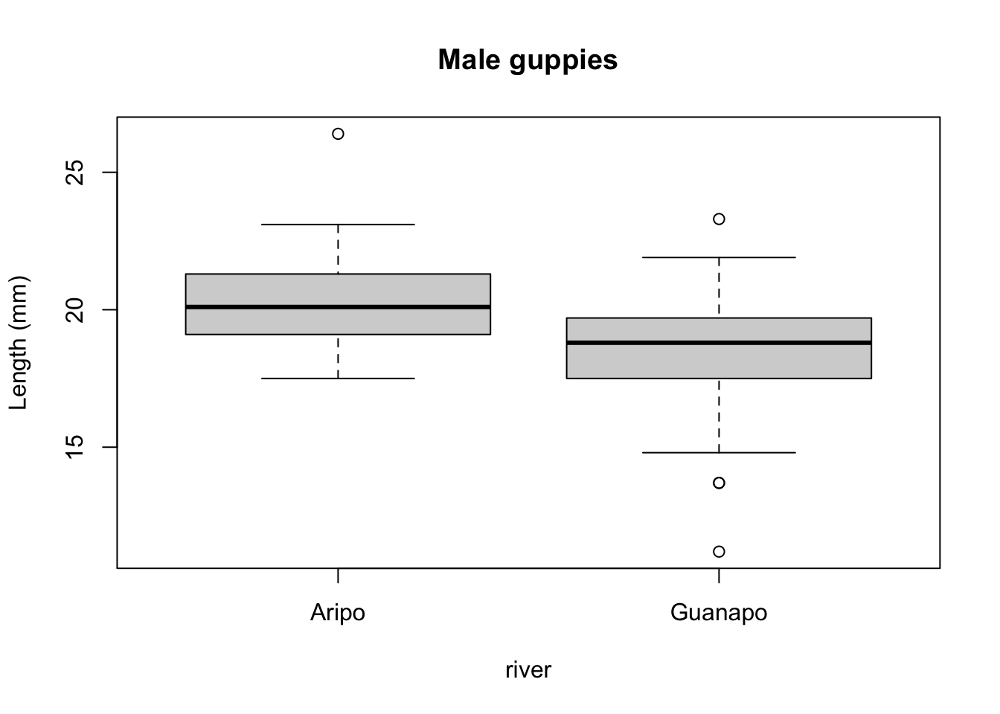
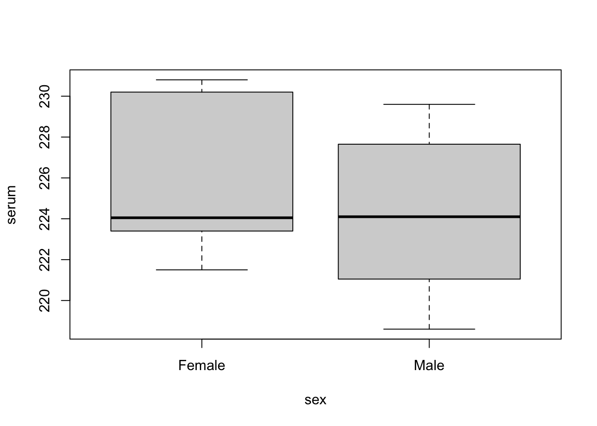
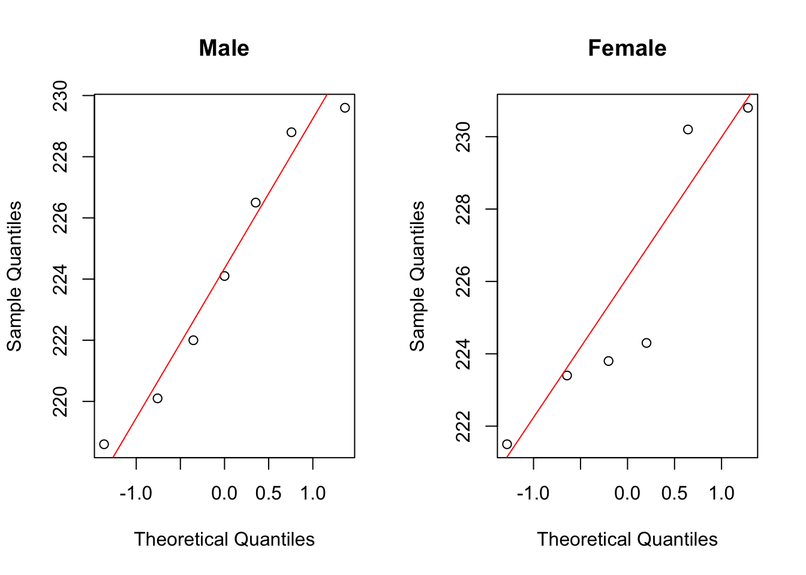
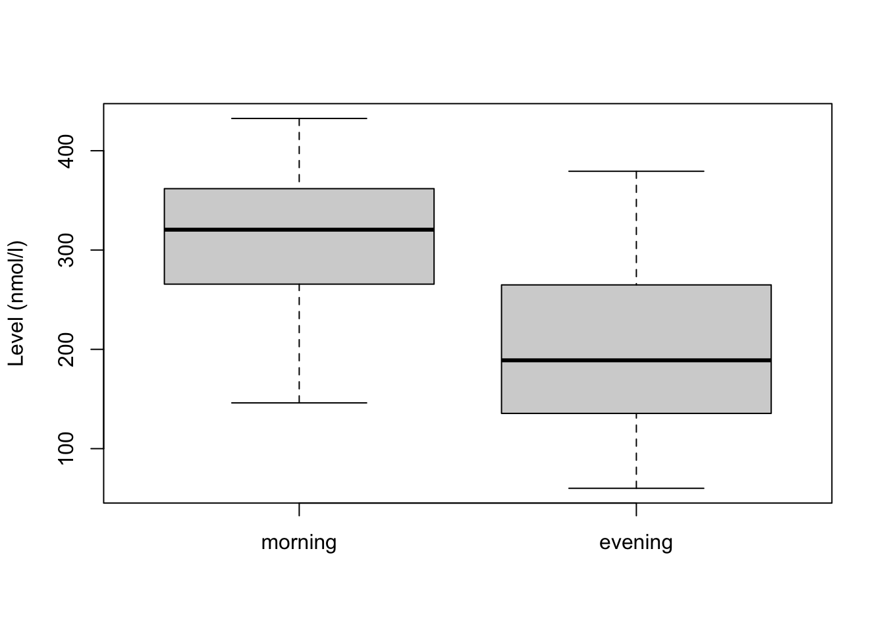
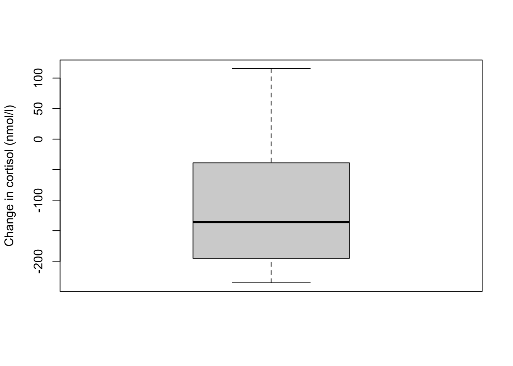
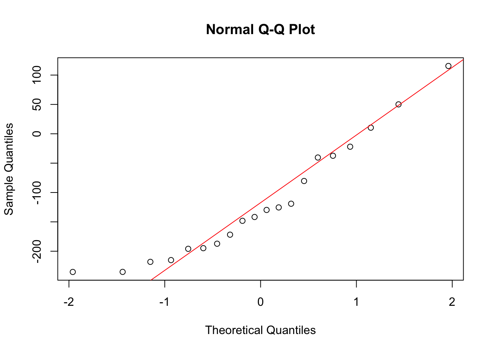
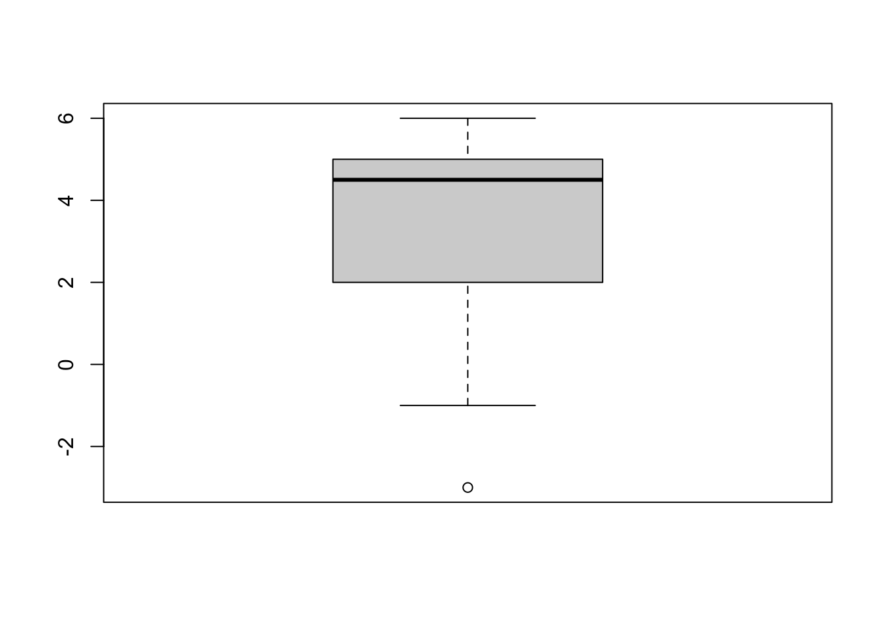
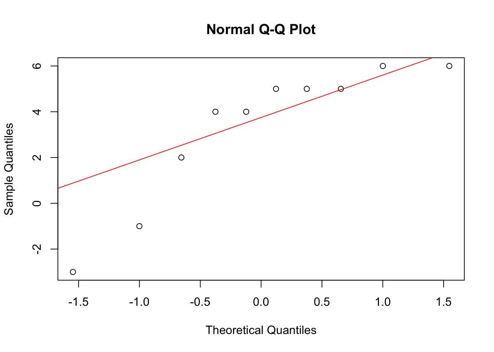

# Two-sample tests

## Objectives
:::objectives
**Questions**

- When do I perform a two-sample test?
- Which two-sample tests are there and what are the assumptions?
- How do I interpret and present the results of the tests?

**Objectives**

- Set out your hypothesis for two-sample continuous data
- Determine the correct data format to perform a two-sample test in R
- Summarise and visualise the data
- Check underlying assumptions (normality, homogeneity of variance)
- Be able to choose an appropriate two-sample test and run it in R
- Be able to interpret and report the results
:::

## Purpose and aim
These tests are used when we have two samples of continuous data where we are trying to find out if the samples came from the same parent distribution or not. This essentially boils down to finding out if there is a difference in the means of the two samples.

## Choosing a test {#two-sample-choosing-a-test}
There are five key tests that can be used to deal with two samples. Choosing which test to use depends upon which key assumptions are satisfied by your sample data and this effectively boils down to answering four questions about your samples:

1.	Are the samples normally distributed? (Yes/No)
2.	How big are your samples? (<30 data points or >30 data points)
3.	Are the samples paired? (Yes/No)
4.	Do the samples have the same variance? (Yes/No)

There are two sets of tests to consider depending on your answers to questions 1 and 2. If your data are normally distributed or if you have big samples then you need to look at the parametric tests. If your data are not normally distributed _and_ your sample size is small, then you need to look at non-parametric tests (see Figure \@ref(fig:fig-cs1-diagram-test). Questions 3 and 4 then help you pick the specific test to use, which is summarised in Figure \@ref(fig:fig-cs1-diagram-which-test).


<div class="figure" style="text-align: center">

<p class="caption">(\#fig:fig-cs1-diagram-test)Category of test</p>
</div>


<div class="figure" style="text-align: center">

<p class="caption">(\#fig:fig-cs1-diagram-which-test)Which test to use</p>
</div>

1.	Testing whether a sample comes from a normal distribution was covered in [One-sample tests](#one-sample-tests). You need to visualise your data and/or use the Shapiro-Wilk test.
2.	The size of the sample makes things easier. Because of maths (specifically due to something called the central limit theorem which I am not even going to attempt to touch upon here) if you have large samples then you can use the tests that assume normality of the parent population (Student’s t-test, Welch’s t-test and the paired t-test) even if your parent populations are certainly not normal. If you really want to understand exactly why this works, then you will have to do some more rigorous mathematics. So, for the moment I’m going to say that it’s OK to take these facts on faith and just trust me on this.
3.	Paired samples mean that for every data point in one sample there is a matching data point in the other sample that is linked to it in some inextricable way. A typical example would involve a group of 20 test subjects being measured before and after some experiment. Providing that the experiment didn’t do anything fatal to the test subjects then the data would consist of two samples; 20 pre-experiment measurements and 20 post-experiment measurements. However, because the same test subjects were used then each pre-experiment data point can be matched exactly to one of the post-experiment data points. In this sense the two samples are said to be “paired”.
4.	There are a couple of tests (Bartlett’s test and Levene’s test) that can be used to see if two samples come from distributions with the same variance. These will be covered in a later section.
5.	Resampling techniques aren’t covered in this course and require a mixture of statistical understanding and programming skill. Ask a demonstrator (or Google it 😉) if you want to know more.

### Data format
For two samples the data can be stored in one of three formats in R:

1.	as two separate vectors,
2.	in a stacked data frame,
3.	or in an unstacked data frame/list.

Two separate vectors case is (hopefully) obvious.

When using a data frame we have different options to organise our data. The best way of formatting data in R is by using [the tidy data format](https://r4ds.had.co.nz/tidy-data.html).

:::highlight
**Tidy data** has the following properties:

- Each variable has its own column
- Each observation has its own row
- Each value has its own cell
:::

Stacked form (or [long format data](https://tidyr.tidyverse.org/reference/pivot_longer.html)) is where the data is arranged in such a way that each variable (thing that we measured) has its own column. If we consider a dataset containing meerkat weights (in g) from two different countries then a stacked format of the data would look like:

<table class="table table-striped table-condensed" style="width: auto !important; margin-left: auto; margin-right: auto;">
 <thead>
  <tr>
   <th style="text-align:left;"> country </th>
   <th style="text-align:right;"> weight </th>
  </tr>
 </thead>
<tbody>
  <tr>
   <td style="text-align:left;"> Botswana </td>
   <td style="text-align:right;"> 514 </td>
  </tr>
  <tr>
   <td style="text-align:left;"> Botswana </td>
   <td style="text-align:right;"> 568 </td>
  </tr>
  <tr>
   <td style="text-align:left;"> Botswana </td>
   <td style="text-align:right;"> 519 </td>
  </tr>
  <tr>
   <td style="text-align:left;"> Uganda </td>
   <td style="text-align:right;"> 624 </td>
  </tr>
  <tr>
   <td style="text-align:left;"> Uganda </td>
   <td style="text-align:right;"> 662 </td>
  </tr>
  <tr>
   <td style="text-align:left;"> Uganda </td>
   <td style="text-align:right;"> 633 </td>
  </tr>
</tbody>
</table>

In the unstacked (or [wide format](https://tidyr.tidyverse.org/reference/pivot_wider.html)) form a variable (measured thing) is present in more than one column. For example, let's say we measured meerkat weight in two countries over a period of years. We could then organise our data in such a way that for each year the measured values are split by country:

<table class="table table-striped table-condensed" style="width: auto !important; margin-left: auto; margin-right: auto;">
 <thead>
  <tr>
   <th style="text-align:right;"> year </th>
   <th style="text-align:right;"> Botswana </th>
   <th style="text-align:right;"> Uganda </th>
  </tr>
 </thead>
<tbody>
  <tr>
   <td style="text-align:right;"> 1990 </td>
   <td style="text-align:right;"> 514 </td>
   <td style="text-align:right;"> 624 </td>
  </tr>
  <tr>
   <td style="text-align:right;"> 1992 </td>
   <td style="text-align:right;"> 568 </td>
   <td style="text-align:right;"> 662 </td>
  </tr>
  <tr>
   <td style="text-align:right;"> 1995 </td>
   <td style="text-align:right;"> 519 </td>
   <td style="text-align:right;"> 633 </td>
  </tr>
</tbody>
</table>

Having tidy data is the easiest way of doing analyses in R and I would strongly encourage you all to start adopting this format as standard for data collection and processing.

## Student's t-test
For this test we assume that both sample data sets are normally distributed and have equal variance. We test to see if the means of the two samples differ significantly from each other. 

:::note
The language used in this section is slightly different to that used in section \@ref(one-sample-tests). Although the language used in section \@ref(one-sample-tests) was technically more correct, the sentences are somewhat more onerous to read. Here I’ve opted for an easier reading style at the expense of technical accuracy. Please feel free to re-write this section (at your own leisure).
:::

### Section commands
New commands used in this section:

| Function| Description|
|:- |:- |
|`aggregate`| Splits the data into subsets, computes summary statistics for each, and returns the result in a convenient form |
|`unstack()`| Converts a stacked data frame into an unstacked data frame (or a list if the lengths of the samples are different) |
|`bartlett.test()`| Perform Bartlett's test for equality of variance |
|`leveneTest()`| Perform Levene's test for equality of variance |

### Data and hypotheses
For example, suppose we now measure the body lengths of male guppies (in mm) collected from two rivers in Trinidad; the Aripo and the Guanapo. We want to test whether the mean body length differs between samples. We form the following null and alternative hypotheses:

-	$H_0$: The mean body length does not differ between the two groups ($\mu A = \mu G$)
-	$H_1$: The mean body length does differ between the two groups ($\mu A \neq \mu G$)

We use a two-sample, two-tailed t-test to see if we can reject the null hypothesis.

-	We use a two-sample test because we now have two samples.
-	We use a two-tailed t-test because we want to know if our data suggest that the true (population) means are different from one another rather than that one mean is specifically bigger or smaller than the other.
-	We’re using Student’s t-test because the sample sizes are big and because we’re assuming that the parent populations have equal variance (We can check this later).

The data are stored in stacked format in the file `data/raw/CS1-twosample.csv`.

Read this into R:


```r
rivers <- read.csv("data/raw/CS1-twosample.csv")
```

### Summarise and visualise {#cs1-students-sumvisual}
Let's summarise the data...


```r
aggregate(length ~ river, data = rivers, summary)
```

```
##     river length.Min. length.1st Qu. length.Median length.Mean length.3rd Qu.
## 1   Aripo    17.50000       19.10000      20.10000    20.33077       21.30000
## 2 Guanapo    11.20000       17.50000      18.80000    18.29655       19.70000
##   length.Max.
## 1    26.40000
## 2    23.30000
```

and visualise it:


```r
boxplot(length ~ river, data = rivers,
        main = "Male guppies",
        ylab = "Length (mm)")
```



The boxplot does appear to suggest that the two samples have different means, and moreover that the guppies in Guanapo may be smaller than the guppies in Aripo. It isn’t immediately obvious that the two populations don’t have equal variances though, so we plough on.

### Implement test
Perform a two-sample, two-tailed, t-test:


```r
t.test(length ~ river, data = rivers,
       alternative = "two.sided",
       var.equal = TRUE)
```

In this case, with the data in stacked format:

-	The first argument must be in the formula format: `variables ~ category`
-	The second argument must be the name of the data frame
-	The third argument gives the type of alternative hypothesis and must be one of `two.sided`, `greater` or `less` 
-	The fourth argument says whether the variance of the two samples can be assumed to be equal (Student's t-test) or unequal (Welch's t-test)

This next section shows you that we can perform exactly the same test with the data in a different (unstacked) format. This is potentially somewhat redundant (or thorough depending on your point of view). Probably best just to do it anyway just in case you gain extra insight through repetition (it works for rowers…)

Convert the data to unstacked format and repeat the t test:


```r
# create a new object that contains the unstacked data
uns_rivers <- unstack(rivers)

# have a look at the data
uns_rivers
```


```r
# perform the t-test
t.test(uns_rivers$Guanapo, uns_rivers$Aripo,
       alternative = "two.sided",
       var.equal = TRUE)
```

### Interpret output and report results
Let's look at the results of the t-test that we performed on the original (stacked) data frame:


```
## 
## 	Two Sample t-test
## 
## data:  length by river
## t = 3.8433, df = 66, p-value = 0.0002754
## alternative hypothesis: true difference in means between group Aripo and group Guanapo is not equal to 0
## 95 percent confidence interval:
##  0.9774482 3.0909868
## sample estimates:
##   mean in group Aripo mean in group Guanapo 
##              20.33077              18.29655
```

-	The 1st line gives the name of the test and the 2nd line reminds you what the dataset was called, and what variables were used.
-	The 3rd line contains the three key outputs from the test:
    - The calculated t-value is 3.8433 (we need this for reporting)
    - There are 66 degrees of freedom (we need this for reporting)
    - The p-value is 0.0002754. 
-	The 4th line simply states the alternative hypothesis in terms of the difference between the two sample means (testing if the two sample means are different is equivalent to testing whether the difference in the means is equal to zero).
-	The 5th and 6th lines give the 95th confidence interval (we don’t need to know this here).
-	The 7th, 8th and 9th lines give the sample means for each group (20.33077 in Aripo and 18.29655 in Guanapo) which we found earlier.

Again, the p-value on the 3rd line is what we’re most interested in. Since the p-value is very small (much smaller than the standard significance level) we choose to say “that it is very unlikely that these two samples came from the same parent distribution and as such we can reject our null hypothesis" and state that:

> A Student’s t-test indicated that the mean body length of male guppies in the Guanapo river (18.29 mm) differs significantly from the mean body length of male guppies in the Aripo river (20.33 mm) (t = 3.8433, df = 66, p = 0.0003).

Now there's a conversation starter.

### Assumptions
In order to use a Student’s t-test (and for the results to be strictly valid) we have to make three assumptions:

1.	The parent distributions from which the samples are taken are both normally distributed (which would lead to the sample data being normally distributed too).
2.	Each data point in the samples is independent of the others.
3.	The parent distributions should have the same variance.

In this example the first assumption can be ignored as the sample sizes are large enough (because of maths, with Aripo containing 2 and Guanapo 2 samples). If the samples were smaller then we would use the tests from the previous section.

The second point we can do nothing about unless we know how the data were collected, so again we ignore it.

The third point regarding equality of variance can be tested using either Bartlett’s test (if the samples are normally distributed) or Levene’s test (if the samples are not normally distributed).
This is where it gets a bit trickier. Although we don’t care if the samples are normally distributed for the t-test to be valid (because the sample size is big enough to compensate), we do need to know if they are normally distributed in order to decide which variance test to use.

So we perform a [Shapiro-Wilk test](#shapiro-wilk-test) on both samples separately:


```r
shapiro.test(uns_rivers$Aripo)
```

```
## 
## 	Shapiro-Wilk normality test
## 
## data:  uns_rivers$Aripo
## W = 0.93596, p-value = 0.02802
```

```r
shapiro.test(uns_rivers$Guanapo)
```

```
## 
## 	Shapiro-Wilk normality test
## 
## data:  uns_rivers$Guanapo
## W = 0.94938, p-value = 0.1764
```

We can see that whilst the Guanapo data is probably normally distributed (p = 0.1764 > 0.05), the Aripo data is unlikely to be normally distributed (p = 0.02802 < 0.05). Remember that the p-value gives the probability of observing each sample if the parent population is actually normally distributed.
The Shapiro-Wilk test is quite sensitive to sample size. This means that if you have a large sample then even small deviations from normality will cause the sample to fail the test, whereas smaller samples are allowed to pass with much larger deviations. Here the Aripo data has nearly 40 points in it compared with the Guanapo data and so it is much easier for the Aripo sample to fail compared with the Guanapo data.

### Exercise
:::exercise
Q-Q plots for `rivers` data

Create the Q-Q plots for the two samples and discuss with your neighbour what you see in light of the results from the above Shapiro-Wilk test.

<details><summary>Answer</summary>


```r
par(mfrow=c(1,2))
qqnorm(uns_rivers$Aripo, main = "Aripo")
qqline(uns_rivers$Aripo, col = "red")

qqnorm(uns_rivers$Guanapo, main = "Guanapo")
qqline(uns_rivers$Guanapo, col = "red")
```


The Q-Q plots mirror what we found with the Shapiro-Wilk tests: the data for Aripo are pretty normally distributed, whereas the assumption of normality for the Guanapo data is less certain.

</details>
:::

<br />

:::highlight
Remember that statistical tests do not provide answers, they merely suggest patterns. Human interpretation is still a crucial aspect to what we do.
:::

Nevertheless, the Shapiro-Wilk test has shown that the data are not normal _enough_ and so in order to test for equality of variance we will use Levene’s test.
Levene’s test is not included in the default R packages and may require the installation of an additional package called `car` (Companion to Applied Regression).

To install the `car` package, run the following command in your console:


```r
install.packages("car")
```

Alternatively, go to <kbd>Tools</kbd> > <kbd>Install packages...</kbd> > <kbd>Packages</kbd>, type in `car` and press <kbd>Install</kbd>

We can now perform Levene's test:


```r
leveneTest(length ~ river, data = rivers)
```

```
## Levene's Test for Homogeneity of Variance (center = median)
##       Df F value Pr(>F)
## group  1  1.7732 0.1876
##       66
```
Ignore any warning you might get about coercion to factors (the test needs to create grouped variables to work and R versions from 4.x onwards do not read in the data as factors).

The key bit of information is the 3rd line under the text `Pr(>F)`. This is the p-value (0.1876) for this test. And this tells us the probability of observing these two samples if they come from distributions with the same variance. As this probability is greater than our arbitrary significance level of 0.05 then we can be somewhat confident that the necessary assumptions for carrying out Student’s t-test on these two samples was valid. (Once again woohoo!)

:::note
**For information only:**

If we had wanted to carry out Bartlett’s test (i.e. if the data had been sufficiently normally distributed) then the command would have been:


```r
bartlett.test(length ~ river, data = rivers)
```

```
## 
## 	Bartlett test of homogeneity of variances
## 
## data:  length by river
## Bartlett's K-squared = 4.4734, df = 1, p-value = 0.03443
```

The relevant p-value is given on the 3rd line.
:::


### Exercise
:::exercise
Serum cholesterol concentrations in turtles

Using the following data, test the null hypothesis that male and female turtles have the same mean serum cholesterol concentrations.

<table class="table table-striped table-condensed" style="width: auto !important; margin-left: auto; margin-right: auto;">
<caption>(\#tab:cs1-twosample-turtle-data)Serum cholesterol (mg/100 ml</caption>
 <thead>
  <tr>
   <th style="text-align:right;background-color: white !important;"> Male </th>
   <th style="text-align:right;background-color: white !important;"> Female </th>
  </tr>
 </thead>
<tbody>
  <tr>
   <td style="text-align:right;background-color: white !important;"> 220.1 </td>
   <td style="text-align:right;background-color: white !important;"> 223.4 </td>
  </tr>
  <tr>
   <td style="text-align:right;background-color: white !important;"> 218.6 </td>
   <td style="text-align:right;background-color: white !important;"> 221.5 </td>
  </tr>
  <tr>
   <td style="text-align:right;background-color: white !important;"> 229.6 </td>
   <td style="text-align:right;background-color: white !important;"> 230.2 </td>
  </tr>
  <tr>
   <td style="text-align:right;background-color: white !important;"> 228.8 </td>
   <td style="text-align:right;background-color: white !important;"> 224.3 </td>
  </tr>
  <tr>
   <td style="text-align:right;background-color: white !important;"> 222.0 </td>
   <td style="text-align:right;background-color: white !important;"> 223.8 </td>
  </tr>
  <tr>
   <td style="text-align:right;background-color: white !important;"> 224.1 </td>
   <td style="text-align:right;background-color: white !important;"> 230.8 </td>
  </tr>
  <tr>
   <td style="text-align:right;background-color: white !important;"> 226.5 </td>
   <td style="text-align:right;background-color: white !important;"> NA </td>
  </tr>
</tbody>
</table>

1. Write down the null and alternative hypotheses
2. Choose a representation for the data (stacked or unstacked) and create a `csv` file
3. Import the data into R
4. Summarise and visualise the data
5. Check your assumptions (normality and variance) using appropriate tests and plots
6. Perform a two-sample t-test
7. Write down a sentence that summarises the results that you have found 

<details><summary>Answer</summary>

**1. Hypotheses**

$H_0$ : male mean $=$ female mean

$H_1$ : male mean $\neq$ female mean

**2-4. Import Data, Summarise and visualise**

I'd always recommend storing data in tidy, stacked format (in fact I can't think of any situation where I would want to store data in an untidy, unstacked format!) So for this example I manually input the data into Excel in the following layout, saving the data as a CSV file and reading it in:

<table class="table table-striped table-condensed" style="width: auto !important; margin-left: auto; margin-right: auto;">
 <thead>
  <tr>
   <th style="text-align:right;background-color: white !important;"> serum </th>
   <th style="text-align:left;background-color: white !important;"> sex </th>
  </tr>
 </thead>
<tbody>
  <tr>
   <td style="text-align:right;background-color: white !important;"> 220.1 </td>
   <td style="text-align:left;background-color: white !important;"> Male </td>
  </tr>
  <tr>
   <td style="text-align:right;background-color: white !important;"> 218.6 </td>
   <td style="text-align:left;background-color: white !important;"> Male </td>
  </tr>
  <tr>
   <td style="text-align:right;background-color: white !important;"> 229.6 </td>
   <td style="text-align:left;background-color: white !important;"> Male </td>
  </tr>
  <tr>
   <td style="text-align:right;background-color: white !important;"> 228.8 </td>
   <td style="text-align:left;background-color: white !important;"> Male </td>
  </tr>
  <tr>
   <td style="text-align:right;background-color: white !important;"> 222.0 </td>
   <td style="text-align:left;background-color: white !important;"> Male </td>
  </tr>
  <tr>
   <td style="text-align:right;background-color: white !important;"> 224.1 </td>
   <td style="text-align:left;background-color: white !important;"> Male </td>
  </tr>
  <tr>
   <td style="text-align:right;background-color: white !important;"> 226.5 </td>
   <td style="text-align:left;background-color: white !important;"> Male </td>
  </tr>
  <tr>
   <td style="text-align:right;background-color: white !important;"> 223.4 </td>
   <td style="text-align:left;background-color: white !important;"> Female </td>
  </tr>
  <tr>
   <td style="text-align:right;background-color: white !important;"> 221.5 </td>
   <td style="text-align:left;background-color: white !important;"> Female </td>
  </tr>
  <tr>
   <td style="text-align:right;background-color: white !important;"> 230.2 </td>
   <td style="text-align:left;background-color: white !important;"> Female </td>
  </tr>
  <tr>
   <td style="text-align:right;background-color: white !important;"> 224.3 </td>
   <td style="text-align:left;background-color: white !important;"> Female </td>
  </tr>
  <tr>
   <td style="text-align:right;background-color: white !important;"> 223.8 </td>
   <td style="text-align:left;background-color: white !important;"> Female </td>
  </tr>
  <tr>
   <td style="text-align:right;background-color: white !important;"> 230.8 </td>
   <td style="text-align:left;background-color: white !important;"> Female </td>
  </tr>
</tbody>
</table>


```r
turtle <- read.csv("data/examples/cs1-turtle.csv")
```

Let's summarise the data...

```{rcs1-twosample-turtle-summary}
aggregate(serum ~ sex , data = turtle, summary)
```

and visualise the data:


```r
boxplot(serum ~ sex , data = turtle)
```



As always we use the plot and summary to assess three things:

1. Does it look like we've loaded the data in correctly?
    * We have two groups and the extreme values of our plots seem to match with our dataset, so I'm happy that we haven't done anything massively wrong here.
2.  Do we think that there is a difference between the two groups?
    * We need the result of the formal test to make sense given the data, so it's important to develop a sense of what we think is going to happen here. Whilst the ranges of the two groups suggests that the Female serum levels might be higher than the males when we look at things more closely we realise that isn't the case. The boxplot shows that the median values of the two groups is virtually identical and this is backed up by the summary statistics we calculated: the medians are both about 224.1, and the means are fairly close too (225.7 vs 224.2). Based on this, and the fact that there are only 13 observations in total I would be very surprised if any test came back showing that there was a difference between the groups.
3. What do we think about assumptions?
    * Normality looks a bit worrying: whilst the Male group appears nice and symmetric (and so might be normal), the Female group appears to be quite skewed (since the median is much closer to the bottom than the top). We'll have to look carefully at the more formal checks to decided whether we think the data are normal enough for us to use a t-test.
    * Homogeneity of variance. At this stage the spread of the data within each group looks similar, but because of the potential skew in the Female group we'll again want to check the assumptions carefully.


**5. Check Assumptions**

**Normality**

Let's look at the normality of each of the groups separately. There are several ways of getting at the `serum` values for Males and Females separately. We'll use the unstacking method, then use Shapiro-Wilk followed by qqplots.


```r
uns_turtle <- unstack(turtle, serum ~ sex)
shapiro.test(uns_turtle$Male)
```

```
## 
## 	Shapiro-Wilk normality test
## 
## data:  uns_turtle$Male
## W = 0.94392, p-value = 0.6743
```

```r
shapiro.test(uns_turtle$Female)
```

```
## 
## 	Shapiro-Wilk normality test
## 
## data:  uns_turtle$Female
## W = 0.84178, p-value = 0.1349
```

The p-values for both Shapiro-Wilk tests are non-significant which suggests that the data are normal enough. This is a bit surprising given what we saw in the boxplot but there are two bits of information that we can use to reassure us.

1. The p-value for the Female group is smaller than for the Male group (suggesting that the Female group is closer to being non-normal than the Male group) which makes sense.
2. The Shapiro-Wilk test is generally quite relaxed about normality for small sample sizes (and notoriously strict for very large sample sizes). For a group with only 6 data points in it, the data would actually have to have a really, really skewed distribution. Given that the Female group only has 6 data points in it, it's not too surprising that the Shapiro-Wilk test came back saying everything is OK.


```r
par(mfrow=c(1,2))
qqnorm(uns_turtle$Male, main = "Male")
qqline(uns_turtle$Male, col = "red")
qqnorm(uns_turtle$Female, main = "Female")
qqline(uns_turtle$Female, col = "red")
```



The results from the Q-Q plots echo what we've already seen from the Shapiro-Wilk analyses. The Male group doesn't look too bad whereas the Female group looks somewhat dodgy.

Overall, the assumption of normality of the data doesn't appear to be very well met at all, but we do have to bear in mind that there are only a few data points in each group and we might just be seeing this pattern in the data due to random chance rather than because the underlying populations are actually not normally distributed. Personally, though I'd edge towards non-normal here.

**Homogeneity of Variance**

It's not clear whether the data are normal or not, so it isn't clear which test to use here. The sensible approach is to do both and hope that they agree (fingers crossed!)

Bartlett's test gives us:


```r
bartlett.test(serum ~ sex, turtle)
```

```
## 
## 	Bartlett test of homogeneity of variances
## 
## data:  serum by sex
## Bartlett's K-squared = 0.045377, df = 1, p-value = 0.8313
```

and Levene's test gives us:


```r
# load if needed
# library(car)

leveneTest(serum ~ sex, turtle)
```

```
## Levene's Test for Homogeneity of Variance (center = median)
##       Df F value Pr(>F)
## group  1  0.2434 0.6315
##       11
```

The good news is that both Levene and Bartlett agree that there is homogeneity of variance between the two groups (thank goodness!).

Overall, what this means is that we're not too sure about normality, but that homogeneity of variance is pretty good.

**6. Carry out a two-sample t-test**

Because of the result of the Bartlett test I know that I can carry out a two-sample Student's t-test (as opposed to a two-sample Welch's t-test, if you're confused, see Figure \@ref(fig:fig-cs1-diagram-which-test))


```r
t.test(serum ~ sex , turtle,
       alternative="two.sided",
       var.equal=TRUE)
```

```
## 
## 	Two Sample t-test
## 
## data:  serum by sex
## t = 0.62681, df = 11, p-value = 0.5436
## alternative hypothesis: true difference in means between group Female and group Male is not equal to 0
## 95 percent confidence interval:
##  -3.575759  6.423378
## sample estimates:
## mean in group Female   mean in group Male 
##             225.6667             224.2429
```

With a p-value of 0.544, this test tells me that there is insufficient evidence to suggest that the means of the two groups are different. A suitable summary sentence would be:

> A Student's two-sample t-test indicated that the mean serum cholesterol level did not differ significantly between Male and Female turtles (t = 0.627, df = 11, p = 0.544).

**Discussion**

In reality, because of the ambiguous normality assumption assessment, for this dataset I would actually carry out two different tests; the two-sample t-test with equal variance and the Mann-Whitney U test. If both of them agreed then it wouldn't matter too much which one I reported (I'd personally report both with a short sentence to say that I'm doing that because it wasn't clear whether the assumption of normality had or had not been met), but it would be acceptable to report just one. 

</details>
:::

## Mann-Whitney U test
This test also compares two samples, however for this test (in contrast to Student’s t-test) we don’t have to assume that the parent distributions are normally distributed. In order to compare the medians of the two groups we do still need the parent distributions (and consequently the samples) to both have the same shape and variance. In this test we look to see if the medians of the two parent distributions differ significantly from each other.

### Section commands
No new commands used in this section.

### Data and hypotheses
Again, we use the `rivers` dataset. We want to test whether the median body length of male guppies differs between samples. We form the following null and alternative hypotheses:

-	$H_0$: The difference in median body length between the two groups is 0 ($\mu A - \mu G = 0$)
-	H1: The difference in median body length between the two groups is not 0 ($\mu A - \mu G \neq 0$)

We use a two-tailed Mann-Whitney U test to see if we can reject the null hypothesis.

### Summarise and visualise
We did this in the [previous section](#cs1-students-sumvisual).

### Implement test
Perform a two-tailed, Mann-Whitney U test:


```r
wilcox.test(length ~ river, data = rivers,
            alternative = "two.sided")
```

```
## 
## 	Wilcoxon rank sum test with continuity correction
## 
## data:  length by river
## W = 841, p-value = 0.0006464
## alternative hypothesis: true location shift is not equal to 0
```
In this case, with the data in a tidy format:

-	The first argument must be in the formula format: `variable ~ category`
-	The second argument must be the name of the data frame
-	The third argument gives the type of alternative hypothesis and must be one of `two.sided`, `greater` or `less` 

### Interpret output and report results
You may get a warning message in the console stating `cannot compute exact p-value with ties`. This just means that some of the data points have exactly the same value which affects the internal mathematics slightly. However, given that the p-value is so very small, this is not something that we need to worry about.

After the warning message:

-	The 1st line gives the name of the test and the 2nd line reminds you what the dataset was called, and what variables were used
-	The 3rd line contains the two key outputs from the test:
    - The calculated W-value is 841 (we’ll use this in reporting)
    - The p-value is 0.0006464. 
-	The 4th line simply states the alternative hypothesis in terms of the difference between the two sample medians in that if there were a difference then one distribution would be shifted relative to the other. 

Given that the p-value is less than 0.05 we can reject the null hypothesis at this confidence level.
Again, the p-value on the 3rd line is what we’re most interested in. Since the p-value is very small (much smaller than the standard significance level) we choose to say "that it is very unlikely that these two samples came from the same parent distribution and as such we can reject our null hypothesis".

To put it more completely, we can state that:

> A Mann-Whitney test indicated that the median body length of male guppies in the Guanapo river (18.8 mm) differs significantly from the median body length of male guppies in the Aripo river (20.1 mm) (W = 841, p = 0.0006).

### Assumptions
We have checked these previously.

### Exercise
:::exercise
Analyse the turtle dataset from before using a Mann Whitney test.

We follow the same process as with Student's t-test.

<details><summary>Answer</summary>

**Hypotheses**

$H_0$ : male median $=$ female median

$H_1$ : male median $\neq$ female median

**Summarise and visualise**

This is the same as before.

**Assumptions**

We've already checked that the variances of the two groups are similar, so we're OK there. Whilst the Mann-Whitney test doesn't require normality or symmetry of distributions it does require that the distributions have the same shape. In this example, with just a handful of data points in each group, it's quite hard to make this call one way or another. My advice in this case would be say that unless it's obvious that the distributions are very different we can just allow this assumption to pass, and you're only going see obvious differences in distribution shape when you have considerably more data points than we have here.

**Carry out a Mann-Whitney test**


```r
wilcox.test(serum ~ sex, data = turtle,
            alternative = "two.sided")
```

```
## 
## 	Wilcoxon rank sum exact test
## 
## data:  serum by sex
## W = 26, p-value = 0.5338
## alternative hypothesis: true location shift is not equal to 0
```

This gives us exactly the same conclusion that we got from the two-sample t-test _i.e_. that there isn't any significant difference between the two groups.

A Mann-Whitney test indicated that there wasn't a significant difference in the median Serum Cholesterol levels between male and female turtles (W = 26, p = 0.534)

</details>
:::

## Paired two-sample t-test
A paired t-test is used when we have two samples of continuous data that can be paired (examples of these sort of data would be weights of individuals before and after a diet). This test is applicable if the number of paired points within the samples is large (>30) or, if the number of points is small, then this test also works when the parent distributions are normally distributed.

### Section commands
There are no new commands in this section.

### Data and hypotheses
For example, suppose we measure the cortisol levels in 20 adult females (nmol/l) first thing in the morning and again in the evening. We want to test whether the cortisol levels differs between the two measurement times. We will initially form the following null and alternative hypotheses:

- $H_0$: There is no difference in cortisol level between times ($\mu M = \mu E$)
-	$H_1$: There is a difference in cortisol levels between times ($\mu M \neq \mu E$)

We use a two-sample, two-tailed paired t-test to see if we can reject the null hypothesis.

-	We use a **two-sample** test because we now have two samples
-	We use a **two-tailed** t-test because we want to know if our data suggest that the true (population) means are different from one another rather than that one mean is specifically bigger or smaller than the other
-	We use a **paired** test because each data point in the first sample can be linked to another data point in the second sample by a connecting factor
-	We’re using a **t-test** because we’re assuming that the parent populations are normal and have equal variance (We’ll check this in a bit)

The data are stored in unstacked format in the file “CS1-twopaired.csv”.
Read this into R:


```r
cortisol <- read.csv("data/raw/CS1-twopaired.csv")
```

### Summarise and visualise


```r
summary(cortisol)
```

```
##     morning         evening     
##  Min.   :146.1   Min.   : 60.1  
##  1st Qu.:266.6   1st Qu.:137.8  
##  Median :320.5   Median :188.9  
##  Mean   :313.5   Mean   :197.4  
##  3rd Qu.:359.7   3rd Qu.:260.8  
##  Max.   :432.5   Max.   :379.3
```

```r
boxplot(cortisol, ylab = "Level (nmol/l)")
```



The box plot does not capture how the cortisol level of each individual subject has changed though. We can explore the individual changes between morning and evening by creating a boxplot of the _differences_ between the two times of measurement.


```r
# calculate the difference between evening and morning values
changeCor <- cortisol$evening - cortisol$morning

boxplot(changeCor, ylab = "Change in cortisol (nmol/l)")
```



The differences in cortisol levels appear to be very much less than zero, (meaning that the evening cortisol levels appear to be much lower than the morning ones). As such we would expect that the test would give a pretty significant result.

### Implement test
Perform a two-sample, two-tailed, paired t-test:


```r
t.test(cortisol$evening, cortisol$morning,
       alternative = "two.sided", paired = TRUE)
```

-	The first two arguments must be vectors containing the numerical data for both samples
-	The third argument gives the type of alternative hypothesis and must be one of `two.sided`, `greater` or `less` 
-	The fourth argument says that the data are paired

### Interpret output and report results

```
## 
## 	Paired t-test
## 
## data:  cortisol$evening and cortisol$morning
## t = -5.1833, df = 19, p-value = 5.288e-05
## alternative hypothesis: true difference in means is not equal to 0
## 95 percent confidence interval:
##  -162.96038  -69.20962
## sample estimates:
## mean of the differences 
##                -116.085
```

From our perspective the value of interested is on the 3rd line (p-value = 5.288e10<sup>-5</sup>). Given that this is substantially less than 0.05 we can reject the null hypothesis and state:

> A two-tailed, paired t-test indicated that the cortisol level in adult females differed significantly between the morning (313.5 nmol/l) and the evening (197.4 nmol/l) (t = -5.1833, df = 19, p = 5.3x10<sup>-5</sup>).

### Assumptions
You will do this in the exercise!

### Exercise
:::exercise
Checking assumptions

Check the assumptions necessary for this this paired t-test.
Was a paired t-test an appropriate test?

<details><summary>Answer</summary>

A paired test is really just a one-sample test in disguise. We actually don't care too much about the distributions of the individual groups. Instead we care about the properties of the **differences**. So for a paired t-test to be valid for this dataset, we need the differences between the morning and evening values to be normally distributed.

Let's check this with Shapiro-Wilk and Q-Q plots using the `changeCor` variable we created earlier.


```r
shapiro.test(changeCor)
```

```
## 
## 	Shapiro-Wilk normality test
## 
## data:  changeCor
## W = 0.92362, p-value = 0.1164
```

```r
qqnorm(changeCor)
qqline(changeCor, col = "red")
```



The Shapiro-Wilk test says that the data are normal enough and whilst the Q-Q plot is mostly fine, there is some suggestion of snaking at the bottom left. I'm actually OK with this because the suggestion of snaking is actually only due to a single point (the last point on the left). If you cover that point up with your thumb (or finger of your choice) then the remaining points in the Q-Q plot look pretty damn good, and so the suggestion of snaking is actually driven by only a single point (which can happen by chance). As such I'm actually happy that the assumption of normality is well met in this case. This **single point** check is a useful thing to remember when assessing diagnostic plots.

So, yep, a paired t-test is appropriate for this dataset.

</details>
:::

## Wilcoxon signed-rank test
A Wilcoxon signed-rank test is an alternative to a paired t-test. It does not require that the data are drawn from normal distributions, but it does require that the distribution of the differences is symmetric. We’re effectively testing to see if the median of the differences between the two samples differs significantly from zero.

### Section commands
There are no new commands in this section.

### Data and hypotheses
Using the `cortisol` dataset from before we form the following null and alternative hypotheses:

-	$H_0$: The median of the difference in cortisol levels between the two groups is 0 ($\mu M = \mu E$)
-	$H_1$: The median of the difference in cortisol levels between the two groups is not 0 ($\mu M \neq \mu E$)

We use a two-tailed Wilcoxon signed-rank test to see if we can reject the null hypothesis.

### Summarise and visualise
Already implemented previously.

### Implement test
Perform a two-tailed, Wilcoxon signed-rank test:


```r
wilcox.test(cortisol$morning, cortisol$evening,
            alternative = "two.sided", paired = TRUE)
```

-	The first two arguments must be the two samples in numerical vector format
-	The second argument gives the type of alternative hypothesis and must be one of `two.sided`, `greater` or `less`
-	The third argument indicates that the test is paired

### Interpret output and report results

```
## 
## 	Wilcoxon signed rank exact test
## 
## data:  cortisol$morning and cortisol$evening
## V = 197, p-value = 0.0001678
## alternative hypothesis: true location shift is not equal to 0
```

The p value is given on the 3rd line (p-value = 0.0001678). Given that this is less than 0.05 we can still reject the null hypothesis.

> A two-tailed, Wilcoxon signed-rank test indicated that the median cortisol level in adult females differed significantly between the morning (320.5 nmol/l) and the evening (188.9 nmol/l) (V = 197, p = 0.00017).

### Assumptions
### Exercise
:::exercise
Deer legs

Using the following data, test the null hypothesis that the fore and hind legs of deer are the same length.

<table class="table table-striped table-condensed" style="width: auto !important; margin-left: auto; margin-right: auto;">
<caption>(\#tab:cs1-pairedwilcoxon-example)Deer leg length (cm)</caption>
 <thead>
  <tr>
   <th style="text-align:right;background-color: white !important;"> hindleg </th>
   <th style="text-align:right;background-color: white !important;"> foreleg </th>
  </tr>
 </thead>
<tbody>
  <tr>
   <td style="text-align:right;background-color: white !important;"> 142 </td>
   <td style="text-align:right;background-color: white !important;"> 138 </td>
  </tr>
  <tr>
   <td style="text-align:right;background-color: white !important;"> 140 </td>
   <td style="text-align:right;background-color: white !important;"> 136 </td>
  </tr>
  <tr>
   <td style="text-align:right;background-color: white !important;"> 144 </td>
   <td style="text-align:right;background-color: white !important;"> 147 </td>
  </tr>
  <tr>
   <td style="text-align:right;background-color: white !important;"> 144 </td>
   <td style="text-align:right;background-color: white !important;"> 139 </td>
  </tr>
  <tr>
   <td style="text-align:right;background-color: white !important;"> 142 </td>
   <td style="text-align:right;background-color: white !important;"> 143 </td>
  </tr>
  <tr>
   <td style="text-align:right;background-color: white !important;"> 146 </td>
   <td style="text-align:right;background-color: white !important;"> 141 </td>
  </tr>
  <tr>
   <td style="text-align:right;background-color: white !important;"> 149 </td>
   <td style="text-align:right;background-color: white !important;"> 143 </td>
  </tr>
  <tr>
   <td style="text-align:right;background-color: white !important;"> 150 </td>
   <td style="text-align:right;background-color: white !important;"> 145 </td>
  </tr>
  <tr>
   <td style="text-align:right;background-color: white !important;"> 142 </td>
   <td style="text-align:right;background-color: white !important;"> 136 </td>
  </tr>
  <tr>
   <td style="text-align:right;background-color: white !important;"> 148 </td>
   <td style="text-align:right;background-color: white !important;"> 146 </td>
  </tr>
</tbody>
</table>

Do these results provide any evidence to suggest that fore- and hind-leg length differ in deer?

1. Write down the null and alternative hypotheses
2. Choose a representation for the data (stacked or unstacked) and create a csv file
3. Import the data into R
4. Summarise and visualise the data
5. Perform a two-sample paired t-test
6. Perform a Wilcoxon signed-rank test
7. Now check your assumptions (normality and variance) using appropriate tests
8. Discuss with your (virtual) neighbour which test is most appropriate?
9. Write down a sentence that summarise the results that you have found

<details><summary>Answer</summary>

**1. Hypotheses**

$H_0$ : foreleg average (mean or median) $=$ hindleg average (mean or median)

$H_1$ : foreleg average $\neq$ hindleg average

**2-4. Import Data, Summarise and visualise**

I always recommend storing data in stacked format even in this example, even though in this case it might seem easier to store your data in unstacked format (this is pretty much the only time where this is even a sensible option).  So for this example I manually input the data into excel in the following layout:


```r
deer <- read.csv("data/examples/cs1-deer.csv")
```

<table class="table table-striped table-condensed" style="width: auto !important; margin-left: auto; margin-right: auto;">
 <thead>
  <tr>
   <th style="text-align:right;background-color: white !important;"> id </th>
   <th style="text-align:left;background-color: white !important;"> leg </th>
   <th style="text-align:right;background-color: white !important;"> length </th>
  </tr>
 </thead>
<tbody>
  <tr>
   <td style="text-align:right;background-color: white !important;"> 1 </td>
   <td style="text-align:left;background-color: white !important;"> hindleg </td>
   <td style="text-align:right;background-color: white !important;"> 142 </td>
  </tr>
  <tr>
   <td style="text-align:right;background-color: white !important;"> 2 </td>
   <td style="text-align:left;background-color: white !important;"> hindleg </td>
   <td style="text-align:right;background-color: white !important;"> 140 </td>
  </tr>
  <tr>
   <td style="text-align:right;background-color: white !important;"> 3 </td>
   <td style="text-align:left;background-color: white !important;"> hindleg </td>
   <td style="text-align:right;background-color: white !important;"> 144 </td>
  </tr>
  <tr>
   <td style="text-align:right;background-color: white !important;"> 4 </td>
   <td style="text-align:left;background-color: white !important;"> hindleg </td>
   <td style="text-align:right;background-color: white !important;"> 144 </td>
  </tr>
  <tr>
   <td style="text-align:right;background-color: white !important;"> 5 </td>
   <td style="text-align:left;background-color: white !important;"> hindleg </td>
   <td style="text-align:right;background-color: white !important;"> 142 </td>
  </tr>
  <tr>
   <td style="text-align:right;background-color: white !important;"> 6 </td>
   <td style="text-align:left;background-color: white !important;"> hindleg </td>
   <td style="text-align:right;background-color: white !important;"> 146 </td>
  </tr>
  <tr>
   <td style="text-align:right;background-color: white !important;"> 7 </td>
   <td style="text-align:left;background-color: white !important;"> hindleg </td>
   <td style="text-align:right;background-color: white !important;"> 149 </td>
  </tr>
  <tr>
   <td style="text-align:right;background-color: white !important;"> 8 </td>
   <td style="text-align:left;background-color: white !important;"> hindleg </td>
   <td style="text-align:right;background-color: white !important;"> 150 </td>
  </tr>
  <tr>
   <td style="text-align:right;background-color: white !important;"> 9 </td>
   <td style="text-align:left;background-color: white !important;"> hindleg </td>
   <td style="text-align:right;background-color: white !important;"> 142 </td>
  </tr>
  <tr>
   <td style="text-align:right;background-color: white !important;"> 10 </td>
   <td style="text-align:left;background-color: white !important;"> hindleg </td>
   <td style="text-align:right;background-color: white !important;"> 148 </td>
  </tr>
  <tr>
   <td style="text-align:right;background-color: white !important;"> 1 </td>
   <td style="text-align:left;background-color: white !important;"> foreleg </td>
   <td style="text-align:right;background-color: white !important;"> 138 </td>
  </tr>
  <tr>
   <td style="text-align:right;background-color: white !important;"> 2 </td>
   <td style="text-align:left;background-color: white !important;"> foreleg </td>
   <td style="text-align:right;background-color: white !important;"> 136 </td>
  </tr>
  <tr>
   <td style="text-align:right;background-color: white !important;"> 3 </td>
   <td style="text-align:left;background-color: white !important;"> foreleg </td>
   <td style="text-align:right;background-color: white !important;"> 147 </td>
  </tr>
  <tr>
   <td style="text-align:right;background-color: white !important;"> 4 </td>
   <td style="text-align:left;background-color: white !important;"> foreleg </td>
   <td style="text-align:right;background-color: white !important;"> 139 </td>
  </tr>
  <tr>
   <td style="text-align:right;background-color: white !important;"> 5 </td>
   <td style="text-align:left;background-color: white !important;"> foreleg </td>
   <td style="text-align:right;background-color: white !important;"> 143 </td>
  </tr>
  <tr>
   <td style="text-align:right;background-color: white !important;"> 6 </td>
   <td style="text-align:left;background-color: white !important;"> foreleg </td>
   <td style="text-align:right;background-color: white !important;"> 141 </td>
  </tr>
  <tr>
   <td style="text-align:right;background-color: white !important;"> 7 </td>
   <td style="text-align:left;background-color: white !important;"> foreleg </td>
   <td style="text-align:right;background-color: white !important;"> 143 </td>
  </tr>
  <tr>
   <td style="text-align:right;background-color: white !important;"> 8 </td>
   <td style="text-align:left;background-color: white !important;"> foreleg </td>
   <td style="text-align:right;background-color: white !important;"> 145 </td>
  </tr>
  <tr>
   <td style="text-align:right;background-color: white !important;"> 9 </td>
   <td style="text-align:left;background-color: white !important;"> foreleg </td>
   <td style="text-align:right;background-color: white !important;"> 136 </td>
  </tr>
  <tr>
   <td style="text-align:right;background-color: white !important;"> 10 </td>
   <td style="text-align:left;background-color: white !important;"> foreleg </td>
   <td style="text-align:right;background-color: white !important;"> 146 </td>
  </tr>
</tbody>
</table>

The ordering of the data is important here; the first hindleg row corresponds to the first foreleg row, the second to the second and so on. To indicate this we use an `id` column, where each observation has a unique ID.

Let's look at the data and see what we can see.


```r
aggregate(length ~ leg, data = deer, summary)
```

```
##       leg length.Min. length.1st Qu. length.Median length.Mean length.3rd Qu.
## 1 foreleg      136.00         138.25        142.00      141.40         144.50
## 2 hindleg      140.00         142.00        144.00      144.70         147.50
##   length.Max.
## 1      147.00
## 2      150.00
```

```r
boxplot(length ~ leg, data = deer)
```


It looks as though there might be a difference between the legs, with hindlegs being longer than forelegs. However, this representation obscures the fact that we have _paired_ data. What we really need to look at is the difference in leg length for each deer:


```r
uns_deer <- unstack(deer, length ~ leg)
deerDiff <- uns_deer$hindleg - uns_deer$foreleg
summary(deerDiff)
```

```
##    Min. 1st Qu.  Median    Mean 3rd Qu.    Max. 
##    -3.0     2.5     4.5     3.3     5.0     6.0
```

```r
boxplot(deerDiff)
```



This gives us a much clearer picture. It looks as though the hindlegs are about 4 cm longer than the forelegs, on average. It also suggests that our leg differences might not be normally distributed (the data look a bit skewed).

**5. Perform a two-sample t-test**


```r
t.test(length ~ leg, data = deer, paired = TRUE)
```

```
## 
## 	Paired t-test
## 
## data:  length by leg
## t = -3.4138, df = 9, p-value = 0.007703
## alternative hypothesis: true difference in means is not equal to 0
## 95 percent confidence interval:
##  -5.486752 -1.113248
## sample estimates:
## mean of the differences 
##                    -3.3
```

The paired t-test here assumes that the data is stored exactly as we have entered it (i.e. that the first hindleg row matches the first foreleg row). Here we apparently see a significant difference.

**6. Perform a paired Wilcoxon test**


```r
wilcox.test(length ~ leg, data = deer, paired = TRUE)
```

```
## Warning in wilcox.test.default(x = c(138L, 136L, 147L, 139L, 143L, 141L, :
## cannot compute exact p-value with ties
```

```
## 
## 	Wilcoxon signed rank test with continuity correction
## 
## data:  length by leg
## V = 4, p-value = 0.01859
## alternative hypothesis: true location shift is not equal to 0
```

The paired Wilcoxon test makes the same assumptions about the order of the data as the paired t-test. Here again we have a significant difference.

**7. Check assumptions**

We need to consider the distribution of the _difference_ in leg lengths rather than the individual distributions.


```r
shapiro.test(deerDiff)
```

```
## 
## 	Shapiro-Wilk normality test
## 
## data:  deerDiff
## W = 0.81366, p-value = 0.02123
```

```r
qqnorm(deerDiff)
qqline(deerDiff, col = "red")
```



Both our Shapiro-Wilk test and our Q-Q plot suggest that the difference data aren't normally distributed, which rules out a paired t-test. We should therefore consider a paired Wilcoxon test next. Remember that this test requires that the distribution of differences be symmetric, whereas our box-plot from before suggested that the data were very much skewed.

**8. Conclusions**

So, frustratingly, neither of our tests are appropriate for this dataset. The differences in fore- and hind leg lengths are neither normal enough for a paired t-test nor are they symmetric enough for a Wilcoxon test and we don't have enough data to just use the t-test (we'd need more than 30 points or so). So what do we do in this situation? Well the answer is that there aren't actually any traditional statistical tests that are valid for this dataset as it stands!

There are two options available to someone:

1. try transforming the raw data (take logs, square root, reciprocals) and hope that one of them leads to a modified dataset that satisfies the assumptions of one of the tests we've covered, or
2. use a permutation test approach (which would work but is beyond the scope of this course).

The reason I included this example in the first practical is purely to illustrate how a very simple dataset with an apparently clear message (leg lengths differ within deer) can be intractable. You don't need to have very complex datasets before you go beyond the capabilities of classical statistics.

</details>
:::

As Jeremy Clarkson [would put it](https://www.quotes.net/mquote/941330):

> And on that bombshell, it's time to end. Goodnight!

## Key points

:::keypoints
- We use two-sample tests to see if two samples of continuous data come from the same parent distribution
- This essentially boils down to testing if the mean or median differs between the two samples
- There are 5 key two-sample tests: Student's t-test, Welch's t-test, Mann-Whitney U test, paired t-test and Wilcoxon signed-rank test
- Which one you use depends on normality of the distribution, sample size, paired or unpaired data and variance of the samples
- Parametric tests are used if the data are normally distributed or the sample size is large
- Non-parametric tests are used if the data are not normally distributed _and_ the sample size is small
- Equality of variance then determines which test is appropriate
- You [can ask yourself](#two-sample-choosing-a-test) 3 questions to determine the test:
    1. is my data paired?
    2. do I need a parametric or non-parametric test
    3. can I assume equality of variance?
:::
