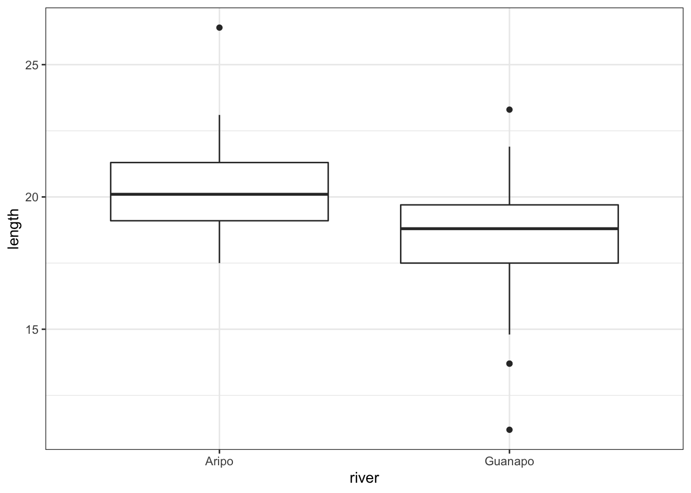
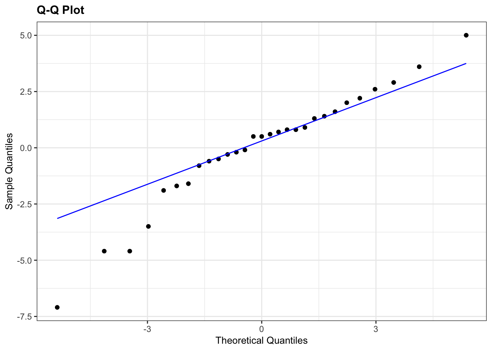
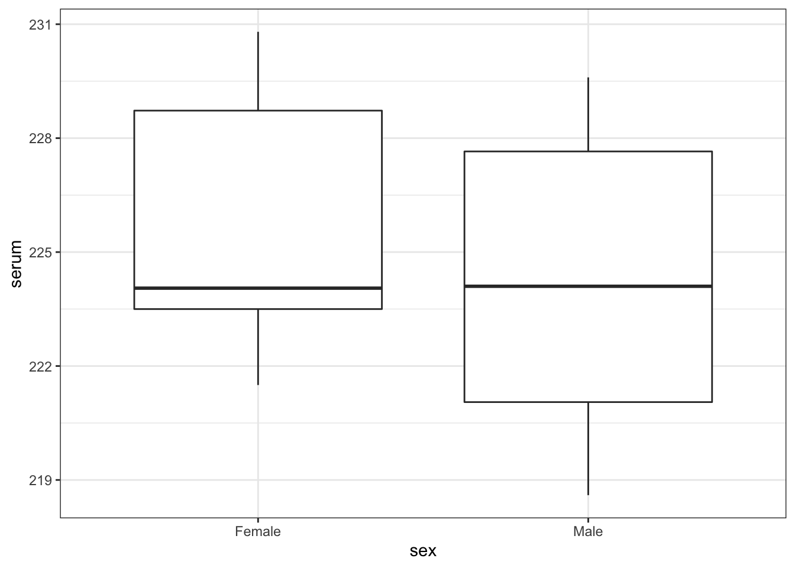
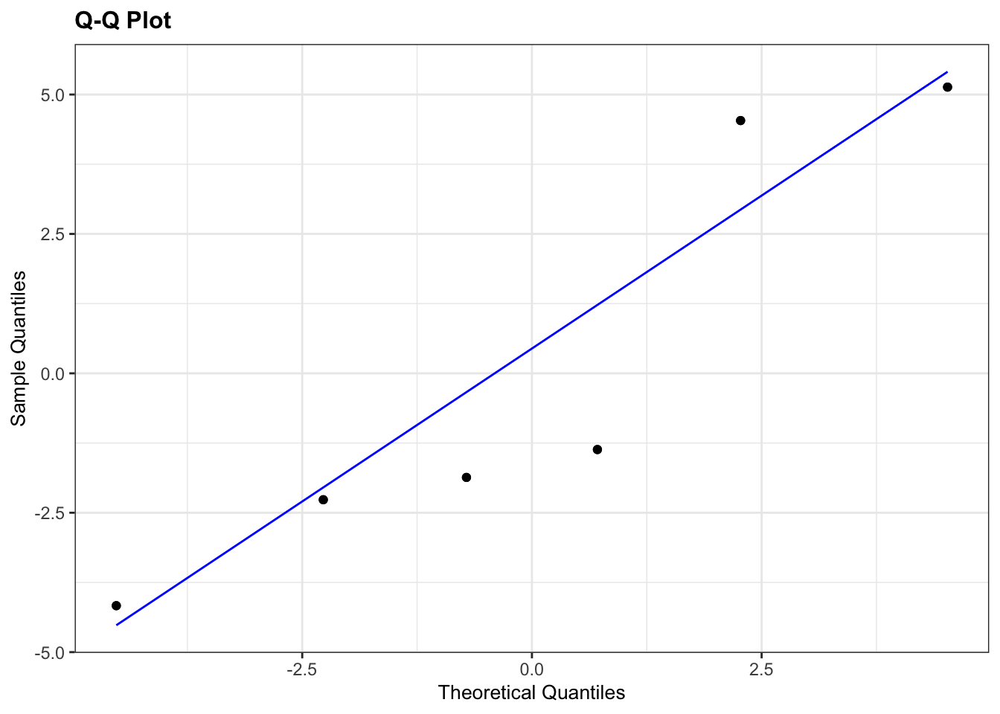

# Student's t-test {#cs1-students-t-test}
For this test we assume that both sample data sets are **normally distributed** and have **equal variance**. We test to see if the means of the two samples differ significantly from each other. 

:::note
The language used in this section is slightly different to that used in section \@ref(cs1-one-sample-tests). Although the language used in section \@ref(cs1-one-sample-tests) was technically more correct, the sentences are somewhat more onerous to read. Here I’ve opted for an easier reading style at the expense of technical accuracy. Please feel free to re-write this section (at your own leisure).
:::

## Section commands
New commands used in this section:

| Function| Description|
|:- |:- |
|`aggregate()`| Splits the data into subsets, computes summary statistics for each, and returns the result in a convenient form |
|`unstack()`| Converts a stacked data frame into an unstacked data frame (or a list if the lengths of the samples are different) |
|`bartlett.test()`| Perform Bartlett's test for equality of variance (normally distributed data) |
|`leveneTest()`| Perform Levene's test for equality of variance (non-normally distributed data) |

## Data and hypotheses
For example, suppose we now measure the body lengths of male guppies (in mm) collected from two rivers in Trinidad; the Aripo and the Guanapo. We want to test whether the mean body length differs between samples. We form the following null and alternative hypotheses:

-	$H_0$: The mean body length does not differ between the two groups $(\mu A = \mu G)$
-	$H_1$: The mean body length does differ between the two groups $(\mu A \neq \mu G)$

We use a two-sample, two-tailed t-test to see if we can reject the null hypothesis.

-	We use a two-sample test because we now have two samples.
-	We use a two-tailed t-test because we want to know if our data suggest that the true (population) means are different from one another rather than that one mean is specifically bigger or smaller than the other.
-	We’re using Student’s t-test because the sample sizes are big and because we’re assuming that the parent populations have equal variance (We can check this later).

The data are stored in stacked format in the file `data/raw/CS1-twosample.csv`.

Read this into R:


```r
rivers <- read_csv("data/raw/CS1-twosample.csv")
```

## Summarise and visualise {#cs1-students-sumvisual}
Let's summarise the data...


```r
rivers %>% 
  summary()
```

```
##      length         river          
##  Min.   :11.20   Length:68         
##  1st Qu.:18.40   Class :character  
##  Median :19.30   Mode  :character  
##  Mean   :19.46                     
##  3rd Qu.:20.93                     
##  Max.   :26.40
```

and visualise it:


```r
rivers %>% 
  ggplot(aes(x = river, y = length)) +
  geom_boxplot()
```



The boxplot does appear to suggest that the two samples have different means, and moreover that the guppies in Guanapo may be smaller than the guppies in Aripo. It isn’t immediately obvious that the two populations don’t have equal variances though, so we plough on.

## Assumptions
In order to use a Student’s t-test (and for the results to be strictly valid) we have to make three assumptions:

1.	The parent distributions from which the samples are taken are both normally distributed (which would lead to the sample data being normally distributed too).
2.	Each data point in the samples is independent of the others.
3.	The parent distributions should have the same variance.

In this example the first assumption can be ignored as the sample sizes are large enough (because of maths, with Aripo containing 39 and Guanapo 29 samples). If the samples were smaller then we would use the tests from the previous section.

The second point we can do nothing about unless we know how the data were collected, so again we ignore it.

The third point regarding equality of variance can be tested using either Bartlett’s test (if the samples are normally distributed) or Levene’s test (if the samples are not normally distributed).
This is where it gets a bit trickier. Although we don’t care if the samples are normally distributed for the t-test to be valid (because the sample size is big enough to compensate), we do need to know if they are normally distributed in order to decide which variance test to use.

So we perform a [Shapiro-Wilk test](#shapiro-wilk-test) on both samples separately. Before we can do that, we need to do a little bit of data wrangling.

* we load the `broom` package (comes installed with `tidyverse`) to access the `tidy()` function. This is a very handy function that converts the output of different types of objects into a tidy format.


```r
rivers %>% 
  group_by(river) %>% 
  shapiro_test(length)
```

We can see that whilst the Guanapo data is probably normally distributed (p = 0.1764 > 0.05), the Aripo data is unlikely to be normally distributed (p = 0.02802 < 0.05). Remember that the p-value gives the probability of observing each sample if the parent population is actually normally distributed.

The Shapiro-Wilk test is quite sensitive to sample size. This means that if you have a large sample then even small deviations from normality will cause the sample to fail the test, whereas smaller samples are allowed to pass with much larger deviations. Here the Aripo data has nearly 40 points in it compared with the Guanapo data and so it is much easier for the Aripo sample to fail compared with the Guanapo data.

## Exercise: Q-Q plots rivers
:::exercise
Q-Q plots for `rivers` data

Create the Q-Q plots for the two samples and discuss with your neighbour what you see in light of the results from the above Shapiro-Wilk test.

<details><summary>Answer</summary>


```r
rivers %>% 
  group_by(river) %>%
  ggplot(aes(sample = length)) +
  stat_qq() +
  stat_qq_line(colour = "red") +
  facet_wrap(facets = vars(river))
```



The Q-Q plots mirror what we found with the Shapiro-Wilk tests: the data for Aripo are pretty normally distributed, whereas the assumption of normality for the Guanapo data is less certain.

</details>
:::

<br />

## Equality of variance
:::highlight
Remember that statistical tests do not provide answers, they merely suggest patterns. Human interpretation is still a crucial aspect to what we do.
:::

The Shapiro-Wilk test has shown that the data are not normal _enough_ and so in order to test for equality of variance we will use Levene’s test.

### Levene's test
Levene’s test is not included in the default R packages and may require the installation of an additional package called `car` (Companion to Applied Regression).

To install the `car` package, run the following command in your console:


```r
install.packages("car")
```

Alternatively, go to <kbd>Tools</kbd> > <kbd>Install packages...</kbd> > <kbd>Packages</kbd>, type in `car` and press <kbd>Install</kbd>

We can now perform Levene's test:


```r
leveneTest(length ~ river, data = rivers)
```

```
## Levene's Test for Homogeneity of Variance (center = median)
##       Df F value Pr(>F)
## group  1  1.7732 0.1876
##       66
```

Ignore any warning you might get about coercion to factors (the test needs to create grouped variables to work and R versions from 4.x onwards do not read in the data as factors).

The key bit of information is the 3rd line under the text `Pr(>F)`. This is the p-value (0.1876) for this test. And this tells us the probability of observing these two samples if they come from distributions with the same variance. As this probability is greater than our arbitrary significance level of 0.05 then we can be somewhat confident that the necessary assumptions for carrying out Student’s t-test on these two samples was valid. (Once again woohoo!)

### Bartlett's test
If we had wanted to carry out Bartlett’s test (i.e. if the data _had_ been sufficiently normally distributed) then the command would have been:


```r
bartlett.test(length ~ river, data = rivers)
```

```
## 
## 	Bartlett test of homogeneity of variances
## 
## data:  length by river
## Bartlett's K-squared = 4.4734, df = 1, p-value = 0.03443
```

The relevant p-value is given on the 3rd line.

## Implement test
In this case we're ignoring the fact that the data are not normal enough, according to the Shapiro-Wilk test. However, because the sample sizes are pretty large and the t-test is also pretty robust in this case, we can perform a t-test. Remember, this is only allowed because the variances of the two groups (Aripo and Guanapo) are equal.

Perform a two-sample, two-tailed, t-test:


```r
t.test(length ~ river, data = rivers,
       alternative = "two.sided",
       var.equal = TRUE)
```

In this case, with the data in stacked format:

-	The first argument must be in the formula format: `variables ~ category`
-	The second argument must be the name of the data frame
-	The third argument gives the type of alternative hypothesis and must be one of `two.sided`, `greater` or `less` 
-	The fourth argument says whether the variance of the two samples can be assumed to be equal (Student's t-test) or unequal (Welch's t-test)

## Interpret output and report results
Let's look at the results of the t-test that we performed on the original (stacked) data frame:


```
## 
## 	Two Sample t-test
## 
## data:  length by river
## t = 3.8433, df = 66, p-value = 0.0002754
## alternative hypothesis: true difference in means between group Aripo and group Guanapo is not equal to 0
## 95 percent confidence interval:
##  0.9774482 3.0909868
## sample estimates:
##   mean in group Aripo mean in group Guanapo 
##              20.33077              18.29655
```

-	The 1st line gives the name of the test and the 2nd line reminds you what the dataset was called, and what variables were used.
-	The 3rd line contains the three key outputs from the test:
    - The calculated t-value is 3.8433 (we need this for reporting)
    - There are 66 degrees of freedom (we need this for reporting)
    - The p-value is 0.0002754. 
-	The 4th line simply states the alternative hypothesis in terms of the difference between the two sample means (testing if the two sample means are different is equivalent to testing whether the difference in the means is equal to zero).
-	The 5th and 6th lines give the 95th confidence interval (we don’t need to know this here).
-	The 7th, 8th and 9th lines give the sample means for each group (20.33077 in Aripo and 18.29655 in Guanapo) which we found earlier.

Again, the p-value on the 3rd line is what we’re most interested in. Since the p-value is very small (much smaller than the standard significance level) we choose to say "that it is very unlikely that these two samples came from the same parent distribution and as such we can reject our null hypothesis" and state that:

> A Student’s t-test indicated that the mean body length of male guppies in the Guanapo river (18.29 mm) differs significantly from the mean body length of male guppies in the Aripo river (20.33 mm) (t = 3.8433, df = 66, p = 0.0003).

Now there's a conversation starter.

## Exercise: Turtles
:::exercise
Serum cholesterol concentrations in turtles

Using the following data, test the null hypothesis that male and female turtles have the same mean serum cholesterol concentrations.

<table class="table table-striped" style="width: auto !important; margin-left: auto; margin-right: auto;">
 <thead>
  <tr>
   <th style="text-align:right;"> Male </th>
   <th style="text-align:right;"> Female </th>
  </tr>
 </thead>
<tbody>
  <tr>
   <td style="text-align:right;"> 220.1 </td>
   <td style="text-align:right;"> 223.4 </td>
  </tr>
  <tr>
   <td style="text-align:right;"> 218.6 </td>
   <td style="text-align:right;"> 221.5 </td>
  </tr>
  <tr>
   <td style="text-align:right;"> 229.6 </td>
   <td style="text-align:right;"> 230.2 </td>
  </tr>
  <tr>
   <td style="text-align:right;"> 228.8 </td>
   <td style="text-align:right;"> 224.3 </td>
  </tr>
  <tr>
   <td style="text-align:right;"> 222.0 </td>
   <td style="text-align:right;"> 223.8 </td>
  </tr>
  <tr>
   <td style="text-align:right;"> 224.1 </td>
   <td style="text-align:right;"> 230.8 </td>
  </tr>
  <tr>
   <td style="text-align:right;"> 226.5 </td>
   <td style="text-align:right;"> NA </td>
  </tr>
</tbody>
</table>

1. Write down the null and alternative hypotheses
2. Choose a representation for the data (stacked or unstacked) and create a `csv` file
3. Import the data into R
4. Summarise and visualise the data
5. Check your assumptions (normality and variance) using appropriate tests and plots
6. Perform a two-sample t-test
7. Write down a sentence that summarises the results that you have found 

<details><summary>Answer</summary>

**1. Hypotheses**

$H_0$ : male mean $=$ female mean

$H_1$ : male mean $\neq$ female mean

**2-4. Import Data, Summarise and visualise**

I'd always recommend storing data in tidy, stacked format (in fact I can't think of any situation where I would want to store data in an untidy, unstacked format!) So for this example I manually input the data into Excel in the following layout, saving the data as a CSV file and reading it in:


```r
turtle <- read.csv("data/examples/cs1-turtle.csv")

turtle
```

```
##    serum    sex
## 1  220.1   Male
## 2  218.6   Male
## 3  229.6   Male
## 4  228.8   Male
## 5  222.0   Male
## 6  224.1   Male
## 7  226.5   Male
## 8  223.4 Female
## 9  221.5 Female
## 10 230.2 Female
## 11 224.3 Female
## 12 223.8 Female
## 13 230.8 Female
```

Let's summarise the data...


```r
aggregate(serum ~ sex , data = turtle, summary)
```

```
##      sex serum.Min. serum.1st Qu. serum.Median serum.Mean serum.3rd Qu.
## 1 Female   221.5000      223.5000     224.0500   225.6667      228.7250
## 2   Male   218.6000      221.0500     224.1000   224.2429      227.6500
##   serum.Max.
## 1   230.8000
## 2   229.6000
```

and visualise the data:


```r
boxplot(serum ~ sex , data = turtle)
```



As always we use the plot and summary to assess three things:

1. Does it look like we've loaded the data in correctly?
    * We have two groups and the extreme values of our plots seem to match with our dataset, so I'm happy that we haven't done anything massively wrong here.
2.  Do we think that there is a difference between the two groups?
    * We need the result of the formal test to make sense given the data, so it's important to develop a sense of what we think is going to happen here. Whilst the ranges of the two groups suggests that the Female serum levels might be higher than the males when we look at things more closely we realise that isn't the case. The boxplot shows that the median values of the two groups is virtually identical and this is backed up by the summary statistics we calculated: the medians are both about 224.1, and the means are fairly close too (225.7 vs 224.2). Based on this, and the fact that there are only 13 observations in total I would be very surprised if any test came back showing that there was a difference between the groups.
3. What do we think about assumptions?
    * Normality looks a bit worrying: whilst the Male group appears nice and symmetric (and so might be normal), the Female group appears to be quite skewed (since the median is much closer to the bottom than the top). We'll have to look carefully at the more formal checks to decided whether we think the data are normal enough for us to use a t-test.
    * Homogeneity of variance. At this stage the spread of the data within each group looks similar, but because of the potential skew in the Female group we'll again want to check the assumptions carefully.


**5. Check Assumptions**

**Normality**

Let's look at the normality of each of the groups separately. There are several ways of getting at the `serum` values for Males and Females separately. We'll use the unstacking method, then use Shapiro-Wilk followed by qqplots.


```r
uns_turtle <- unstack(turtle, serum ~ sex)
shapiro.test(uns_turtle$Male)
```

```
## 
## 	Shapiro-Wilk normality test
## 
## data:  uns_turtle$Male
## W = 0.94392, p-value = 0.6743
```

```r
shapiro.test(uns_turtle$Female)
```

```
## 
## 	Shapiro-Wilk normality test
## 
## data:  uns_turtle$Female
## W = 0.84178, p-value = 0.1349
```

The p-values for both Shapiro-Wilk tests are non-significant which suggests that the data are normal enough. This is a bit surprising given what we saw in the boxplot but there are two bits of information that we can use to reassure us.

1. The p-value for the Female group is smaller than for the Male group (suggesting that the Female group is closer to being non-normal than the Male group) which makes sense.
2. The Shapiro-Wilk test is generally quite relaxed about normality for small sample sizes (and notoriously strict for very large sample sizes). For a group with only 6 data points in it, the data would actually have to have a really, really skewed distribution. Given that the Female group only has 6 data points in it, it's not too surprising that the Shapiro-Wilk test came back saying everything is OK.


```r
par(mfrow=c(1,2))
qqnorm(uns_turtle$Male, main = "Male")
qqline(uns_turtle$Male, col = "red")
qqnorm(uns_turtle$Female, main = "Female")
qqline(uns_turtle$Female, col = "red")
```



The results from the Q-Q plots echo what we've already seen from the Shapiro-Wilk analyses. The Male group doesn't look too bad whereas the Female group looks somewhat dodgy.

Overall, the assumption of normality of the data doesn't appear to be very well met at all, but we do have to bear in mind that there are only a few data points in each group and we might just be seeing this pattern in the data due to random chance rather than because the underlying populations are actually not normally distributed. Personally, though I'd edge towards non-normal here.

**Homogeneity of Variance**

It's not clear whether the data are normal or not, so it isn't clear which test to use here. The sensible approach is to do both and hope that they agree (fingers crossed!)

Bartlett's test gives us:


```r
bartlett.test(serum ~ sex, turtle)
```

```
## 
## 	Bartlett test of homogeneity of variances
## 
## data:  serum by sex
## Bartlett's K-squared = 0.045377, df = 1, p-value = 0.8313
```

and Levene's test gives us:


```r
# load if needed
# library(car)

leveneTest(serum ~ sex, turtle)
```

```
## Levene's Test for Homogeneity of Variance (center = median)
##       Df F value Pr(>F)
## group  1  0.2434 0.6315
##       11
```

The good news is that both Levene and Bartlett agree that there is homogeneity of variance between the two groups (thank goodness!).

Overall, what this means is that we're not too sure about normality, but that homogeneity of variance is pretty good.

**6. Carry out a two-sample t-test**

Because of the result of the Bartlett test I know that I can carry out a two-sample Student's t-test (as opposed to a two-sample Welch's t-test, if you're confused, see Figure \@ref(fig:fig-cs1-diagram-which-test))


```r
t.test(serum ~ sex , turtle,
       alternative="two.sided",
       var.equal=TRUE)
```

```
## 
## 	Two Sample t-test
## 
## data:  serum by sex
## t = 0.62681, df = 11, p-value = 0.5436
## alternative hypothesis: true difference in means between group Female and group Male is not equal to 0
## 95 percent confidence interval:
##  -3.575759  6.423378
## sample estimates:
## mean in group Female   mean in group Male 
##             225.6667             224.2429
```

With a p-value of 0.544, this test tells me that there is insufficient evidence to suggest that the means of the two groups are different. A suitable summary sentence would be:

> A Student's two-sample t-test indicated that the mean serum cholesterol level did not differ significantly between Male and Female turtles (t = 0.627, df = 11, p = 0.544).

**Discussion**

In reality, because of the ambiguous normality assumption assessment, for this dataset I would actually carry out two different tests; the two-sample t-test with equal variance and the Mann-Whitney U test. If both of them agreed then it wouldn't matter too much which one I reported (I'd personally report both with a short sentence to say that I'm doing that because it wasn't clear whether the assumption of normality had or had not been met), but it would be acceptable to report just one. 

</details>
:::
