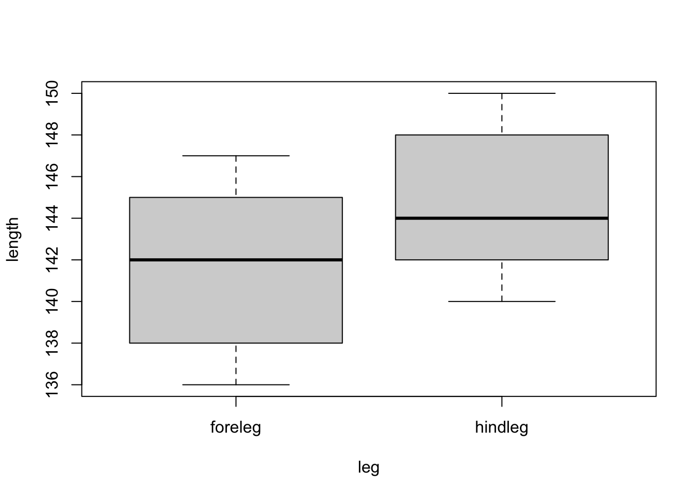
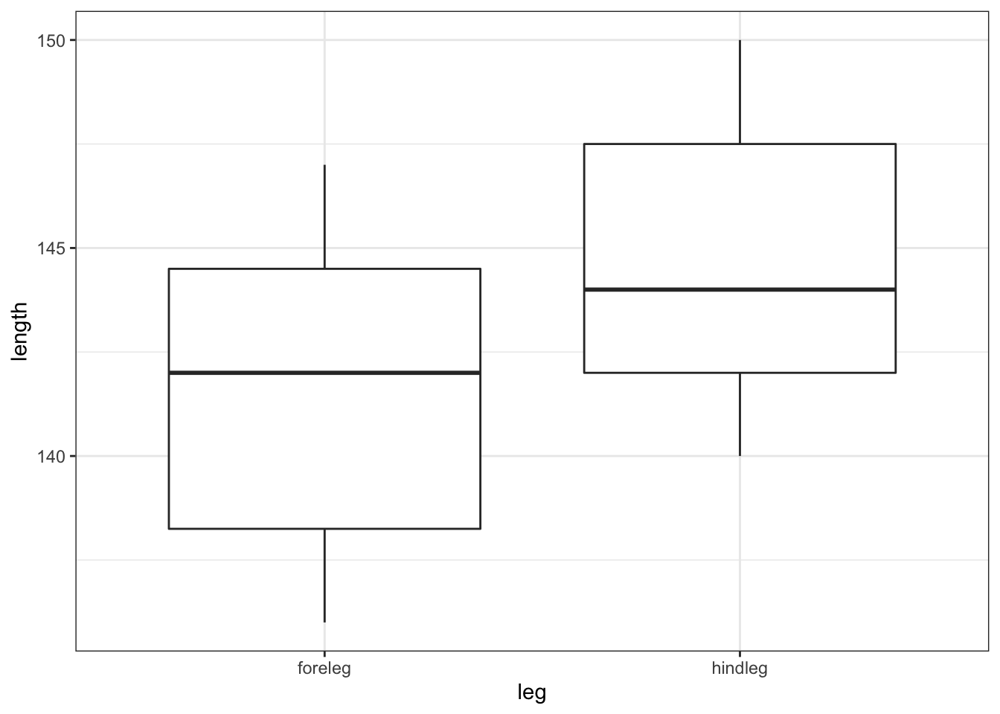
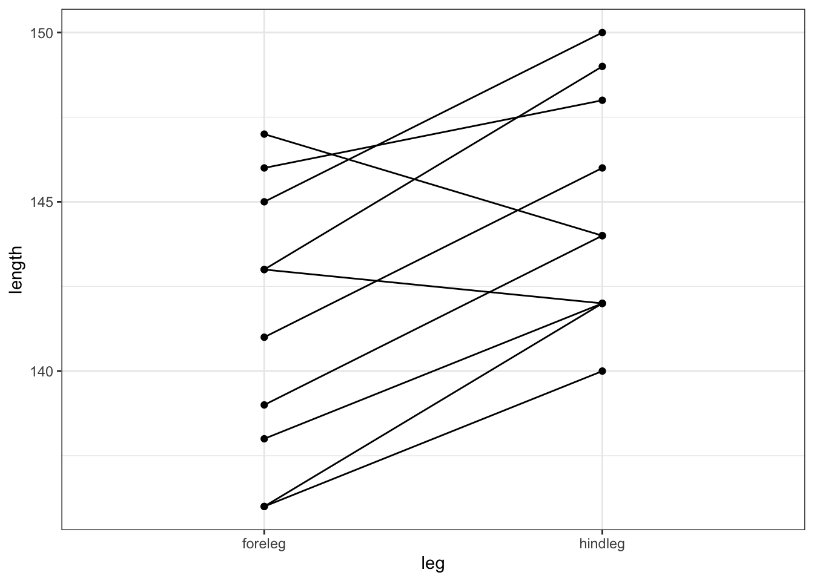

# Wilcoxon signed-rank test {#cs1-twosample-wilcoxon-signed-rank}
A Wilcoxon signed-rank test is an alternative to a paired t-test. It does not require that the data are drawn from normal distributions, but it does require that the distribution of the differences is symmetric. We’re effectively testing to see if the median of the differences between the two samples differs significantly from zero.

## Section commands
There are no new commands in this section.

## Data and hypotheses
Using the `cortisol` dataset from before we form the following null and alternative hypotheses:

-	$H_0$: The median of the difference in cortisol levels between the two groups is 0 $(\mu M = \mu E)$
-	$H_1$: The median of the difference in cortisol levels between the two groups is not 0 $(\mu M \neq \mu E)$

We use a two-tailed Wilcoxon signed-rank test to see if we can reject the null hypothesis.

## Summarise and visualise
Already implemented previously.

## Assumptions
These have been checked previously.

## Implement test
Perform a two-tailed, Wilcoxon signed-rank test:


```r
wilcox.test(cortisol$morning, cortisol$evening,
            alternative = "two.sided", paired = TRUE)
```

-	The first two arguments must be the two samples in numerical vector format
-	The second argument gives the type of alternative hypothesis and must be one of `two.sided`, `greater` or `less`
-	The third argument indicates that the test is paired

## Interpret output and report results

```
## 
## 	Wilcoxon signed rank exact test
## 
## data:  cortisol$morning and cortisol$evening
## V = 197, p-value = 0.0001678
## alternative hypothesis: true location shift is not equal to 0
```

The p value is given on the 3rd line (p-value = 0.0001678). Given that this is less than 0.05 we can still reject the null hypothesis.

> A two-tailed, Wilcoxon signed-rank test indicated that the median cortisol level in adult females differed significantly between the morning (320.5 nmol/l) and the evening (188.9 nmol/l) (V = 197, p = 0.00017).

## Exercise
:::exercise
Deer legs

Using the following data, test the null hypothesis that the fore and hind legs of deer are the same length.


```
## # A tibble: 10 × 2
##    hindleg foreleg
##      <dbl>   <dbl>
##  1     142     138
##  2     140     136
##  3     144     147
##  4     144     139
##  5     142     143
##  6     146     141
##  7     149     143
##  8     150     145
##  9     142     136
## 10     148     146
```

Do these results provide any evidence to suggest that fore- and hind-leg length differ in deer?

1. Write down the null and alternative hypotheses
2. Choose a representation for the data (stacked or unstacked) and create a csv file
3. Import the data into R
4. Summarise and visualise the data
5. Perform a two-sample paired t-test
6. Perform a Wilcoxon signed-rank test
7. Now check your assumptions (normality and variance) using appropriate tests
8. Discuss with your (virtual) neighbour which test is most appropriate?
9. Write down a sentence that summarise the results that you have found

<details><summary>Answer</summary>

**1. Hypotheses**

$H_0$ : foreleg average (mean or median) $=$ hindleg average (mean or median)

$H_1$ : foreleg average $\neq$ hindleg average

**2-4. Import Data, Summarise and visualise**

I always recommend storing data in stacked format even in this example, even though in this case it might seem easier to store your data in unstacked format (this is pretty much the only time where this is even a sensible option).  So for this example I manually input the data into excel in the following layout:


```r
deer <- read.csv("data/examples/cs1-deer.csv")
```


```
## # A tibble: 20 × 3
##       id leg     length
##    <dbl> <chr>    <dbl>
##  1     1 hindleg    142
##  2     2 hindleg    140
##  3     3 hindleg    144
##  4     4 hindleg    144
##  5     5 hindleg    142
##  6     6 hindleg    146
##  7     7 hindleg    149
##  8     8 hindleg    150
##  9     9 hindleg    142
## 10    10 hindleg    148
## 11     1 foreleg    138
## 12     2 foreleg    136
## 13     3 foreleg    147
## 14     4 foreleg    139
## 15     5 foreleg    143
## 16     6 foreleg    141
## 17     7 foreleg    143
## 18     8 foreleg    145
## 19     9 foreleg    136
## 20    10 foreleg    146
```

The ordering of the data is important here; the first hindleg row corresponds to the first foreleg row, the second to the second and so on. To indicate this we use an `id` column, where each observation has a unique ID.

Let's look at the data and see what we can see.


```r
aggregate(length ~ leg, data = deer, summary)
```

```
##       leg length.Min. length.1st Qu. length.Median length.Mean length.3rd Qu.
## 1 foreleg      136.00         138.25        142.00      141.40         144.50
## 2 hindleg      140.00         142.00        144.00      144.70         147.50
##   length.Max.
## 1      147.00
## 2      150.00
```

```r
boxplot(length ~ leg, data = deer)
```



It looks as though there might be a difference between the legs, with hindlegs being longer than forelegs. However, this representation obscures the fact that we have _paired_ data. What we really need to look at is the difference in leg length for each deer:


```r
uns_deer <- unstack(deer, length ~ leg)
deerDiff <- uns_deer$hindleg - uns_deer$foreleg
summary(deerDiff)
```

```
##    Min. 1st Qu.  Median    Mean 3rd Qu.    Max. 
##    -3.0     2.5     4.5     3.3     5.0     6.0
```

```r
boxplot(deerDiff)
```



This gives us a much clearer picture. It looks as though the hindlegs are about 4 cm longer than the forelegs, on average. It also suggests that our leg differences might not be normally distributed (the data look a bit skewed).

**5. Perform a two-sample t-test**


```r
t.test(length ~ leg, data = deer, paired = TRUE)
```

```
## 
## 	Paired t-test
## 
## data:  length by leg
## t = -3.4138, df = 9, p-value = 0.007703
## alternative hypothesis: true difference in means is not equal to 0
## 95 percent confidence interval:
##  -5.486752 -1.113248
## sample estimates:
## mean of the differences 
##                    -3.3
```

The paired t-test here assumes that the data is stored exactly as we have entered it (i.e. that the first hindleg row matches the first foreleg row). Here we apparently see a significant difference.

**6. Perform a paired Wilcoxon test**


```r
wilcox.test(length ~ leg, data = deer, paired = TRUE)
```

```
## Warning in wilcox.test.default(x = c(138L, 136L, 147L, 139L, 143L, 141L, :
## cannot compute exact p-value with ties
```

```
## 
## 	Wilcoxon signed rank test with continuity correction
## 
## data:  length by leg
## V = 4, p-value = 0.01859
## alternative hypothesis: true location shift is not equal to 0
```

The paired Wilcoxon test makes the same assumptions about the order of the data as the paired t-test. Here again we have a significant difference.

**7. Check assumptions**

We need to consider the distribution of the _difference_ in leg lengths rather than the individual distributions.


```r
shapiro.test(deerDiff)
```

```
## 
## 	Shapiro-Wilk normality test
## 
## data:  deerDiff
## W = 0.81366, p-value = 0.02123
```

```r
qqnorm(deerDiff)
qqline(deerDiff, col = "red")
```



Both our Shapiro-Wilk test and our Q-Q plot suggest that the difference data aren't normally distributed, which rules out a paired t-test. We should therefore consider a paired Wilcoxon test next. Remember that this test requires that the distribution of differences be symmetric, whereas our box-plot from before suggested that the data were very much skewed.

**8. Conclusions**

So, frustratingly, neither of our tests are appropriate for this dataset. The differences in fore- and hind leg lengths are neither normal enough for a paired t-test nor are they symmetric enough for a Wilcoxon test and we don't have enough data to just use the t-test (we'd need more than 30 points or so). So what do we do in this situation? Well the answer is that there aren't actually any traditional statistical tests that are valid for this dataset as it stands!

There are two options available to someone:

1. try transforming the raw data (take logs, square root, reciprocals) and hope that one of them leads to a modified dataset that satisfies the assumptions of one of the tests we've covered, or
2. use a permutation test approach (which would work but is beyond the scope of this course).

The reason I included this example in the first practical is purely to illustrate how a very simple dataset with an apparently clear message (leg lengths differ within deer) can be intractable. You don't need to have very complex datasets before you go beyond the capabilities of classical statistics.

As Jeremy Clarkson [would put it](https://www.quotes.net/mquote/941330):

> And on that bombshell, it's time to end. Goodnight!

</details>
:::

## Key points

:::keypoints
- We use two-sample tests to see if two samples of continuous data come from the same parent distribution
- This essentially boils down to testing if the mean or median differs between the two samples
- There are 5 key two-sample tests: Student's t-test, Welch's t-test, Mann-Whitney U test, paired t-test and Wilcoxon signed-rank test
- Which one you use depends on normality of the distribution, sample size, paired or unpaired data and variance of the samples
- Parametric tests are used if the data are normally distributed or the sample size is large
- Non-parametric tests are used if the data are not normally distributed _and_ the sample size is small
- Equality of variance then determines which test is appropriate
- You [can ask yourself](#two-sample-choosing-a-test) 3 questions to determine the test:
    1. is my data paired?
    2. do I need a parametric or non-parametric test
    3. can I assume equality of variance?
:::
