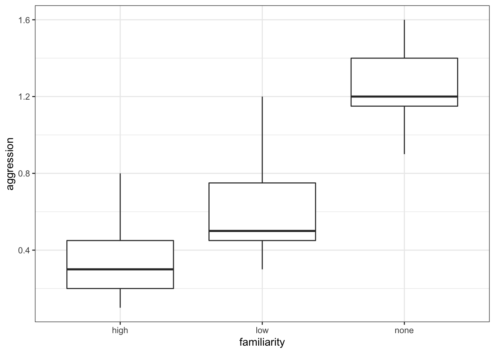

# Kruskal-Wallis test

## Objectives
:::objectives
**Questions**

- How do I analyse multiple samples of continuous data if the data are not normally distributed?
- What is a Kruskal-Wallis test?
- How do I check for differences between groups?

**Objectives**

- Be able to perform an Kruskal-Wallis test in R
- Understand the output of the test and evaluate the assumptions
- Be able to perform post-hoc testing after a Kruskal-Wallis test
:::

## Purpose and aim
The Kruskal-Wallis one-way analysis of variance test is an analogue of ANOVA that can be used when the assumption of normality cannot be met. In this way it is an extension of the Mann-Whitney test for two groups.

## Section commands
New commands used in this section:

| Function| Description|
|:- |:- |
|`kruskal.test()`| Performs the Kruskal-Wallis test |
|`dunn.test()`| Performs Dunn's test |

## Data and hypotheses
For example, suppose a behavioural ecologist records the rate at which [spider monkeys](https://en.wikipedia.org/wiki/Spider_monkey) behaved aggressively towards one another as a function of closely related the two monkeys are. The familiarity of the two monkeys involved in each interaction is classified as `high`, `low` or `none.` We want to test if the data support the hypothesis that aggression rates differ according to strength of relatedness. We form the following null and alternative hypotheses:

-	$H_0$: The median aggression rates for all types of familiarity are the same
-	$H_1$: The median aggression rates are not all equal

We will use a Kruskal-Wallis test to check this.

The data are stored in the file `data/raw/CS2-spidermonkey.csv`.

First we read the data in:


```r
spidermonkey <- read.csv("data/raw/CS2-spidermonkey.csv")
```

## Summarise and visualise


```r
# look at the data format
head(spidermonkey)
```

```
##   aggression familiarity
## 1        0.2        high
## 2        0.1        high
## 3        0.4        high
## 4        0.8        high
## 5        0.3        high
## 6        0.5        high
```

```r
# summarise the data
aggregate(aggression ~ familiarity, data = spidermonkey, summary)
```

```
##   familiarity aggression.Min. aggression.1st Qu. aggression.Median
## 1        high       0.1000000          0.2000000         0.3000000
## 2         low       0.3000000          0.4500000         0.5000000
## 3        none       0.9000000          1.1500000         1.2000000
##   aggression.Mean aggression.3rd Qu. aggression.Max.
## 1       0.3571429          0.4500000       0.8000000
## 2       0.6285714          0.7500000       1.2000000
## 3       1.2571429          1.4000000       1.6000000
```

```r
# create boxplot
boxplot(aggression ~ familiarity, data = spidermonkey)
```



The data appear to show a very significant difference in aggression rates between the three types of familiarity. We would probably expect a reasonably significant result here.

## Implement test
Perform a Kruskal-Wallis test on the data:


```r
kruskal.test(aggression ~ familiarity, data = spidermonkey)
```

-	The first argument must be in the formula format: `variable ~ category`
-	If the data are stored in stacked format, then the second argument must be the name of the data frame

## Interpret output and report results
This is the output that you should now see in the console window:


```
## 
## 	Kruskal-Wallis rank sum test
## 
## data:  aggression by familiarity
## Kruskal-Wallis chi-squared = 13.597, df = 2, p-value = 0.001115
```

The p-value is given in the 3rd line. This shows us the probability of getting samples such as ours if the null hypothesis were actually true.

Since the p-value is very small (much smaller than the standard significance level of 0.05) we can say "that it is very unlikely that these three samples came from the same parent distribution and as such we can reject our null hypothesis" and state that:

> A one-way Kruskal-Wallis rank sum test showed that aggression rates between spidermonkeys depends upon the degree of familiarity between them (KW = 13.597, df = 2, p = 0.0011).

## Assumptions
To use the Kruskal-Wallis test we have to make three assumptions:

1.	The parent distributions from which the samples are drawn have the same shape (if they’re normal then we should use a one-way ANOVA)
2.	Each data point in the samples is independent of the others
3.	The parent distributions should have the same variance

Independence we’ll ignore as usual. Similar shape is best assessed from the earlier visualisation of the data. That means that we only need to check equality of variance.

**Equality of variance**

We test for equality of variance using Levene’s test (since we can’t assume normal parent distributions which rules out Bartlett’s test).

Levene’s test is not included in the default R packages and may require the installation of an additional package called `car` (Companion to Applied Regression).

To install the `car` package, run the following command in your console:


```r
install.packages("car")
```

Alternatively, go to <kbd>Tools</kbd> > <kbd>Install packages...</kbd> > <kbd>Packages</kbd>, type in `car` and press <kbd>Install</kbd>

Remember to load the library with `library(car)`.

Perform Levene's test on the data:


```r
leveneTest(aggression ~ familiarity, data = spidermonkey)
```

```
## Warning in leveneTest.default(y = y, group = group, ...): group coerced to
## factor.
```

```
## Levene's Test for Homogeneity of Variance (center = median)
##       Df F value Pr(>F)
## group  2  0.1139  0.893
##       18
```

The relevant p-value is given on the 3rd line (`Pr(>F) = 0.893`). As it is quite large we see that each group do appear to have the same variance.

There is also a warning about `group coerced to factor`. There is no need to worry about this - Levene's test needs to compare different groups and because `aggression` is encoded as a numeric value, it converts it to a categorical one before running the test.

## Post-hoc testing
The equivalent of Tukey’s range test for non-normal data is **Dunn’s test**.
Dunn’s test is also not included in the default R packages and may require the installation of an additional package called `dunn.test`.

To install the `dunn.test` package, run the following command in your console:


```r
install.packages("dunn.test")
```

Alternatively, go to <kbd>Tools</kbd> > <kbd>Install packages...</kbd> > <kbd>Packages</kbd>, type in `dunn.test` and press <kbd>Install</kbd>

Remember to load the library with `library(dunn.test)`.

Test for a significant difference in group medians:


```r
dunn.test(spidermonkey$aggression, spidermonkey$familiarity)
```

Note that Dunn’s test requires us to enter two arguments, the first is the vector of values and the second is the vector containing the category labels (i.e. the factor).

This will give the following output:


```
##   Kruskal-Wallis rank sum test
## 
## data: x and group
## Kruskal-Wallis chi-squared = 13.5972, df = 2, p-value = 0
## 
## 
##                            Comparison of x by group                            
##                                 (No adjustment)                                
## Col Mean-|
## Row Mean |       high        low
## ---------+----------------------
##      low |  -1.405820
##          |     0.0799
##          |
##     none |  -3.655132  -2.249312
##          |    0.0001*    0.0122*
## 
## alpha = 0.05
## Reject Ho if p <= alpha/2
```

You can see that the `dunn.test()` function also performs a Kruskal-Wallis test on the data, and these results are reported initially.

The comparison between the pairs of groups is reported in the table at the bottom. Each cell in the table has two rows. The bottom row contains the p-values that we want. This table shows that there isn’t a significant difference between the high and low groups, as the p-value (0.0799) is too high. The other two comparisons between the high familiarity and no familiarity groups and between the low and no groups are significant though.

## Exercise
:::exercise
Kruskal-Wallis and Dunn's test on lobster data

Perform a Kruskal-Wallis test and do a post-hoc test on the `lobster` data set.

<details><summary>Answer</summary>

**1. Hypotheses**

- $H_0$ : all medians are equal
- $H_1$ : not all medians are equal

**2. Import data, summarise and visualise**


All done previously.

**3. Assumptions**

From before, since the data are normal enough they are definitely similar enough for a Kruskal-Wallis test and they do all have equality of variance from out assessment of the diagnostic plots. For completeness though we will look at Levene's test


```r
leveneTest(weight ~ diet, data = lobsters)
```

```
## Levene's Test for Homogeneity of Variance (center = median)
##       Df F value Pr(>F)
## group  2  0.0028 0.9972
##       15
```

Given that the p-value is so high, this again agrees with our previous assessment that the equality of variance assumption is well met. Rock on.

**4. Kruskal-Wallis test**


```r
kruskal.test(weight ~ diet, data = lobsters)
```

```
## 
## 	Kruskal-Wallis rank sum test
## 
## data:  weight by diet
## Kruskal-Wallis chi-squared = 3.2565, df = 2, p-value = 0.1963
```

> A Kruskal-Wallis test indicated that the median weight of juvenile lobsters did not differ significantly between diets (KW = 3.26, df = 2, p = 0.20).

**5. Dunn's test**

Although rather unneccessary, since we did not detect any significant differences between diets, we can perform the non-parametric equivalent of Tukey's range test: Dunn's test.


```r
dunn.test(lobsters$weight, lobsters$diet, altp = TRUE)
```

```
##   Kruskal-Wallis rank sum test
## 
## data: x and group
## Kruskal-Wallis chi-squared = 3.2565, df = 2, p-value = 0.2
## 
## 
##                            Comparison of x by group                            
##                                 (No adjustment)                                
## Col Mean-|
## Row Mean |     Flakes    Mussels
## ---------+----------------------
##  Mussels |  -1.787664
##          |     0.0738
##          |
##  Pellets |  -0.670245   1.005415
##          |     0.5027     0.3147
## 
## alpha = 0.05
## Reject Ho if p <= alpha
```

Here, I've used an optional argument called `altp` in the `dunn.test()` call. The default option reports all p-values divided by 2. And assessment of significance requires you to compare each p-value to 0.025 rather than 0.05. Using the argument `altp = TRUE` means that Dunn's test reports actual p-values.

Either way, here we can see that none of the comparisons are significant (as before).

</details>
:::

## Key points

:::keypoints
- We use Kruskal-Wallis test to see if there is a difference in medians between multiple continuous variables
- In R we first define a linear model with `lm()`, using the format `response ~ predictor`
- Next, we perform a Kruskal-Wallis test on the linear model with `kruskal.test()`
- We assume parent distributions have the same shape; each data point is independent and the parent distributions have the same variance
- We test for equality of variance using `LeveneTest()` from the `car` package
- Post-hoc testing to check for significant differences in the group medians is done with `dunn.test()` from the `dunn.test` package
:::
