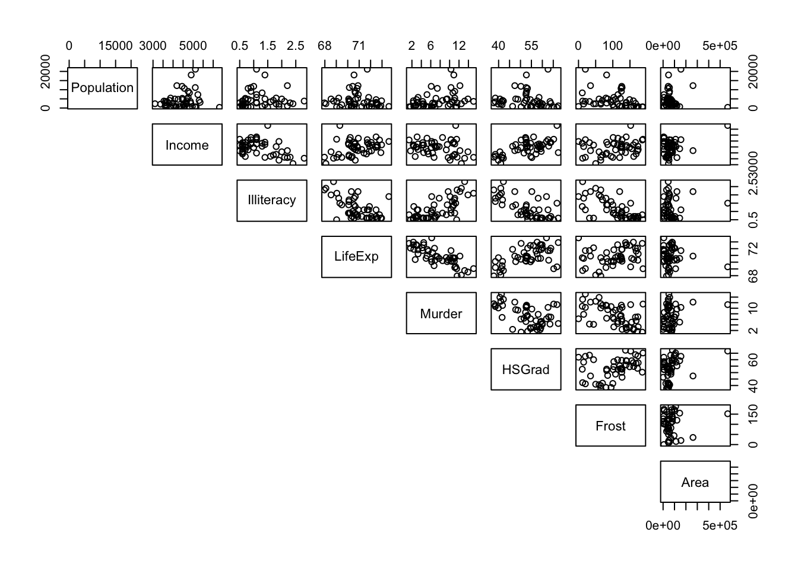
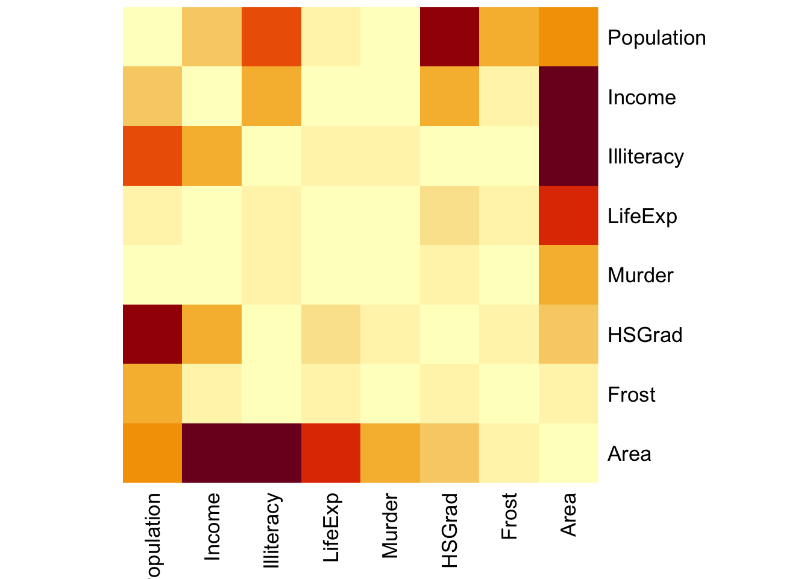
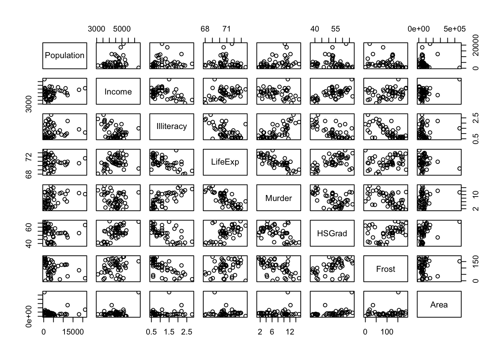

# Correlation coefficients

## Objectives
:::objectives
**Questions**

- What are correlation coefficients?
- What kind of correlation coefficients are there and when do I use them?

**Objectives**

- Be able to calculate correlation coefficients in R
- Use visual tools to explore correlations between variables
- Know the limitations of correlation coefficients
:::

## Purpose and aim
Correlation refers to the relationship of two variables (or datasets) to one another. Two datasets are said to be correlated if they are not independent from one another. Correlations can be useful because they can indicate if a predictive relationship may exist. However just because two datasets are correlated does not mean that they are causally related.

## Section commands
New commands used in this section:

| Function| Description|
|:- |:- |
|`cor()`| Calculates a correlation matrix |
|`pairs()`| Plots a matrix of scatter plots |

## Data and hypotheses
We will use the `USArrests` dataset for this example. This rather bleak dataset contains statistics in arrests per 100,000 residents for assault, murder and robbery in each of the 50 US states in 1973, alongside the proportion of the population who lived in urban areas at that time. `USArrests` is an unstacked data frame with 50 observations of four variables: `Murder`, `Assault`, `UrbanPop` and `Robbery`.

The data are stored in the file `data/raw/CS3-usarrests.csv`.

First we read in the data:


```r
USArrests <- read.csv("data/raw/CS3-usarrests.csv", row.names = 1)

# have a look at the data
head(USArrests)
```

```
##            Murder Assault UrbanPop Robbery
## Alabama      13.2     236       58    21.2
## Alaska       10.0     263       48    44.5
## Arizona       8.1     294       80    31.0
## Arkansas      8.8     190       50    19.5
## California    9.0     276       91    40.6
## Colorado      7.9     204       78    38.7
```

The syntax for reading in this data frame is a little different. Here we want to use the first column of the `.csv` file to specify the names of the rows of the dataset rather than to include the information inside the dataset itself. We do this by using the `row.names = 1` argument which tells R to use the 1st column of the file for the row names. We need to do this because some of the functions will be using require a _matrix_ as input (basically a data frame containing only numbers).

## Pearson’s product moment correlation coefficient
Pearson's r (as this quantity is also known) is a measure of the linear correlation between two variables. It has a value between -1 and +1, where +1 means a perfect positive correlation, -1 means a perfect negative correlation and 0 means no correlation at all.

## Summarise and visualise
Run this command:


```r
pairs(USArrests, lower.panel = NULL)
```


*	The first argument is a matrix or a data frame
*	The argument `lower.panel` tells R not to add the redundant reflected lower set of plots, below the diagonal 

From visual inspection of the scatter plots we can see that there appears to be a slight positive correlation between all pairs of variables, although this may be very weak in some case (`Murder` and `UrbanPop` for example).

## Implement test
Let's test if there are any possible correlations between the variables:


```r
cor(USArrests, method = "pearson")
```

*	The first argument is a matrix or a data frame
*	The argument `method` tells R which correlation coefficient to use (`pearson` (default), `kendall`, or `spearman`)

## Interpret output and report results
This should give the following output:


```
##              Murder   Assault   UrbanPop   Robbery
## Murder   1.00000000 0.8018733 0.06957262 0.5635788
## Assault  0.80187331 1.0000000 0.25887170 0.6652412
## UrbanPop 0.06957262 0.2588717 1.00000000 0.4113412
## Robbery  0.56357883 0.6652412 0.41134124 1.0000000
```

The matrix gives the correlation coefficient between each pair of variables in the data frame. The matrix is symmetric (_why?_) and the diagonal values are all 1 (_why?_). The most correlated variables are `Murder` and `Assault` with an `r` value of 0.801. This appears to agree well with the set of scatter plots that we produced earlier.

## Exercise
:::exercise
State data correlation

We will use the data from the file `data/raw/CS3-statedata.csv` dataset for this exercise. This rather more benign dataset contains information on more general properties of each US state, such as population (1975), per capita income (1974), illiteracy proportion (1970), life expectancy (1969), murder rate per 100,000 people (there's no getting away from it), percentage of the population who are high-school graduates, average number of days where the minimum temperature is below freezing between 1931 and 1960, and the state area in square miles. The dataset contains 50 rows and 8 columns, with column names: `Population`, `Income`, `Illiteracy`, `Life.Exp`, `Murder`, `HS.Grad`, `Frost` and `Area`.

Load in the data (remembering to tell R that the first column of the CSV file should be used to specify the row names of the dataset) and use the pairs command to visually identify 3 different pairs of variables that appear to be

1.	the most positively correlated
2.	the most negatively correlated
3.	not correlated at all

Calculate Pearson’s r for all variable pairs and see how well you were able to identify correlation visually.

<details><summary>Answer</summary>

**1. Read in the data**


```r
USAstate <- read.csv("data/raw/CS3-statedata.csv",
                     row.names = 1)

# have a look at the data
head(USAstate)
```

```
##            Population Income Illiteracy LifeExp Murder HSGrad Frost   Area
## Alabama          3615   3624        2.1   69.05   15.1   41.3    20  50708
## Alaska            365   6315        1.5   69.31   11.3   66.7   152 566432
## Arizona          2212   4530        1.8   70.55    7.8   58.1    15 113417
## Arkansas         2110   3378        1.9   70.66   10.1   39.9    65  51945
## California      21198   5114        1.1   71.71   10.3   62.6    20 156361
## Colorado         2541   4884        0.7   72.06    6.8   63.9   166 103766
```

**2. Look at the pair-wise comparisons**


```r
pairs(USAstate, lower.panel = NULL)
```



**3. Create a correlation matrix**


```r
cor(USAstate, method = "pearson")
```

```
##             Population     Income  Illiteracy     LifeExp     Murder
## Population  1.00000000  0.2082276  0.10762237 -0.06805195  0.3436428
## Income      0.20822756  1.0000000 -0.43707519  0.34025534 -0.2300776
## Illiteracy  0.10762237 -0.4370752  1.00000000 -0.58847793  0.7029752
## LifeExp    -0.06805195  0.3402553 -0.58847793  1.00000000 -0.7808458
## Murder      0.34364275 -0.2300776  0.70297520 -0.78084575  1.0000000
## HSGrad     -0.09848975  0.6199323 -0.65718861  0.58221620 -0.4879710
## Frost      -0.33215245  0.2262822 -0.67194697  0.26206801 -0.5388834
## Area        0.02254384  0.3633154  0.07726113 -0.10733194  0.2283902
##                 HSGrad      Frost        Area
## Population -0.09848975 -0.3321525  0.02254384
## Income      0.61993232  0.2262822  0.36331544
## Illiteracy -0.65718861 -0.6719470  0.07726113
## LifeExp     0.58221620  0.2620680 -0.10733194
## Murder     -0.48797102 -0.5388834  0.22839021
## HSGrad      1.00000000  0.3667797  0.33354187
## Frost       0.36677970  1.0000000  0.05922910
## Area        0.33354187  0.0592291  1.00000000
```


1. The most **positively** correlated variables are  Murder and Illiteracy
2. The most **negatively** correlated variables are Murder and LifeExp
3. The most **uncorrelated** variables are Area and Population

</details>
:::

## Spearman's rank correlation coefficient
This test first calculates the rank of the numerical data (i.e. their position from smallest (or most negative) to the largest (or most positive)) in the two variables and then calculates Pearson’s product moment correlation coefficient using the ranks. As a consequence, this test is less sensitive to outliers in the distribution.

## Implement test
We are using the same `USArrests` data set as before, so run this command:


```r
cor(USArrests, method = "spearman")
```

*	The first argument is a matrix or a data frame
*	The argument `method` tells R which correlation coefficient to use 

## Interpret output and report results
This gives the following output:


```
##             Murder   Assault  UrbanPop   Robbery
## Murder   1.0000000 0.8172735 0.1067163 0.6794265
## Assault  0.8172735 1.0000000 0.2752133 0.7143681
## UrbanPop 0.1067163 0.2752133 1.0000000 0.4381068
## Robbery  0.6794265 0.7143681 0.4381068 1.0000000
```

The matrix gives the correlation coefficient between each pair of variables in the data frame. Again, the matrix is symmetric, and the diagonal values are all 1 as expected. The values obtained are very similar to the correlation coefficients obtained using the Pearson test.

## Exercise
:::exercise
Spearman's correlation for USA state data

Calculate Spearman’s correlation coefficient for the `data/raw/CS3-statedata.csv` dataset.

Which variable’s correlations are affected most by the use of the Spearman’s rank compared with Pearson’s r?

With reference to the scatter plot produced earlier, can you explain why this might this be?

*	Remember to use the `row.names = 1` argument to load the data as a matrix

<details><summary>Hint</summary>
1. Instead of eye-balling differences, think about how you can determine the difference between the two correlation matrices
2. The `heatmap()` function can be very useful to visualise matrices
</details>

<details><summary>Answer</summary>


```r
cor(USAstate, method = "spearman")
```

```
##            Population      Income Illiteracy    LifeExp     Murder     HSGrad
## Population  1.0000000  0.12460984  0.3130496 -0.1040171  0.3457401 -0.3833649
## Income      0.1246098  1.00000000 -0.3145948  0.3241050 -0.2174623  0.5104809
## Illiteracy  0.3130496 -0.31459482  1.0000000 -0.5553735  0.6723592 -0.6545396
## LifeExp    -0.1040171  0.32410498 -0.5553735  1.0000000 -0.7802406  0.5239410
## Murder      0.3457401 -0.21746230  0.6723592 -0.7802406  1.0000000 -0.4367330
## HSGrad     -0.3833649  0.51048095 -0.6545396  0.5239410 -0.4367330  1.0000000
## Frost      -0.4588526  0.19686382 -0.6831936  0.2983910 -0.5438432  0.3985351
## Area       -0.1206723  0.05709484 -0.2503721  0.1275002  0.1064259  0.4389752
##                 Frost        Area
## Population -0.4588526 -0.12067227
## Income      0.1968638  0.05709484
## Illiteracy -0.6831936 -0.25037208
## LifeExp     0.2983910  0.12750018
## Murder     -0.5438432  0.10642590
## HSGrad      0.3985351  0.43897520
## Frost       1.0000000  0.11228778
## Area        0.1122878  1.00000000
```

In order to determine which variables are most affected by the choice of Spearman vs Pearson you could just plot both matrices out side by side and try to spot what was going on, but one of the reasons we're using R is that we can be a bit more **programmatic** about these things.

Let's calculate the difference between the two correlation matrices:


```r
corPear <- cor(USAstate, method = "pearson")
corSpea <- cor(USAstate, method = "spearman")
corDiff <- corPear - corSpea
```

Again, we could now just look at a grid of 64 numbers and see if we can spot the biggest differences, but our eyes aren't that good at processing and parsing this sort of information display. A better way would be to somehow visualise the data. We can do that using some R plotting functions, `heatmap()` to be exact. The `heatmap()` function has a lot of features that we don't need and so I'm not going to go into it in detail here. The main reason I'm using it is that it displays matrices the right way round (other plotting functions display matrices rotated by 90 degrees) and automatically labels the rows and columns.


```r
heatmap(abs(corDiff), symm = TRUE, Rowv = NA)
```



The `abs()` function calculates the absolute value (i.e. just the magnitude) of the matrix values. This is just because I only care about situations where the two correlation coefficients are different from each other but I don't care which is the larger. The `symm` argument tells the function that we have a symmetric matrix and in conjunction with the `Rowv = NA` argument stops the plot from reordering the rows and columns. The `Rowv = NA` argument also stops the function from adding dendrograms to the margins of the plot.

The plot itself is coloured from yellow, indicating the smallest values (which in this case correspond to no difference in correlation coefficients), through orange to dark red, indicating the biggest values (which in this case correspond to the variables with the biggest difference in correlation coefficients).

The plot is symmetric along the leading diagonal (hopefully for obvious reasons) and we can see that the majority of squares are light yellow in colour, which means that there isn't much difference between Spearman and Pearson for the vast majority of variables. The squares appear darkest when we look along the `Area` row/column suggesting that there's a big difference in the correlation coefficients there.

We can now revisit the pairwise scatter plot from before to see if this makes sense:


```r
pairs(USAstate)
```



What we can see clearly is that these correspond to plots with noticeable outliers. For example, Alaska is over twice as big as the next biggest state, Texas. Big outliers in the data can have a large impact on the Pearson coefficient, whereas the Spearman coefficient is more robust to the effects of outliers. We can see this in more detail if we look at the `Area` vs `Income` graph and coefficients. Pearson gives a value of 0.36, a slight positive correlation, whereas Spearman gives a value of 0.057, basically uncorrelated. That single outlier (Alaska) in the top-right of the scatter plot has a big effect for Pearson but is practically ignored for Spearman.

Well done, [Mr. Spearman](https://en.wikipedia.org/wiki/Charles_Spearman).

</details>
:::

## Key points

:::keypoints
- Correlation is the degree to which two variables are linearly related
- Correlation does not imply causation
- We can visualise correlations using the `pairs()` function
- Using the `cor()` function we can calculate correlation matrices
- Two main correlation coefficients are Pearson's r and Spearman's rank, with Spearman's rank being less sensitive to outliers
:::
