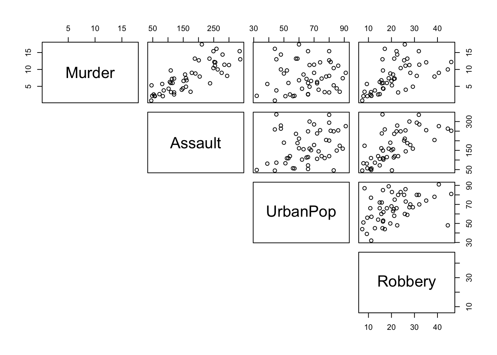

```r
source(file = "setup.R")
```

# Correlation coefficients

## Objectives
:::objectives
**Questions**

- How do I...
- What do I...

**Objectives**

- Be able to...
- Use...
:::

## Purpose and aim
Correlation refers to the relationship of two variables (or datasets) to one another. Two datasets are said to be correlated if they are not independent from one another. Correlations can be useful because they can indicate if a predictive relationship may exist. However just because two datasets are correlated does not mean that they are causally related.

### Section commands
New commands used in this section:

| Function| Description|
|:- |:- |
|`cor()`| Calculates a correlation matrix |
|`pairs()`| Plots a matrix of scatter plots |

### Data and hypotheses
We will use the `USArrests` dataset for this example. This rather bleak dataset contains statistics in arrests per 100,000 residents for assault, murder and robbery in each of the 50 US states in 1973, alongside the proportion of the population who lived in urban areas at that time. `USArrests` is an unstacked data frame with 50 observations of four variables: `Murder`, `Assault`, `UrbanPop` and `Robbery`.

The data are stored in the file `data/raw/CS3-usarrests.csv`.

First we read in the data:


```r
USArrests <- read.csv("data/raw/CS3-usarrests.csv", row.names = 1)

# have a look at the data
head(USArrests)
```

```
##            Murder Assault UrbanPop Robbery
## Alabama      13.2     236       58    21.2
## Alaska       10.0     263       48    44.5
## Arizona       8.1     294       80    31.0
## Arkansas      8.8     190       50    19.5
## California    9.0     276       91    40.6
## Colorado      7.9     204       78    38.7
```

The syntax for reading in this data frame is a little different. Here we want to use the first column of the `.csv` file to specify the names of the rows of the dataset rather than to include the information inside the dataset itself. We do this by using the `row.names = 1` argument which tells R to use the 1st column of the file for the row names. We need to do this because some of the functions will be using require a _matrix_ as input (basically a data frame containing only numbers).

## Pearson’s product moment correlation coefficient
Pearson's r (as this quantity is also known) is a measure of the linear correlation between two variables. It has a value between -1 and +1, where +1 means a perfect positive correlation, -1 means a perfect negative correlation and 0 means no correlation at all.

### Summarise and visualise
Run this command:


```r
pairs(USArrests, lower.panel = NULL)
```


*	The first argument is a matrix or a data frame
*	The argument `lower.panel` tells R not to add the redundant reflected lower set of plots, below the diagonal 

From visual inspection of the scatter plots we can see that there appears to be a slight positive correlation between all pairs of variables, although this may be very weak in some case (`Murder` and `UrbanPop` for example).

### Implement test
Let's test if there are any possible correlations between the variables:


```r
cor(USArrests, method = "pearson")
```

*	The first argument is a matrix or a data frame
*	The argument `method` tells R which correlation coefficient to use (`pearson` (default), `kendall`, or `spearman`)

### Interpret output and report results
This should give the following output:


```
##              Murder   Assault   UrbanPop   Robbery
## Murder   1.00000000 0.8018733 0.06957262 0.5635788
## Assault  0.80187331 1.0000000 0.25887170 0.6652412
## UrbanPop 0.06957262 0.2588717 1.00000000 0.4113412
## Robbery  0.56357883 0.6652412 0.41134124 1.0000000
```

The matrix gives the correlation coefficient between each pair of variables in the data frame. The matrix is symmetric (_why?_) and the diagonal values are all 1 (_why?_). The most correlated variables are `Murder` and `Assault` with an `r` value of 0.801. This appears to agree well with the set of scatter plots that we produced earlier.

### Exercise
:::exercise
State data correlation

We will use the data from the file `data/raw/CS3-statedata.csv` dataset for this exercise. This rather more benign dataset contains information on more general properties of each US state, such as population (1975), per capita income (1974), illiteracy proportion (1970), life expectancy (1969), murder rate per 100,000 people (there's no getting away from it), percentage of the population who are high-school graduates, average number of days where the minimum temperature is below freezing between 1931 and 1960, and the state area in square miles. The dataset contains 50 rows and 8 columns, with column names: `Population`, `Income`, `Illiteracy`, `Life.Exp`, `Murder`, `HS.Grad`, `Frost` and `Area`.

Load in the data (remembering to tell R that the first column of the CSV file should be used to specify the row names of the dataset) and use the pairs command to visually identify 3 different pairs of variables that appear to be

1.	the most positively correlated
2.	the most negatively correlated
3.	not correlated at all

Calculate Pearson’s r for all variable pairs and see how well you were able to identify correlation visually.

<details><summary>Answer</summary>

**1. Read in the data**


```r
USAstate <- read.csv("data/raw/CS3-statedata.csv",
                     row.names = 1)

# have a look at the data
head(USAstate)
```

```
##            Population Income Illiteracy LifeExp Murder HSGrad Frost   Area
## Alabama          3615   3624        2.1   69.05   15.1   41.3    20  50708
## Alaska            365   6315        1.5   69.31   11.3   66.7   152 566432
## Arizona          2212   4530        1.8   70.55    7.8   58.1    15 113417
## Arkansas         2110   3378        1.9   70.66   10.1   39.9    65  51945
## California      21198   5114        1.1   71.71   10.3   62.6    20 156361
## Colorado         2541   4884        0.7   72.06    6.8   63.9   166 103766
```

**2. Look at the pair-wise comparisons**


```r
pairs(USAstate, lower.panel = NULL)
```



**3. Create a correlation matrix**


```r
cor(USAstate, method = "pearson")
```

```
##             Population     Income  Illiteracy     LifeExp     Murder
## Population  1.00000000  0.2082276  0.10762237 -0.06805195  0.3436428
## Income      0.20822756  1.0000000 -0.43707519  0.34025534 -0.2300776
## Illiteracy  0.10762237 -0.4370752  1.00000000 -0.58847793  0.7029752
## LifeExp    -0.06805195  0.3402553 -0.58847793  1.00000000 -0.7808458
## Murder      0.34364275 -0.2300776  0.70297520 -0.78084575  1.0000000
## HSGrad     -0.09848975  0.6199323 -0.65718861  0.58221620 -0.4879710
## Frost      -0.33215245  0.2262822 -0.67194697  0.26206801 -0.5388834
## Area        0.02254384  0.3633154  0.07726113 -0.10733194  0.2283902
##                 HSGrad      Frost        Area
## Population -0.09848975 -0.3321525  0.02254384
## Income      0.61993232  0.2262822  0.36331544
## Illiteracy -0.65718861 -0.6719470  0.07726113
## LifeExp     0.58221620  0.2620680 -0.10733194
## Murder     -0.48797102 -0.5388834  0.22839021
## HSGrad      1.00000000  0.3667797  0.33354187
## Frost       0.36677970  1.0000000  0.05922910
## Area        0.33354187  0.0592291  1.00000000
```


1. The most **positively** correlated variables are  Murder and Illiteracy
2. The most **negatively** correlated variables are Murder and LifeExp
3. The most **uncorrelated** variables are Area and Population

</details>
:::


## Spearman's rank correlation coefficient
### Summarise and visualise
### Assumptions
### Implement test
### Interpret output and report results
### Exercise
:::exercise
Exercise title

Exercise description

<details><summary>Answer</summary>

An elaborate answer

</details>
:::

## Key points

:::keypoints
- Point 1
- Point 2
- Point 3
:::
