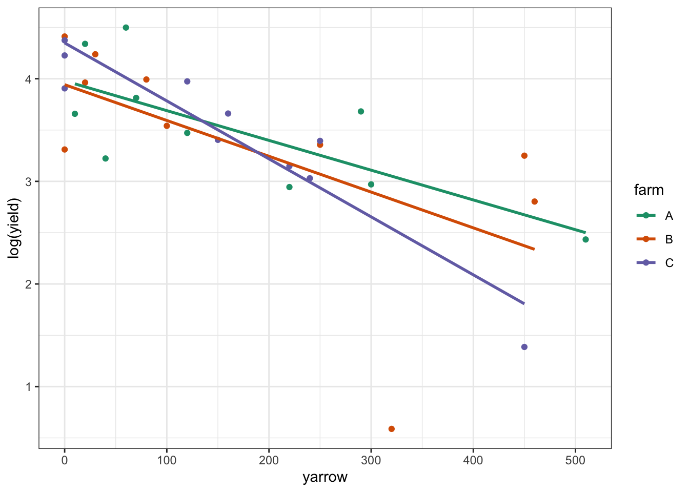

# Linear regression with grouped data

## Objectives
:::objectives
**Questions**

- How do I perform a linear regression on grouped data?

**Objectives**

- Be able to perform a linear regression on grouped data in R
- Calculate the linear regression for individual groups and visualise these with the data
- Understand and be able to create equations of the line of best fit
- Be able to deal with interactions in this context
:::

## Purpose and aim
A linear regression analysis with grouped data is used when we have one categorical predictor variable (or factor), and one continuous predictor variable. The response variable must still be continuous however.

For example in an experiment that looks at light intensity in woodland, how is light intensity (continuous: lux) affected by the height at which the measurement is taken, recorded as depth measured from the top of the canopy (continuous: metres) and by the type of woodland (categorical: Conifer or Broad leaf).


When analysing this type of data we want to know:

1.	Is there a difference between the groups?
2.	Does the continuous predictor variable affect the continuous response variable (does canopy depth affect measured light intensity?)
3.	Is there any interaction between the two predictor variables? Here an interaction would display itself as a difference in the slopes of the lines of best fit for each group, so for example perhaps the conifer dataset has a significantly steeper line than the broad leaf woodland dataset.

In this case, no interaction means that the lines of best fit will have the same slope.
Essentially the analysis is identical to two-way ANOVA (and R doesn’t really notice the difference).

1. We will plot the data and visually inspect it.
2. We will test for an interaction and if it doesn’t exist then:
    a. We can test to see if either predictor variable has an effect (i.e. do the lines of best fit have different intercepts? and is the common gradient significantly different from zero?)
    
We will first consider how to visualise the data before then carrying out an appropriate statistical test.

## Section commands
New commands used in this section:

| Function| Description|
|:- |:- |
|`subset()`| Creates a subset of the data |

## Data and hypotheses
The data are stored in `data/raw/CS4-treelight.csv`.

Read in the data and inspect it:


```r
# read in the data
treelight <- read.csv("data/raw/CS4-treelight.csv")

# inspect the data
head(treelight)
```

```
##      Light Depth Species
## 1 4105.646  1.00 Conifer
## 2 4933.925  1.75 Conifer
## 3 4416.527  2.50 Conifer
## 4 4528.618  3.25 Conifer
## 5 3442.610  4.00 Conifer
## 6 4640.297  4.75 Conifer
```

`treelight` is a data frame with three variables; `Light`, `Depth` and `Species`. `Light` is the continuous response variable, `Depth` is the continuous predictor variable and `Species` is the categorical predictor variables.

## Summarise and visualise


```r
plot(Light ~ Depth,
     data = treelight)
```


This plots all of the points in the data set on the same window, but unfortunately there isn’t a way of easily distinguishing them, at least not using base R. We will need to extract the correct subset data from the `treelight` dataframe.

Create subsets of the data frame and look at the raw data:


```r
# subset the conifers
conLight <- subset(treelight,
                   subset = (Species == "Conifer"))

# subset the broad leaf
broLight <- subset(treelight,
                   subset = (Species == "Broadleaf"))

# look at the first few rows of the raw data
head(conLight)
```

```
##      Light Depth Species
## 1 4105.646  1.00 Conifer
## 2 4933.925  1.75 Conifer
## 3 4416.527  2.50 Conifer
## 4 4528.618  3.25 Conifer
## 5 3442.610  4.00 Conifer
## 6 4640.297  4.75 Conifer
```

```r
head(broLight)
```

```
##    Light Depth   Species
## 14  7652 2.438 Broadleaf
## 15  6866 3.488 Broadleaf
## 16  5437 8.316 Broadleaf
## 17  7327 1.597 Broadleaf
## 18  5991 6.265 Broadleaf
## 19  7574 2.651 Broadleaf
```

The `subset` function creates subsets of data frames. The first argument is the original data frame, and the subset argument is a logical expression that defines which observations (rows) should be extracted. The logical expression must be enclosed in parentheses. In the first case it says (`Species == "Conifer"`). This tells R to only extract the rows of the original data frame which have `Conifer` in the species variable column. Ditto for `Broadleaf`.
We can use these smaller data frames to distinguish between the points in the plot.

Before we do that, we need to calculate the linear regression for each group, and add them to the plot:

Type this in:


```r
# linear regression for Broadleaf
lm.Broadleaf <- lm(Light ~ Depth,
                   data = broLight)

# linear regression for Conifer
lm.Conifer <- lm(Light ~ Depth,
                 data = conLight)
```

Now type this in to create the plot with the data and the linear regressions:


```r
# create a new plot based on Light ~ Depth
plot(Light ~ Depth, 
     data = treelight, type = "n")

# add the Broadleaf data
points(Light ~ Depth,
     data = broLight, col = "blue")

# add the Conifer data
points(Light ~ Depth,
     data = conLight, col = "red")

# add the Broadleaf linear regression
abline(lm.Broadleaf, col = "blue")

# add the Conifer linear regression
abline(lm.Conifer, col = "red")
```


You should now have a basic plot that looks similar to the figure above (but with different labels, no legend and different characters).

(Optional) Modify your graph to make it look the same as the above figure.

Looking at this plot, there doesn’t appear to be any significant interaction between the woodland type (`Broadleaf` and `Conifer`) and the depth at which light measurements were taken (`Depth`) on the amount of light intensity getting through the canopy as the gradients of the two lines appear to be very similar. There does appear to be a noticeable slope to both lines and both lines look as though they have very different intercepts. All of this suggests that there isn’t any interaction but that both `Depth` and `Species` have a significant effect on `Light` independently.

## Implement the test
In this case we're going to implement the test before checking the assumptions (I know, let's live a little!). You'll find out why soon...

We can test for a possible interaction more formally:


```r
anova(lm(Light ~ Depth * Species,
         data = treelight))
```

Remember that `Depth * Species` is a shorthand way of writing the full set of `Depth + Species + Depth:Species` terms in R _i.e._ both main effects and the interaction effect.

## Interpret output and present results
This gives the following output:


```
## Analysis of Variance Table
## 
## Response: Light
##               Df   Sum Sq  Mean Sq  F value    Pr(>F)    
## Depth          1 30812910 30812910 107.8154 2.861e-09 ***
## Species        1 51029543 51029543 178.5541 4.128e-11 ***
## Depth:Species  1   218138   218138   0.7633    0.3932    
## Residuals     19  5430069   285793                       
## ---
## Signif. codes:  0 '***' 0.001 '**' 0.01 '*' 0.05 '.' 0.1 ' ' 1
```

As with two-way ANOVA we have a row in the table for each of the different effects that we’ve asked R to consider. The last column is the important one as this contains the p-values. We need to look at the interaction row first.
`Depth:Species` has a p-value of 0.393 (which is bigger than 0.05) and so we can conclude that the interaction between `Depth` and `Species` isn’t significant. As such we can now consider whether each of the predictor variables independently has an effect. Both `Depth` and `Species` have very small p-values (2.86x10<sup>-9</sup> and 4.13x10 <sup>-11</sup>) and so we can conclude that they do have a significant effect on `Light`.

This means that the two lines of best fit should have the same non-zero slope, but different intercepts. We would now like to know what those values are.

### Finding intercept values
Unfortunately, R doesn’t make this obvious and easy for us and there is some deciphering required getting this right.
For a simple straight line such as the linear regression for the conifer dataset by itself, the output is relatively straightforward.


```r
lm(Light ~ Depth,
   data = conLight)
```

```
## 
## Call:
## lm(formula = Light ~ Depth, data = conLight)
## 
## Coefficients:
## (Intercept)        Depth  
##      5014.0       -292.2
```

And we can interpret this as meaning that the intercept of the line of best fit is 5014 and the coefficient of the depth variable (the number in front of it in the equation) is -292.2.

So, the equation of the line of best fit is given by:

\begin{equation}
Light = 5014 + -292.2 * Depth
\end{equation} 

This came from fitting a simple linear model using the conifer dataset, and has the meaning that for every extra 1 m of depth of forest canopy we lose 292.2 lux of light.

When we looked at the full dataset, we found that interaction wasn’t important. This means that we will have a model with two distinct intercepts but only a single slope (that’s what you get for a linear regression without any interaction), so we need to ask R to calculate that specific combination. The command for that is simply:


```r
lm(Light ~ Depth + Species,
   data = treelight)
```

```
## 
## Call:
## lm(formula = Light ~ Depth + Species, data = treelight)
## 
## Coefficients:
##    (Intercept)           Depth  SpeciesConifer  
##         7962.0          -262.2         -3113.0
```

Notice the `+` symbol in the argument, as opposed to the `*` symbol used earlier. This means that we are explicitly _not_ including an interaction term in this fit, and consequently we are forcing R to calculate the equation of lines which have the same gradient.

Ideally we would like R to give us two equations, one for each forest type, so four parameters in total.
Unfortunately, R is parsimonious and doesn’t do that. Instead R gives you three coefficients, and these require a bit of interpretation.

The first two numbers that R returns (underneath `Intercept` and `Depth`) are the exact intercept and slope coefficients for one of the lines (in this case they correspond to the data for `Broadleaf` woodlands).

For the coefficients belonging to the other line, R uses these first two coefficients as baseline values and expresses the other coefficients relative to these ones. R also doesn’t tell you explicitly which group it is using as its baseline reference group! (Did I mention that R can be very helpful at times 😉?)

So, how to decipher the above output?

First, I need to work out which group has been used as the baseline.
* It will be the group that comes first alphabetically, so it should be `Broadleaf`
* The other way to check would be to look and see which group is not mentioned in the above table. `Conifer` is mentioned (in the `SpeciesConifer` heading) and so again the baseline group is `Broadleaf.`
This means that the intercept value and `Depth` coefficient correspond to the `Broadleaf` group and as a result I know what the equation of one of my lines is:

Broadleaf:

\begin{equation}
Light = 7962 + -262.2 * Depth
\end{equation} 

In this example we know that the gradient is the same for both lines (because we explicitly asked R not to include an interaction), so all I need to do is find the intercept value for the `Conifer` group. Unfortunately, the final value given underneath `SpeciesConifer` does not give me the intercept for `Conifer`, instead it tells me the difference between the `Conifer` group intercept and the baseline intercept i.e. the equation for the line of best fit for conifer woodland is given by:

\begin{equation}
Light = (7962 + -3113) + -262.2 * Depth
\end{equation} 

\begin{equation}
Light = 4829 + -262.2 * Depth
\end{equation} 

### Adding multiple regression lines
Unfortunately, base R doesn’t have a sensible way of automatically adding multiple regression lines to a plot and so if we want to do this, we will have to do it manually (this is easier to do in `ggplot` and this will be added to the materials later).

First, we create the underlying plot containing the raw data values. We did this previously, so we can just copy/paste the code for the raw data.


```r
# create a new plot based on Light ~ Depth
plot(Light ~ Depth, 
     data = treelight, type = "n")

# add the Broadleaf data
points(Light ~ Depth,
     data = broLight, col = "blue")

# add the Conifer data
points(Light ~ Depth,
     data = conLight, col = "red")
```


Then we can add the linear regression without the interaction term.


```r
lm.add <- lm(Light ~ Depth + Species,
             data = treelight)
```

We first need to extract the relative coefficient values from the `lm` object and then combine them manually to create separate vectors containing the intercept and slope coefficients for each line. This next set of command is a bit annoying but stick with it; it’ll pay dividends (no, really it will – you always secretly wanted to be a computer programmer didn’t you? This medic/biologist/life scientist thing is just a passing phase that you’ll grow out of…)


```r
cf <- coef(lm.add)
cf
```

```
##    (Intercept)          Depth SpeciesConifer 
##      7962.0316      -262.1656     -3113.0265
```

```r
cf.Broadleaf <- c(cf[1], cf[2])
cf.Conifer <- c(cf[1] + cf[3], cf[2])

cf.Broadleaf
```

```
## (Intercept)       Depth 
##   7962.0316   -262.1656
```

```r
cf.Conifer
```

```
## (Intercept)       Depth 
##   4849.0051   -262.1656
```

* The first line extracts the three (in this case) coefficients from the `lm` object as a vector called `cf`, and the second line prints this to the screen.
* In the third line we take the 1st and 2nd components of `cf` and store them as the coefficients for the `Broadleaf` line in a vector called `cf.Broadleaf`
* The fourth line is where we do some actual calculations. Here we realise that the intercept of the conifer line is actually the sum of the 1st and 3rd values of `cf`, whereas the slope is just the 2nd value, and so we create a vector for the conifer line that reflects this.
* The 5th and 6th lines just print these two vectors to the screen.

We can now use these two vectors to add the appropriate regression lines to the existing plot. The final code then looks like this:


```r
# create a new plot based on Light ~ Depth
plot(Light ~ Depth, 
     data = treelight, type = "n")

# add the Broadleaf data
points(Light ~ Depth,
     data = broLight, col = "blue")

# add the Conifer data
points(Light ~ Depth,
     data = conLight, col = "red")

# add the Broadleaf regression line
abline(cf.Broadleaf, col = "blue")

# add the Conifer regression line
abline(cf.Conifer, col = "red")
```


## Assumptions
In this case we first wanted to check if the interaction was significant, prior to checking the assumptions. If we would have checked the assumptions first, then we would have done that one the full model (with the interaction), then done the ANOVA if everything was OK. We would have then found out that the interaction was not significant, meaning we'd have to re-check the assumptions with the new model. In what order you do it is a bit less important here. The main thing is that you check the assumptions and report on it!

Anyway, hopefully you’ve got the gist of checking assumptions for linear models by now: diagnostic plots!


```r
par(mfrow = c(2, 2))
plot(lm(Light ~ Depth + Species,
        data = treelight))
```


* The top left graph looks OK, no systematic pattern.
* The top right graph isn’t perfect, but I’m happy with the normality assumption.
* The bottom left graph is OK, some very slight suggestion of heterogeneity of variance, but nothing to be too worried about.
* The bottom right graph shows that all of the points are OK

Woohoo!

## Dealing with interaction
If there _had been_ a significant interaction between the two predictor variables (for example, if light intensity had dropped off significantly faster in conifer woods than in broad leaf woods, in addition to being lower overall, then we would again be looking for two equations for the linear regression, but this time the gradients vary as well.
In this case interaction is important and so we need the output from a linear regression that explicitly includes the interaction term:


```r
lm(Light ~ Depth + Species + Depth:Species,
   data = treelight)
```

or written using the short-hand:


```r
lm(Light ~ Depth * Species,
   data = treelight)
```

There really is absolutely no difference in the end result.
Either way this gives us the following output:


```
## 
## Call:
## lm(formula = Light ~ Depth * Species, data = treelight)
## 
## Coefficients:
##          (Intercept)                 Depth        SpeciesConifer  
##              7798.57               -221.13              -2784.58  
## Depth:SpeciesConifer  
##               -71.04
```

As before the broadleaf line is used as the baseline regression and we can read off the values for its intercept and slope directly:

Broadleaf:
\begin{equation}
Light = 7798.57 + -221.13 * Depth
\end{equation}

Note that this is different from the previous section, by allowing for an interaction all fitted values will change.

For the conifer line we will have a different intercept value and a different gradient value. As before the value underneath `SpeciesConifer` gives us the difference between the intercept of the conifer line and the broad leaf line. The new, additional term `Depth:SpeciesConifer` tells us how the coefficient of `Depth` varies for the conifer line i.e. how the gradient is different. Putting these two together gives us the following equation for the line of best fit conifer woodland:

Conifer:
\begin{equation}
Light = (7798.57 + -2784.58) + (-221.13 + -71.04) * Depth
\end{equation}

\begin{equation}
Light = 5014 + -292.2 * Depth
\end{equation}

These also happen to be exactly the lines of best fit that you would get by calculating a linear regression on each group’s data separately.

## Exercise: Clover and yarrow
:::exercise
Clover and yarrow field trials

The `data/raw/CS4-clover.csv` dataset contains information on field trials at three different farms (`A`, `B` and `C`). Each farm recorded the yield of clover in each of ten fields along with the density of yarrow stalks in each field.

* Investigate how clover yield is affected by yarrow stalk density. Is there evidence of competition between the two species?
* Is there a difference between farms?

<details><summary>Answer</summary>


```r
clover <- read.csv("data/raw/CS4-clover.csv",
                   stringsAsFactors = TRUE)
```

This dataset has three variables; `Yield` (which is the response variable), `Yarrow` (which is a continuous predictor variable) and `Farm` (which is the categorical predictor variables). As always we'll visualise the data first:


```r
plot(Yield ~ Yarrow,
     data = clover, col = Farm)
```


Here, I've used a trick (that admittedly I probably should have told you in the practical handout) where we can use a categorical variable (here `Farm`) to specify the colours used in the plot. This trick only works for categorical variables with at most 8 levels because there are only 8 colours hard-coded into this feature. the colours are: black, red, green, blue, cyan, magenta, yellow and grey, in that order.

For our plot this means that farm `A` is black, farm `B` is red and farm `C` is green.

This method is still rather clunky and `ggplot` does a much better job in this respect. We'll see how that works in an updated version.

More importantly, looking at this plot as it stands, it's pretty clear that yarrow density has a significant effect on yield, but it's pretty hard to see from the plot whether there is any effect of `Farm`, or whether there is any interaction. In order to work that out we'll want to add the lines of best fit for each `Farm` separately.


```r
plot(Yield ~ Yarrow,
     data = clover, col = Farm)

farmA <- subset(clover, subset = (Farm == "A"))
farmB <- subset(clover, subset = (Farm == "B"))
farmC <- subset(clover, subset = (Farm == "C"))

lmA <- lm(Yield ~ Yarrow, data = farmA)
lmB <- lm(Yield ~ Yarrow, data = farmB)
lmC <- lm(Yield ~ Yarrow, data = farmC)

abline(lmA, col = "black")
abline(lmB, col = "red")
abline(lmC, col = "green")
```



The lines of best fit are very close together, and it looks very much as if there isn't any interaction, but also that there isn't any effect of `Farm`. Let's carry out the analysis:


```r
lm.clover <- lm(Yield ~ Yarrow * Farm,
                data = clover)

anova(lm.clover)
```

```
## Analysis of Variance Table
## 
## Response: Yield
##             Df Sum Sq Mean Sq F value    Pr(>F)    
## Yarrow       1 8538.3  8538.3 28.3143 1.847e-05 ***
## Farm         2    3.8     1.9  0.0063    0.9937    
## Yarrow:Farm  2  374.7   187.4  0.6213    0.5457    
## Residuals   24 7237.3   301.6                      
## ---
## Signif. codes:  0 '***' 0.001 '**' 0.01 '*' 0.05 '.' 0.1 ' ' 1
```

This confirms our suspicions from looking at the plot. There isn't any interaction between `Yarrow` and `Farm.` `Yarrow` density has a statistically significant effect on `Yield` but there isn't any difference between the different farms on the yields of clover.

Let's check the assumptions:


```r
par(mfrow = c(2, 2))
plot(lm.clover)
```


This is a borderline case.

1. Normality is fine (Normal QQ)
2. There aren't any highly influential points (Residuals vs Leverage)
3. There is a strong suggestion of heterogeneity of variance. Most of the points are relatively close to the lines of best fit, but the there is a much great spread of points low Yarrow density (which corresponds to high Yield values, which is what the fitted values correspond to).
4. Finally, there is a slight suggestion that the data might not be linear, that it might curve slightly.

We have two options; both of which are arguably OK to do in real life.

1. We can claim that these assumptions are well enough met and just report the analysis that we've just done.
2. We can decide that the analysis is not appropriate and look for other options.
    a. We can try to transform the data by taking logs of `Yield.` This might fix both of our problems: taking logs of the response variable has the effect of improving heterogeneity of variance when the residual vs fitted plot is more spread out on the right vs. the left (like ours). It also is appropriate if we think the true relationship between the response and predictor variables is exponential rather than linear (which we might have). We do have the capabilities to try this option.
    b. We could try a permutation based approach (beyond the remit of this course, and actually a bit tricky in this situation). This wouldn't address the non-linearity but it would deal with the variance assumption.
    c. We could come up with a specific functional, mechanistic relationship between yarrow density and clover yield based upon other aspects of their biology. For example there might be a threshold effect such that for yarrow densities below a particular value, clover yields are unaffected, but as soon as yarrow values get above that threshold the clover yield decreases (maybe even linearly). This would require a much better understanding of clover-yarrow dynamics (of which I personally know very little).

Let's do a quick little transformation of the data, and repeat our analysis see if our assumptions are better met this time (just for the hell of it):


```r
plot(log(Yield) ~ Yarrow,
     data = clover, col = Farm)

lmlogA <- lm(log(Yield) ~ Yarrow, data = farmA)
lmlogB <- lm(log(Yield) ~ Yarrow, data = farmB)
lmlogC <- lm(log(Yield) ~ Yarrow, data = farmC)

abline(lmlogA, col = "black")
abline(lmlogB, col = "red")
abline(lmlogC, col = "green")
```


Again, this looks plausible. There's a noticeable outlier from Farm B (red point at the bottom of the plot) but otherwise we see that: there probably isn't an interaction; there is likely to be an effect of `Yarrow` on `log(Yield)`; and there probably isn't any difference between the farms.

Let's do the analysis:


```r
lm.log <- lm(log(Yield) ~ Yarrow * Farm,
             data = clover)
anova(lm.log)
```

```
## Analysis of Variance Table
## 
## Response: log(Yield)
##             Df  Sum Sq Mean Sq F value   Pr(>F)    
## Yarrow       1 10.6815 10.6815 27.3233 2.34e-05 ***
## Farm         2  0.0862  0.0431  0.1103   0.8960    
## Yarrow:Farm  2  0.8397  0.4199  1.0740   0.3575    
## Residuals   24  9.3823  0.3909                     
## ---
## Signif. codes:  0 '***' 0.001 '**' 0.01 '*' 0.05 '.' 0.1 ' ' 1
```

Woop. All good so far. We have the same conclusions as before in terms of what is significant and what isn't. Now we just need to check the assumptions:


```r
par(mfrow = c(2, 2))
plot(lm.log)
```


Well, this is actually a better set of diagnostic plots. Whilst point number 12 is a clear outlier, if we ignore that point then all of the rest of the plots do look better.

So now we know that `Yarrow` is a significant predictor of `Yield` and we're happy that the assumptions have been met.

</details>
:::

## Key points

:::keypoints
- A linear regression analysis with grouped data is used when we have one categorical and one continuous predictor variable, together with one continuous response variable
- We can visualise the data by plotting a line of best fit together with the raw data
- When performing an ANOVA, we need to check for interaction terms
- Again, we check the underlying assumptions using diagnostic plots
- We can create an equation for the line of best fit for each group in the data using the `lm()` output
:::
