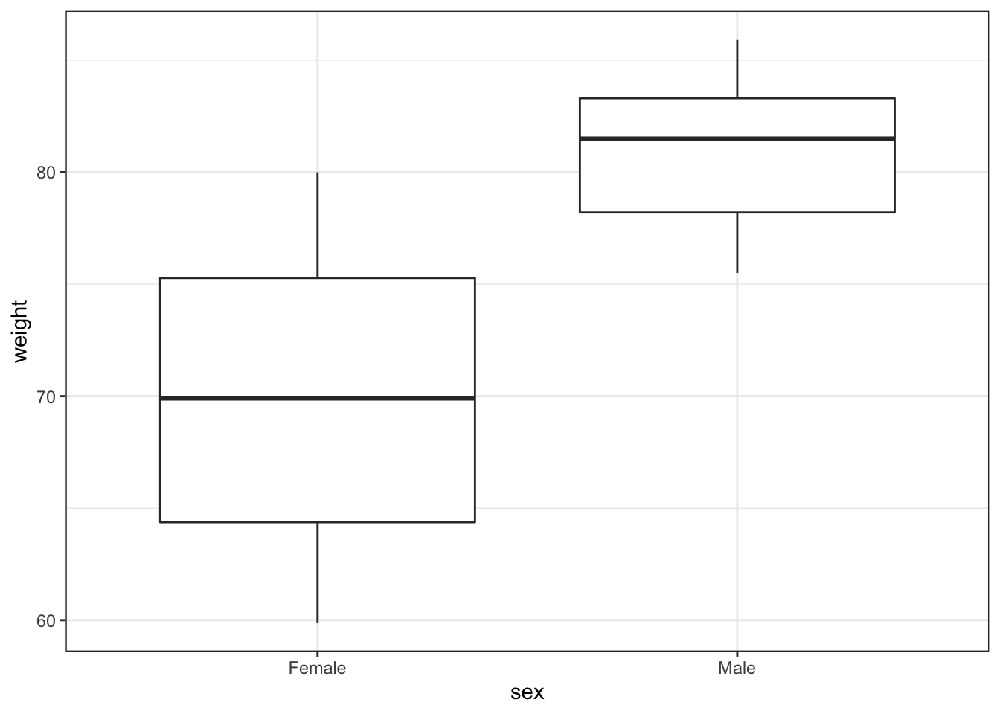
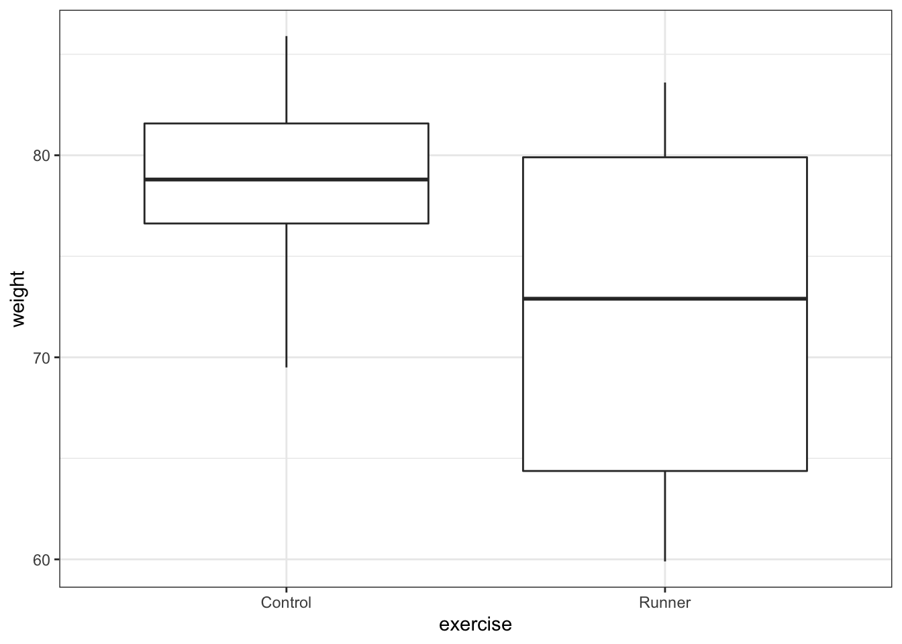
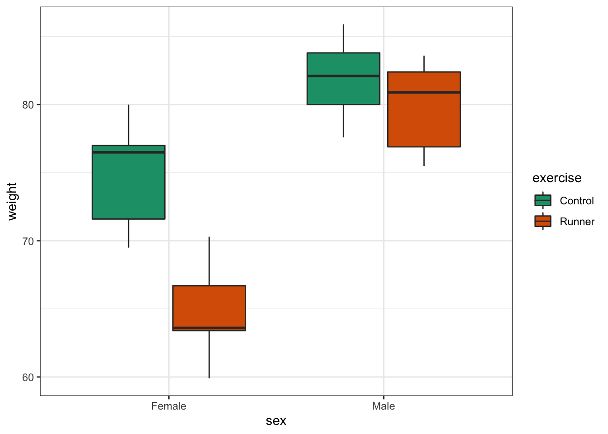
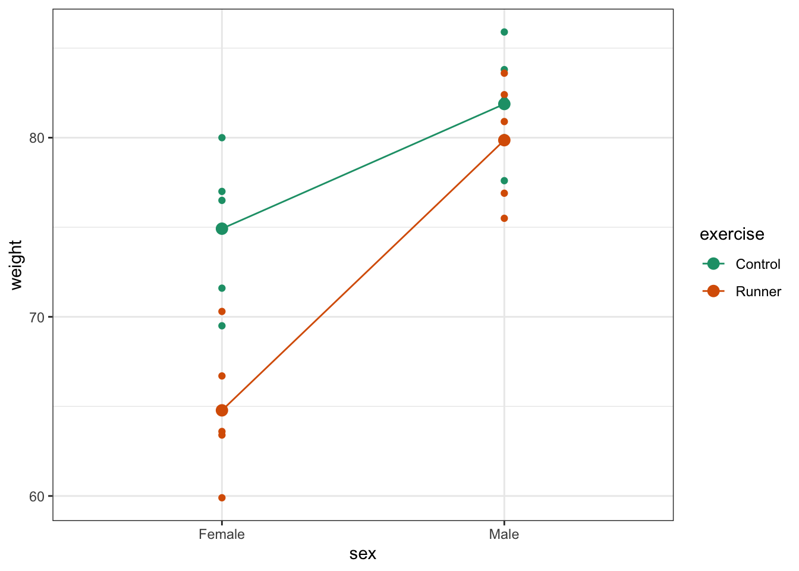
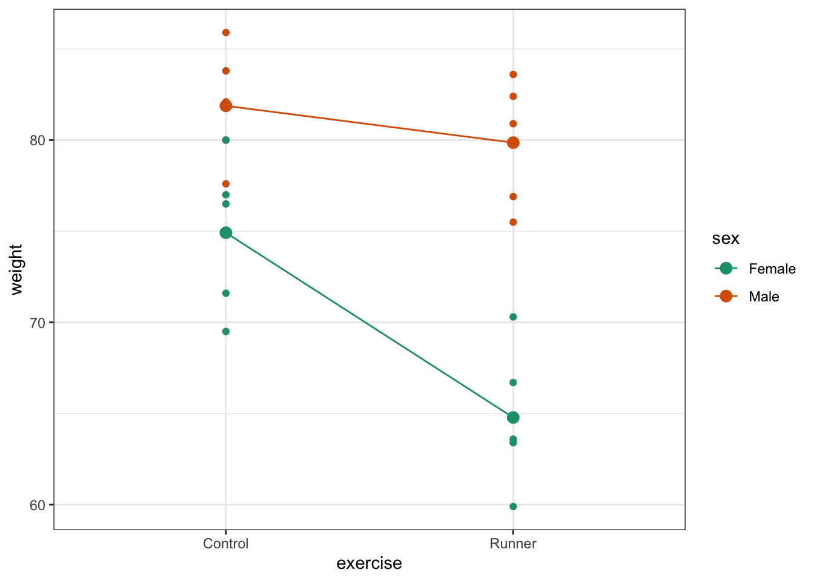
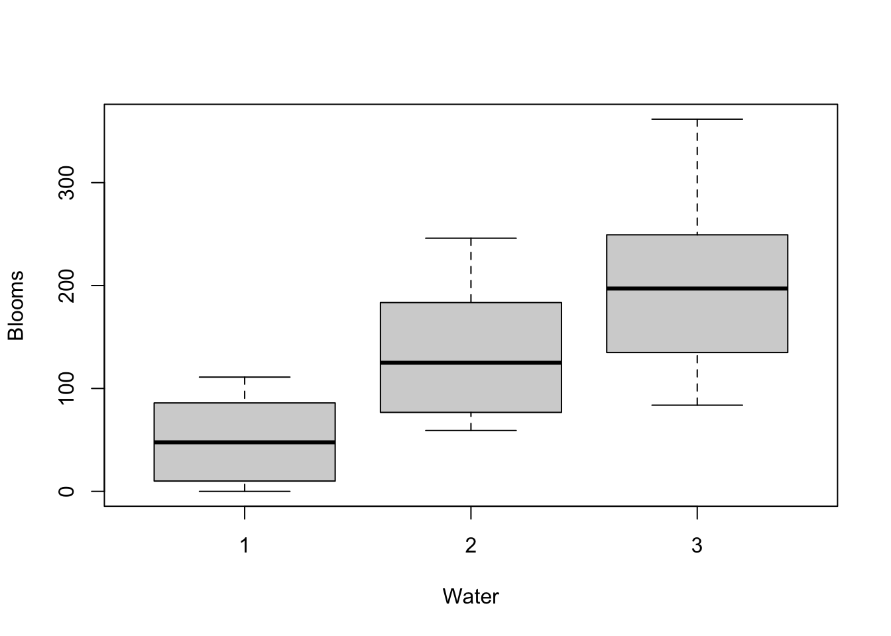

# Two-way ANOVA

## Objectives
:::objectives
**Questions**

- When is the use of a two-way ANOVA appropriate?
- How do I perform this in R?

**Objectives**

- Be able to perform a two-way ANOVA in R
- Understand the concept of interaction between two predictor variables
- Be able to plot interactions in R
:::

## Purpose and aim
A two-way analysis of variance is used when we have two categorical predictor variables (or factors) and a single continuous response variable. For example, when we are looking at how body `Weight` (continuous response variable in kilograms) is affected by gender (categorical variable, `Male` or `Female`) and exercise type (categorical variable, `Control` or `Runner`).


When analysing these type of data there are two things we want to know:

1.	Does either of the predictor variables have an effect on the response variable i.e. does gender affect body weight? Or does being a runner affect body weight?
2.	Is there any **interaction** between the two predictor variables? An interaction would mean that the effect that exercise has on your weight depends on whether you are male or female rather than being independent of your gender. For example if being male means that runners weigh more than non-runners, but being female means that runners weight less than non-runners then we would say that there was an interaction.

We will first consider how to visualise the data before then carrying out an appropriate statistical test.


## Section commands
New commands used in this section:

| Function| Description|
|:- |:- |
|`boxplot()`| Creates a boxplot |
|`interaction.plot()`| Creates an interaction plot |
|`anova()`| Carries out an ANOVA test |

## Data and hypotheses
We will recreate the example analysis used in the lecture. The data are stored as a .csv file called `CS4-exercise.csv`.

## Summarise and visualise
`Experiment` is a dataframe with three variables; `Weight`, `Gender` and `Exercise.` `Weight` is the continuous response variable, whereas `Gender` and `Exercise` are the categorical predictor variables.

First,read in the data:

```r
Experiment <- read.csv("data/raw/CS4-exercise.csv")
```

Then visualise:

```r
boxplot(Weight ~ Gender, data = Experiment)
```



```r
boxplot(Weight ~ Exercise, data = Experiment)
```



These produce basic box plots showing the response variable (`Weight`) only in terms of one of the predictor variables. The values of the other predictor variable in each case aren’t taken into account. The argument `Weight ~ Gender` (or `Weight ~ Exercise`) is key here. It tells R to treat `Weight` as a function of `Gender` only (or as a function of `Exercise` only.)
These are also very basic plots just showing the raw data and using default arguments.

(Optional) Add titles, axis labels and any other information that you see fit to the plots to make them presentable.

Visualise both predictor variables together:


```r
boxplot(Weight ~ Gender + Exercise, data = Experiment)
```



This produces box plots for all (four) combinations of the predictor variables. The key argument here is `Weight ~ Gender + Exercise`. This tells R to treat `Weight` as a function of both `Gender` and `Exercise.` The + symbol does not mean to add the numbers together, but that `Weight` should be treated as a function of `Gender` plus `Exercise.`
Again, this is a very basic plot that just shows the raw data and uses default arguments.

(Optional) Add titles, axis labels and any other information that you see fit to the plot to make it presentable.

In this example there are only four box plots and so it is relatively easy to compare them and look for any interactions between variables, but if there were more than two levels (groups) per categorical variable, it would become harder to spot what was going on. To compare categorical variables more easily we just plot the group means which aids our ability to look for interactions and the main effects of each predictor variable.

Create an interaction plot:

```r
interaction.plot(Experiment$Gender,
                 Experiment$Exercise,
                 Experiment$Weight)
```



* The first argument defines the categorical variable that will be used for the horizontal axis. This must be a factor vector (if it comes from a data.frame then it will automatically be a factor). In this function this is called the `x.factor`.
* The second argument defines the categorical variable that will be used for the different lines to be plotted. This must be a factor vector. In this function this is called the `trace.factor`.
* The third argument defines the response variable that will be used for the vertical axis. This must be a numerical vector. In this function this argument is called the `response`.

It’s common to get the order of these arguments muddled up. Remember that it’s the **third argument** that defines the variable that goes on the vertical axis!

The default settings aren’t too great for displaying interaction plots. Try the following for (in my opinion) a more user-friendly display.


```r
interaction.plot(Experiment$Gender,
                 Experiment$Exercise,
                 Experiment$Weight,
                 xlab = "Gender", ylab = "Weight",
                 trace.label = "Exercise",
                 type = "b", pch = 4,
                 col = c("blue", "red"))
```



The choice of which categorical factor is plotted on the horizontal axis and which is plotted as different lines is completely arbitrary. Looking at the data both ways shouldn’t add anything but often you’ll find that you prefer one plot to another.

Plot the interaction plot the other way round:

```r
interaction.plot(Experiment$Exercise,
                 Experiment$Gender,
                 Experiment$Weight,
                 xlab = "Gender", ylab = "Weight",
                 trace.label = "Exercise",
                 type = "b", pch = 4,
                 col = c("blue", "red"))
```


By now you should have a good feeling for the data and could already provide some guesses to the following three questions:

* Does there appear to be any interaction between the two categorical variables?
*	If not:
    * Does `Exercise` have an effect on `Weight`?
    * Does `Gender` have an effect on `Weight`?
    
We can now attempt to answer these three questions more formally using an ANOVA test. We have to ask R explicitly to test for three things: the interaction, the effect of `Exercise` and the effect of `Gender.`

## Assumptions
Before we can formally test these things we first need to define the model and check the underlying assumptions. We use the following code to define the model:


```r
# define the linear model
lm.exercise <- lm(Weight ~ Gender + Exercise + Gender:Exercise,
                  data = Experiment)
```

The `Gender:Exercise` term is how R represents the concept of an interaction between these two variables.

As the two-way ANOVA is a type of linear model we need to satisfy pretty much the same assumptions as we did for a simple linear regression or a one-way ANOVA:

1. The data must not have any systematic pattern to it
2. The residuals must be normally distributed
3. The residuals must have homogeneity of variance
4. The fit should not depend overly much on a single point (no point should have high leverage).

Again, we will check these assumptions visually by producing four key diagnostic plots.


```r
par(mfrow = c(2, 2))

plot(lm.exercise)
```

```
## hat values (leverages) are all = 0.2
##  and there are no factor predictors; no plot no. 5
```


*	The first command changes the plotting parameters and splits the graphics window into 2 rows and 2 columns (you won’t notice anything whilst you run it).
*	The second command produces 3 plots in the graphics window and one warning stating that the Residuals vs Factor Levels plot is left out. This is because all of our groups have exactly the same number of data points.

* The top left graph plots the residuals against the fitted values. There is no systematic pattern here and this plot is pretty good.
*	The top right graph allows a visual inspection of normality. Again, this looks OK (not perfect but OK).
*	The bottom left graph allows us to investigate whether there is homogeneity of variance. This plot is fine (not perfect but fine).

:::note
There is a shorthand way of writing:

`Weight ~ Gender + Exercise + Gender:Exercise`

If you use the following syntax:

`Weight ~ Gender * Exercise`

Then R interprets it exactly the same way as writing all three terms.
You can see this if you compare the output of the following two commands:


```r
anova(lm(Weight ~ Gender + Exercise + Gender:Exercise,
         data = Experiment))
```

```
## Analysis of Variance Table
## 
## Response: Weight
##                 Df Sum Sq Mean Sq F value    Pr(>F)    
## Gender           1 607.20  607.20 43.1144 6.493e-06 ***
## Exercise         1 184.83  184.83 13.1240  0.002287 ** 
## Gender:Exercise  1  82.42   82.42  5.8521  0.027839 *  
## Residuals       16 225.34   14.08                      
## ---
## Signif. codes:  0 '***' 0.001 '**' 0.01 '*' 0.05 '.' 0.1 ' ' 1
```

```r
anova(lm(Weight ~ Gender * Exercise,
         data = Experiment))
```

```
## Analysis of Variance Table
## 
## Response: Weight
##                 Df Sum Sq Mean Sq F value    Pr(>F)    
## Gender           1 607.20  607.20 43.1144 6.493e-06 ***
## Exercise         1 184.83  184.83 13.1240  0.002287 ** 
## Gender:Exercise  1  82.42   82.42  5.8521  0.027839 *  
## Residuals       16 225.34   14.08                      
## ---
## Signif. codes:  0 '***' 0.001 '**' 0.01 '*' 0.05 '.' 0.1 ' ' 1
```
:::

## Implement the test
The assumptions appear to be met well enough, meaning we can implement the ANOVA. We do this as follows (this is probably the easiest bit!):


```r
# perform the ANOVA
anova(lm.exercise)
```

## Interpret output and present results
Performing the ANOVA gives us the following output:


```
## Analysis of Variance Table
## 
## Response: Weight
##                 Df Sum Sq Mean Sq F value    Pr(>F)    
## Gender           1 607.20  607.20 43.1144 6.493e-06 ***
## Exercise         1 184.83  184.83 13.1240  0.002287 ** 
## Gender:Exercise  1  82.42   82.42  5.8521  0.027839 *  
## Residuals       16 225.34   14.08                      
## ---
## Signif. codes:  0 '***' 0.001 '**' 0.01 '*' 0.05 '.' 0.1 ' ' 1
```

We have a row in the table for each of the different effects that we’ve asked R to consider. The last column is the important one as this contains the p-values (although we will also need the F-values and the degrees of freedom for reporting purposes). We need to look at the interaction row first.

`Gender:Exercise` has a p-value of about 0.028 (which is smaller than 0.05) and so we can conclude that the interaction between `Gender` and `Exercise` is significant.

This is where we must stop.

The top two lines (corresponding to the effects of `Gender` and `Exercise`) are meaningless now and the p-values that have been reported are utterly redundant (in particular we do not in any way care that their p-values are so small).

If a model has a significant interaction then it is logically impossible to meaningfully interpret the main effects.

We would report this as follows:

> A two-way ANOVA test showed that there was a significant interaction between the effects of Gender and Exercise on Weight (F = 5.8521, df = 1,16, p = 0.028). Exercise was associated with a small loss of weight in males but a larger loss of weight in females.

## Exercise: Cells
:::exercise
Cell growth

These `data/examples/cs4-cells.csv` data are from a fictional experiment that involves looking at the effect of different concentrations of a substance on the growth rate of two different cell types (all annoyingly vague I know – suggestions for context are welcome here!). There are two cell types and three concentrations.

For each cell type we have a _control_ experiment in which no substance is added (i.e. concentration is `none`); a `low` concentration of substance and a `high` concentration of substance. The cells are called `A` and `B`.
For each combination of cell type and substance concentration we add the substance to an individual cell in a petri dish and after 8 hours, we count the number of cells in the dish (Again this may well be biologically weird/impossible – suggestions are welcome). Each experiment is repeated three times.

For each cell type we have a _control_ experiment in which no substance is added (i.e. concentration is `none`); a `low` concentration of substance and a `high` concentration of substance. The cells are called `A` and `B`.
For each combination of cell type and substance concentration we add the substance to an individual cell in a petri dish and after 8 hours, we count the number of cells in the dish (Again this may well be biologically weird/impossible – suggestions are welcome). Each experiment is repeated three times.

Questions to answer:

* Visualise the data using boxplots and interaction plots.
* Does there appear to be any interaction?
* Carry out a two-way ANOVA test.
* Check the assumptions.
* What can you conclude? (Write a sentence to summarise).

<details><summary>Answer</summary>

### Load the data


```r
# read in the data
cells <- read.csv("data/examples/cs4-cells.csv")

# let's have a peek at the data
head(cells)
```

```
##   id cell_type concentration cell_number
## 1  1         A          none           7
## 2  2         A          none           9
## 3  3         A          none           4
## 4  4         B          none           5
## 5  5         B          none           8
## 6  6         B          none           9
```

### Visualise the data


```r
boxplot(cell_number ~ concentration,
        data = cells)
```


```r
boxplot(cell_number ~ cell_type,
        data = cells)
```


Let's look at the interaction plots:

```r
# by cell type
interaction.plot(cells$concentration,
                 cells$cell_type,
                 cells$cell_number)
```


```r
# by concentration
interaction.plot(cells$cell_type,
                 cells$concentration,
                 cells$cell_number)
```


We're constructed both box plots and we've also constructed two interaction plots. We only needed to do one interaction plot but I find it can be quite useful to look at the data from looks of different angles. Both interaction plots suggest that there is an interaction here as the lines in the plots aren't parallel. Looking at the interaction plot with `concentration` on the x-axis, it appears that there is non difference between cell types when the concentration is `none`, but that there is a difference between cell types when the concentration is `low` or `high`.

### Assumptions
First we need to define the model:


```r
# define the linear model, with interaction term
lm1 <- lm(cell_number ~ concentration * cell_type,
          data = cells)
```

Next, we check the assumptions:


```r
par(mfrow = c(2, 2))

plot(lm1)
```

```
## hat values (leverages) are all = 0.3333333
##  and there are no factor predictors; no plot no. 5
```


So, these actually all look pretty good, although at first glance you might be a bit worried by some apparent heterogeneity of variance. The last group in the `Residuals vs fitted` graph does appear to be more spread out then the other 5 groups. This is echoed in the `Scale-Location` graph, where the red line kicks up at the end. Whilst this does technically signify that there is heterogeneity of variance we aren't too worried by this because there are only three data points per group. Because of this low number of data points per group when we get one data point that is a little bit more extreme than the others (purely by chance) then this has a large impact on our perception of the homogeneity of variance. If there were more data points in each group then we would be more certain that any observed heterogeneity of variance was a true feature of the underlying parent population (and therefore a problem) rather than just being caused by a single random point (and therefore not a problem).

### Implement the test
Let's carry out a two-way ANOVA:


```r
# perform the ANOVA
anova(lm1)
```

```
## Analysis of Variance Table
## 
## Response: cell_number
##                         Df  Sum Sq Mean Sq F value    Pr(>F)    
## concentration            2 10932.1  5466.1 537.645 1.807e-12 ***
## cell_type                1  1152.0  1152.0 113.311 1.816e-07 ***
## concentration:cell_type  2  1158.3   579.2  56.967 7.485e-07 ***
## Residuals               12   122.0    10.2                      
## ---
## Signif. codes:  0 '***' 0.001 '**' 0.01 '*' 0.05 '.' 0.1 ' ' 1
```

### Interpret the output and report the results
There is definitely a significant interaction between `concentration` and `cell_type`.

</details>
:::

## Exercise: Tulips
:::exercise
Blooms and growing conditions

The `data/raw/CS4-tulip.csv` dataset contains information on an experiment to determine the best conditions for growing tulips (well someone has to care about these sorts of things!). The average number of flower heads (blooms) were recorded for 27 different plots. Each plot experienced one of three different watering regimes and one of three different shade regimes.

* Investigate how the number of blooms is affected by different growing conditions.


<details><summary>Answer</summary>

### Load the data


```r
# read in the data
tulip <- read.csv("data/raw/CS4-tulip.csv")

# have a quick look at the data
head(tulip)
```

```
##   Water Shade Blooms
## 1     1     1   0.00
## 2     1     2   0.00
## 3     1     3 111.04
## 4     2     1 183.47
## 5     2     2  59.16
## 6     2     3  76.75
```

This dataset has three variables; `Blooms` (which is the response variable) and `Water` and `Shade` (which are the two potential predictor variables). 

### Visualise the data
As always we'll visualise the data first:


```r
boxplot(Blooms ~ Water, data = tulip)
```



```r
boxplot(Blooms ~ Shade, data = tulip)
```


```r
interaction.plot(tulip$Water,
                 tulip$Shade,
                 tulip$Blooms)
```


```r
interaction.plot(tulip$Shade,
                 tulip$Water,
                 tulip$Blooms)
```


Again, both interaction plots suggest that there might be an interaction here. Digging in a little deeper from a descriptive perspective, it looks as though that `Water` regime 1 is behaving differently to `Water` regimes 2 and 3 under different shade conditions.

### Assumptions
First we need to define the model:


```r
# define the linear model
lm.tulip <- lm(Blooms ~ Water * Shade,
               data = tulip)
```

Next, we check the assumptions:


```r
par(mfrow = c(2, 2))
plot(lm.tulip)
```


These are actually all OK. Point number 8 is messing with the homogeneity of variance assumption a little bit, but since it's only one point we won't worry about it. A two-way ANOVA analysis is still on the cards.

### Implement the test
Let's carry out the two-way ANOVA and check the assumptions. It's worth pointing out that the order in which we carry these out doesn't really matter as we'll be making our decision about what to do once we have everything in place. Technically, we should check the assumptions first before doing the statistical test, but as long as you check them at all I'm fairly relaxed about the order you do these steps.


```r
# perform the ANOVA
anova(lm.tulip)
```

```
## Analysis of Variance Table
## 
## Response: Blooms
##             Df Sum Sq Mean Sq F value    Pr(>F)    
## Water        1 103426  103426  43.057 1.075e-06 ***
## Shade        1  31154   31154  12.970  0.001505 ** 
## Water:Shade  1  33520   33520  13.954  0.001082 ** 
## Residuals   23  55248    2402                      
## ---
## Signif. codes:  0 '***' 0.001 '**' 0.01 '*' 0.05 '.' 0.1 ' ' 1
```

### Interpret the output and report results
So we do appear to have a significant interaction between `Water` and `Shade` as expected.

</details>
:::
## Key points

:::keypoints
- A two-way ANOVA is used when there are two categorical variables and a single continuous variable
- We can visually check for interactions between the categorical variables by using `interaction.plot()`
- The two-way ANOVA is a type of linear model and assumes the following:
    1. the data have no systematic pattern
    2. the residuals are normally distributed
    3. the residuals have homogeneity of variance
    4. the fit does not depend on a single point (no single point has high leverage)
:::
