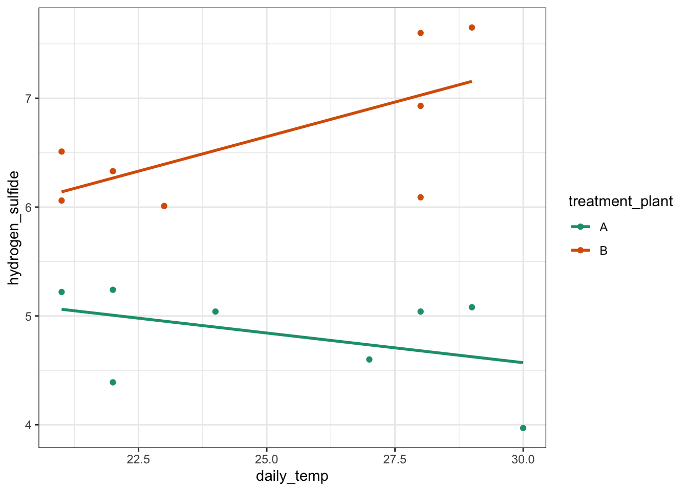
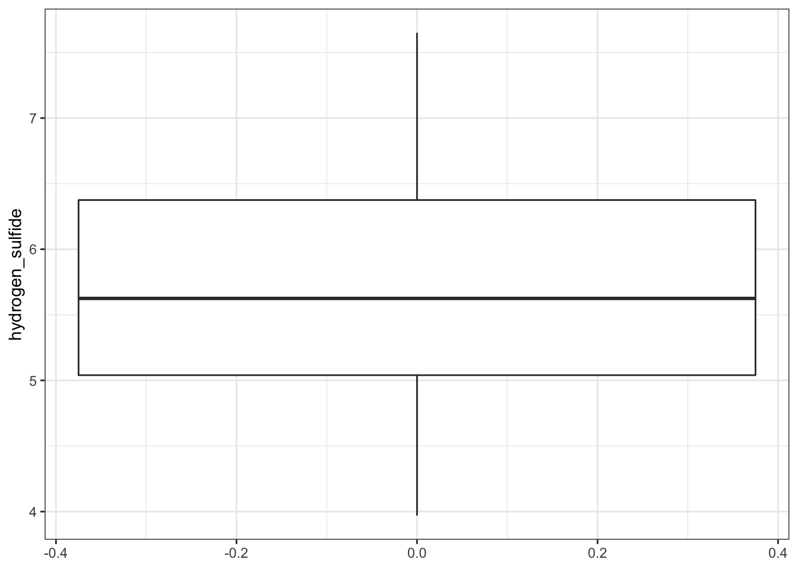
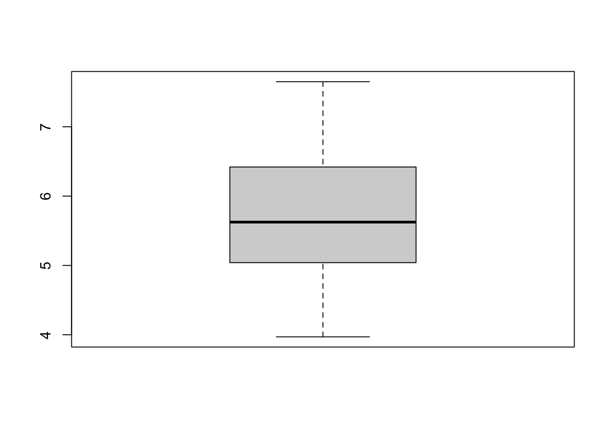
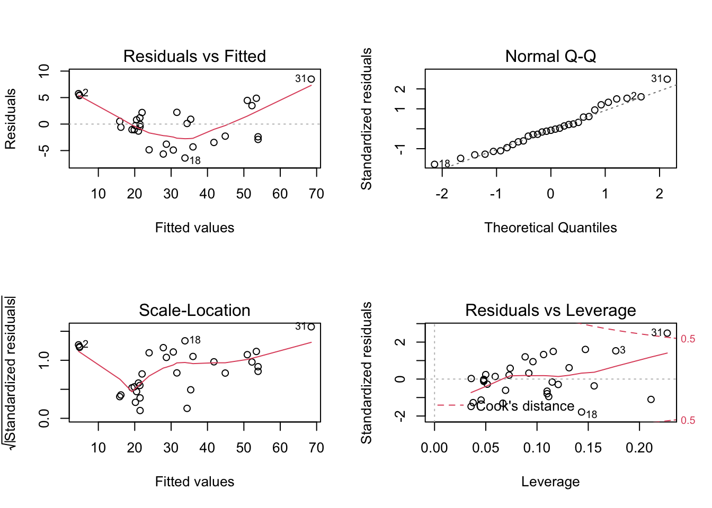
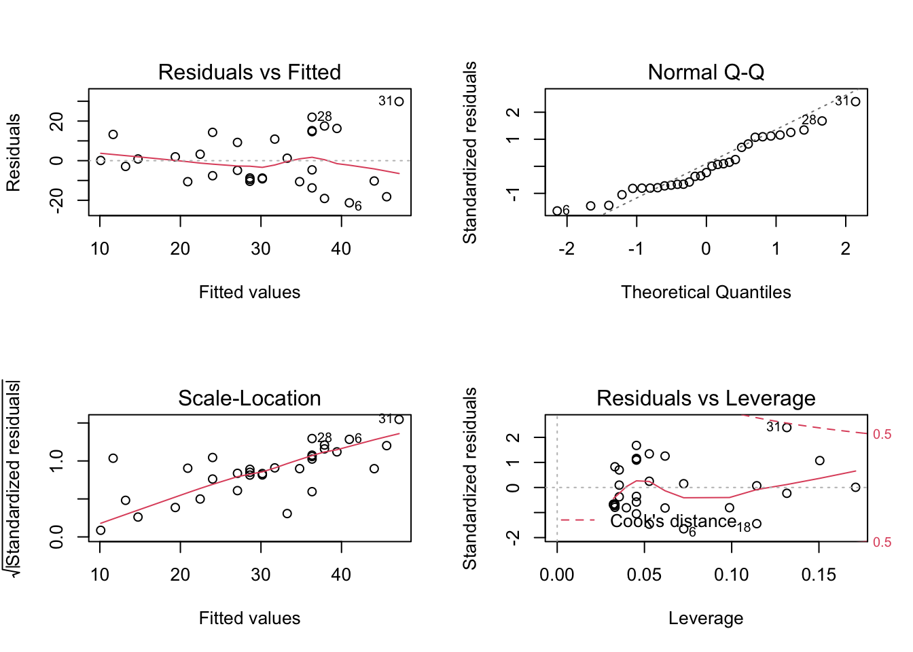
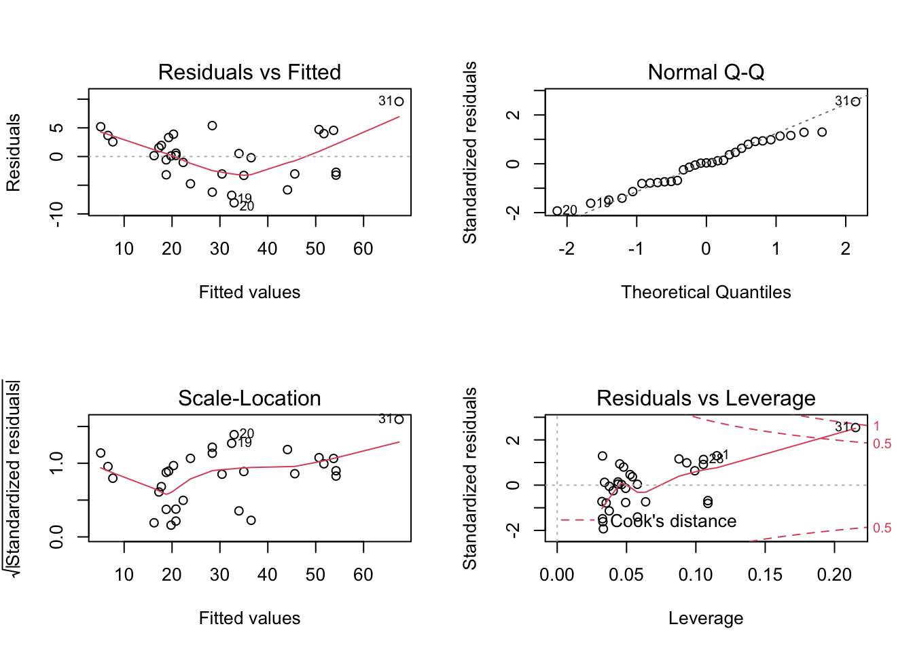

# Linear models

## Objectives
:::objectives
**Questions**

- How do I use the linear model framework with three predictor variables?

**Objectives**

- Be able to expand the linear model framework in R to three predictor variables
- Define the equation for the line of best fit for each categorical variable
- Be able to construct and analyse any possible combination of predictor variables in the data
:::

## Purpose and aim
Revisiting the linear model framework and expanding to systems with three predictor variables.

## Section commands
Commands used in this section

| Function| Description|
|:- |:- |
|`lm()`| Constructs a linear model according to the formula specified |
|`subset()`| Extracts a subset of the data |

## Data and hypotheses
The first section uses the following dataset:
`data/raw/CS5-H2S.csv`. This is a dataset comprising 16 observations of three variables (one dependent and two predictor). This records the air pollution caused by H<sub>2</sub>S produced by two types of waste treatment plants. For both types of plant, we obtain eight measurements each of H<sub>2</sub>S production (ppm). We also obtain information on the daily temperature (C). The data are stacked.

## Summarise and visualise
Let's first load the data:


```r
airpoll <- read.csv("data/raw/CS5-H2S.csv")
```

Next, visualise the data:


```r
# create a plot canvas without data points
plot(H2S ~ Temp,
     data = airpoll, type = "n")

# subset plant A
PlantA <- subset(airpoll, subset = (Plant == "A"))
PlantB <- subset(airpoll, subset = (Plant == "B"))
points(H2S ~ Temp, PlantA, col = "red")
points(H2S ~ Temp, PlantB, col = "blue", pch=2)
```



* The first line plots all of the H<sub>2</sub>S values against the temperature values from the `airpoll` dataset regardless of which plant they are from. However it neglects to actually put the points on the screen (the argument type=n prevents the actual plotting of data). This command is used simply to create a plotting region of the correct size and extent for later.
* The second and third lines create subsets of the data frame `airpoll`. The second line extracts all observations from the subset of `airpoll` that has the `Plant` variable equal to `A` (via the `subset = (Plant == "A"`) argument).
* The fourth and fifth lines add these subsetted points to the graph window using different colours and characters so that the data points for each plant can be distinguished.

It looks as though the variable `Plant` has an effect on H<sub>2</sub>S emissions (as one cloud of points is higher than the other). there is also a suggestion that temperature might affect emissions (both data sets look like the gradient of the line of best fit through their respective cloud might not be zero) and it also appears that there might be an interaction between `Plant` and `Temperature` (the gradient of the two lines of best fit don’t look like they’ll be that similar).

## Implemention
Construct and analyse a full linear model.


```r
# define the linear model with all terms and interactions
lm.full <- lm(H2S ~ Plant + Temp + Plant:Temp,
              data=airpoll)

# view the model
lm.full

# perform an ANOVA
anova(lm.full)

# plot the model
par(mfrow=c(2,2))
plot(lm.full)
```

* The first line creates a linear model that seeks to explain the H<sub>2</sub>S values in terms of the categorical `Plant` variable, the continuous `Temp` variable and the interaction between the two variables. This linear model object is given the name `lm.full`
* The first argument `H2S ~ Plant + Temp + Plant:Temp` is a formula that summarises the model to be fit. Here H<sub>2</sub>S is the dependent variable and we are asking R to use the `Plant`, `Temp` and `Plant:Temp` interaction terms as predictor variables.
* The second line produces the following output:


```
## 
## Call:
## lm(formula = H2S ~ Plant + Temp + Plant:Temp, data = airpoll)
## 
## Coefficients:
## (Intercept)       PlantB         Temp  PlantB:Temp  
##     6.20495     -2.73075     -0.05448      0.18141
```

This gives us the coefficients of the model:


```
## # A tibble: 4 × 2
##   term        estimate
##   <chr>          <dbl>
## 1 (Intercept)   6.20  
## 2 PlantB       -2.73  
## 3 Temp         -0.0545
## 4 PlantB:Temp   0.181
```

These are best interpreted by using the linear model notation:

\begin{equation}
H_2S = 6.20495 - 0.05448 \cdot Temp + \binom{0}{-2.73075}\binom{PlantA}{PlantB} + \binom{0}{0.18141 \cdot Temp}\binom{PlantA}{PlantB}
\end{equation}

This is effectively shorthand for writing down the equation of the two straight lines (one for each categorical variable):

\begin{equation}
PlantA = 6.20495 - 0.05448 \cdot Temp
\end{equation}

\begin{equation}
PlantB = 3.4742 + 0.12693 \cdot Temp
\end{equation}

* The `anova(lm.full)` produces the following output:


```
## Analysis of Variance Table
## 
## Response: H2S
##            Df  Sum Sq Mean Sq F value    Pr(>F)    
## Plant       1 13.3225 13.3225 54.1557 8.746e-06 ***
## Temp        1  0.2316  0.2316  0.9415   0.35104    
## Plant:Temp  1  1.4470  1.4470  5.8822   0.03201 *  
## Residuals  12  2.9520  0.2460                      
## ---
## Signif. codes:  0 '***' 0.001 '**' 0.01 '*' 0.05 '.' 0.1 ' ' 1
```

Here we can see that the interaction term appears to be marginally significant, implying that the effect of temperature on H<sub>2</sub>S is different for the two different plants.

Finally, plotting the `lm.full` model shows us the diagnostic plots:


## Exploring models
Rather than stop here however, we will use the concept of the linear model to its full potential and show that we can construct and analyse any possible combination of predictor variables for this dataset. Namely we will consider the following four extra models:

| Model| Description|
|:- |:- |
|1. `H2S ~ Plant + Temp`| An additive model |
|2. `H2S ~ Plant` | Equivalent to a one-way ANOVA |
|3. `H2S ~ Temp` | Equivalent to a simple linear regression |
|4. `H2S ~ 1` | The null model, where we have no predictors |


### Additive model
Construct and analyse the additive linear model.


```r
# define the linear model
lm.add <- lm(H2S ~ Plant + Temp,
             data = airpoll)

# view the linear model
lm.add

# perform an ANOVA on the model
anova(lm.add)
```

* The first line creates a linear model that seeks to explain the `H2S` values purely in terms of the categorical `Plant` variable and the continuous `Temp` variable.
* The second line produces the following output:


```
## 
## Call:
## lm(formula = H2S ~ Plant + Temp, data = airpoll)
## 
## Coefficients:
## (Intercept)       PlantB         Temp  
##     3.90164      1.83861      0.03629
```

This gives us the coefficients of the additive model:


```
## # A tibble: 3 × 2
##   term        estimate
##   <chr>          <dbl>
## 1 (Intercept)   3.90  
## 2 PlantB        1.84  
## 3 Temp          0.0363
```

These are best interpreted by using the linear model notation:

\begin{equation}
H_S = 3.9 + 0.036 \cdot Temp + \binom{0}{1.8} \binom{PlantA}{PlantB}
\end{equation}

This is effectively shorthand for writing down the equation of the two straight lines (one for each categorical variable):

\begin{equation}
H_2S_{PlantA} = 3.9 + 0.036 \cdot Temp
\end{equation}

\begin{equation}
H_2S_{PlantB} = 5.7 + 0.036 \cdot Temp
\end{equation}

What is very important to note is not so much that the coefficients have changed (it is natural to assume that there would be some change in the model given that we’ve altered the predictor variables included). What is striking here is that the **signs** of the coefficients have changed! For example, in the full model we saw that the coefficient of `PlantB` was negative (implying that in general `PlantB` produced lower H<sub>2</sub>S values than `PlantA` by default) whereas now it is positive indicating exactly the opposite effect. Given that the difference between the two models was the inclusion of an interaction term which we saw was significant in the analysis of the full model, it perhaps, is not surprising that dropping this term would lead to very different results.

But just imagine if we had never included it in the first place! If we only looked at the additive model we would come out with completely different conclusions about the baseline pollution levels of each plant.

* The 3rd line produces the following output:


```
## Analysis of Variance Table
## 
## Response: H2S
##           Df  Sum Sq Mean Sq F value    Pr(>F)    
## Plant      1 13.3225 13.3225 39.3702 2.858e-05 ***
## Temp       1  0.2316  0.2316  0.6845     0.423    
## Residuals 13  4.3991  0.3384                      
## ---
## Signif. codes:  0 '***' 0.001 '**' 0.01 '*' 0.05 '.' 0.1 ' ' 1
```

Here we can see that the temperature term is not significant, whereas the `Plant` term is very significant indeed.

:::exercise
Check the assumptions of this additive model. Do they differ significantly from the full model?
:::

### Revisiting ANOVA
Construct and analyse only the effect of `Plant`:


```r
# visualise the data
boxplot(H2S ~ Plant,
        data = airpoll)
```

```r
# define the linear model
lm.Plant <- lm(H2S ~ Plant,
               data = airpoll)

# view the linear model
lm.Plant

# perform an ANOVA on the model
anova(lm.Plant)
```

* The first line creates a box plot:


* The second line fits a linear model to the data
* The third line gives us the model coefficients:


```
## 
## Call:
## lm(formula = H2S ~ Plant, data = airpoll)
## 
## Coefficients:
## (Intercept)       PlantB  
##       4.823        1.825
```

In this case it tells us the means of the groups. `(Intercept)` is the mean of the PlantA H2S data (4.8225) whilst `PlantB` tells us that the mean of the Plant B H2S data is 1.8250 more than the intercept value i.e. the mean of `PlantB` is 4.8225 + 1.8250 = 6.6475.

* The fourth line gives us the normal ANOVA table for testing whether the means of the two groups differ significantly from each other.


```
## Analysis of Variance Table
## 
## Response: H2S
##           Df  Sum Sq Mean Sq F value    Pr(>F)    
## Plant      1 13.3225 13.3225  40.278 1.809e-05 ***
## Residuals 14  4.6307  0.3308                      
## ---
## Signif. codes:  0 '***' 0.001 '**' 0.01 '*' 0.05 '.' 0.1 ' ' 1
```

:::exercise
Check the assumptions of this plant only model. Do they differ significantly from the previous models?
:::

### Revisiting regression
Construct a simple linear regression model:


```r
# define the linear model
lm.Temp <- lm(H2S ~ Temp,
              data=airpoll)

# create a scatter plot of the data
plot(H2S ~ Temp, data=airpoll)
# and add a line of best fit
abline(lm.Temp)
```

```r
# view the model
lm.Temp

# perform an ANOVA on the model
anova(lm.Temp)
```

* The first line fits a linear model to the data
* The second line creates a scatter plot
* The third line uses the results of the linear model fitting (`lm.Temp`) to add a line of best fit to the scatter plot.



* The fourth line gives us the coefficients to the equation of the line of best fit


```
## 
## Call:
## lm(formula = H2S ~ Temp, data = airpoll)
## 
## Coefficients:
## (Intercept)         Temp  
##     5.21465      0.02066
```

In this case it tells us the intercept `(Intercept)` and the gradient (`Temp`) of the line of best fit.

* The fifth line gives us the ANOVA analysis:


```
## Analysis of Variance Table
## 
## Response: H2S
##           Df  Sum Sq Mean Sq F value Pr(>F)
## Temp       1  0.0753  0.0753   0.059 0.8117
## Residuals 14 17.8779  1.2770
```

Temperature clearly does not have a significant effect.

:::exercise
Again, check the assumptions of this temperature only model. Do they differ significantly from the previous models?
:::

### The null model
Construct and analyse the null model:


```r
# define the null model
lm.null <- lm(H2S ~ 1, data = airpoll)

# visualise the data
boxplot(airpoll$H2S)
```



```r
# view the model
lm.null
```

```
## 
## Call:
## lm(formula = H2S ~ 1, data = airpoll)
## 
## Coefficients:
## (Intercept)  
##       5.735
```

* The first line fits a null model to the data (effectively just finding the mean of all H<sup>2</sup>S values in the dataset)
* The second line creates a box plot
* The third line gives us the mean of the H<sup>2</sup>S values (i.e. the coefficient of the null model)

The null model by itself is rarely analysed for its own sake but is instead used a reference point for more sophisticated model selection techniques.

## Exercise: trees
:::exercise
Trees: an example with only continuous variables

Use the internal dataset trees. This is a data frame with 31 observations of 3 continuous variables. The variables are the height `Height`, diameter `Girth` and timber volume `Volume` of 31 felled black cherry trees.

Investigate the relationship between `Volume` (as a dependent variable) and `Height` and `Girth` (as predictor variables).

* Here all variables are continuous and so there isn’t a way of producing a 2D plot of all three variables for visualisation purposes using R’s standard plotting functions.
* construct four linear models
    * Assume volume depends on `Height`, `Girth` and an interaction between `Girth` and `Height`
    * Assume `Volume` depends on `Height` and `Girth` but that there isn’t any interaction between them.
    * Assume `Volume` only depends on `Girth` (plot the result, with the regression line).
    * Assume `Volume` only depends on `Height` (plot the result, with the regression line).
* For each linear model write down the algebraic equation that the linear model produces that relates volume to the two continuous predictor variables.
* Check the assumptions of each model. Do you have any concerns?

NB: For two continuous predictors, the interaction term is simply the two values multiplied together (so `Girth:Height` means `Girth x Height`)

* Use the equations to calculate the predicted volume of a tree that has a diameter of 20 inches and a height of 67 feet in each case.

<details><summary>Answer</summary>

Let's construct the four linear models in turn.

### Full model

The r commands are:


```r
# define the model
lm.full <- lm(Volume ~ Height * Girth,
              data = trees)

# view the model
lm.full
```

This gives us the following output:


```
## 
## Call:
## lm(formula = Volume ~ Height * Girth, data = trees)
## 
## Coefficients:
##  (Intercept)        Height         Girth  Height:Girth  
##      69.3963       -1.2971       -5.8558        0.1347
```

We can use this output to get the following equation:

Volume = 69.40 + -1.30$\cdot$Height + -5.86$\cdot$Girth + 0.13$\cdot$Height$\cdot$Girth

If we stick the numbers in (`Girth = 20` and `Height = 67`) we get the following equation:

Volume = 69.40 + -1.30 $\cdot$ 67 + -5.86 $\cdot$ 20 + 0.13 $\cdot$ 67 $\cdot$ 20

Volume =  45.81

Here we note that the interaction term just requires us to multiple the three numbers together (we haven't looked at continuous predictors before in the examples and this exercise was included as a check to see if this whole process was making sense).

If we look at the diagnostic plots for the model using the following commands we get:


```r
par(mfrow = c(2, 2))

plot(lm.full)
```


All assumptions are OK.

* There is some suggestion of heterogeneity of variance (with the variance being lower for small and large fitted (i.e. predicted Volume) values), but that can be attributed to there only being a small number of data points at the edges, so I'm not overly concerned.
* Similarly, there is a suggestion of snaking in the Normal Q-Q plot (suggesting some lack of normality) but this is mainly due to the inclusion of point 18 and overall the plot looks acceptable.
* There are no highly influential points

### Additive model

The r commands are:


```r
# define the model
lm.add <- lm(Volume ~ Height + Girth,
             data = trees)

# view the model
lm.add
```

These gives us the following output:


```
## 
## Call:
## lm(formula = Volume ~ Height + Girth, data = trees)
## 
## Coefficients:
## (Intercept)       Height        Girth  
##    -57.9877       0.3393       4.7082
```

We can use this output to get the following equation:

Volume = -57.99 + 0.34$\cdot$Height + 4.71$\cdot$Girth

If we stick the numbers in (`Girth = 20` and `Height = 67`) we get the following equation:

Volume = -57.99 + 0.34 $\cdot$ 67 + 4.71 $\cdot$ 20

Volume =  58.91

If we look at the diagnostic plots for the model using the following commands we get the following:


```r
par(mfrow = c(2, 2))

plot(lm.add)
```



This model isn't great.

* There is a worrying lack of linearity exhibited in the Residuals vs Fitted plot suggesting that this linear model isn't appropriate.
* Assumptions of Normality seem OK
* Equality of variance is harder to interpret. Given the lack of linearity in the data it isn't really sensible to interpret the Scale-Location plot as it stands (since the plot is generated assuming that we've fitted a straight line through the data), but for the sake of practising interpretation we'll have a go. There is definitely suggestions of homogeneity of variance here with a cluster of points with fitted values of around 20 having noticeably lower variance than the rest of the dataset.
* Point 31 is influential and if there weren't issues with the linearity of the model I would remove this point and repeat the analysis. As it stands there isn't much point.

### Height-only model

The r commands are:


```r
# define the model
lm.height <- lm(Volume ~ Height,
              data = trees)

# view the model
lm.height
```

These gives us the following output:


```
## 
## Call:
## lm(formula = Volume ~ Height, data = trees)
## 
## Coefficients:
## (Intercept)       Height  
##     -87.124        1.543
```

We can use this output to get the following equation:

Volume = -87.12 + 1.54$\cdot$Height

If we stick the numbers in (`Girth = 20` and `Height = 67`) we get the following equation:

Volume = -87.12 + 1.54 $\cdot$ 67

Volume =  16.28

If we look at the diagnostic plots for the model using the following commands we get the following:


```r
par(mfrow = c(2, 2))

plot(lm.height)
```



This model also isn't great.

* The main issue here is the clear heterogeneity of variance. For trees with bigger volumes the data are much more spread out than for trees with smaller volumes (as can be seen clearly from the Scale-Location plot).
* Apart from that, the assumption of Normality seems OK
* And there aren't any hugely influential points in this model

### Girth-only model

The r commands are:


```r
# define the model
lm.girth <- lm(Volume ~ Girth,
               data = trees)

# view the model
lm.girth
```

These gives us the following output:


```
## 
## Call:
## lm(formula = Volume ~ Girth, data = trees)
## 
## Coefficients:
## (Intercept)        Girth  
##     -36.943        5.066
```

We can use this output to get the following equation:

Volume = -36.94 + 5.07$\cdot$Girth

If we stick the numbers in (`Girth = 20` and `Height = 67`) we get the following equation:

Volume = -36.94 + 5.07 $\cdot$ 20

Volume =  64.37

If we look at the diagnostic plots for the model using the following commands we get the following:


```r
par(mfrow = c(2, 2))

plot(lm.girth)
```



The diagnostic plots here look rather similar to the ones we generated for the additive model and we have the same issue with a lack of linearity, heterogeneity of variance and point 31 being influential.

</details>
:::

## Key points

:::keypoints
* We can define a linear model with `lm()`, adding extra variables
* Using the coefficients of the model we can construct the linear model equation
* The underlying assumptions of a linear model with three predictor variables are the same as those of a two-way ANOVA
:::
