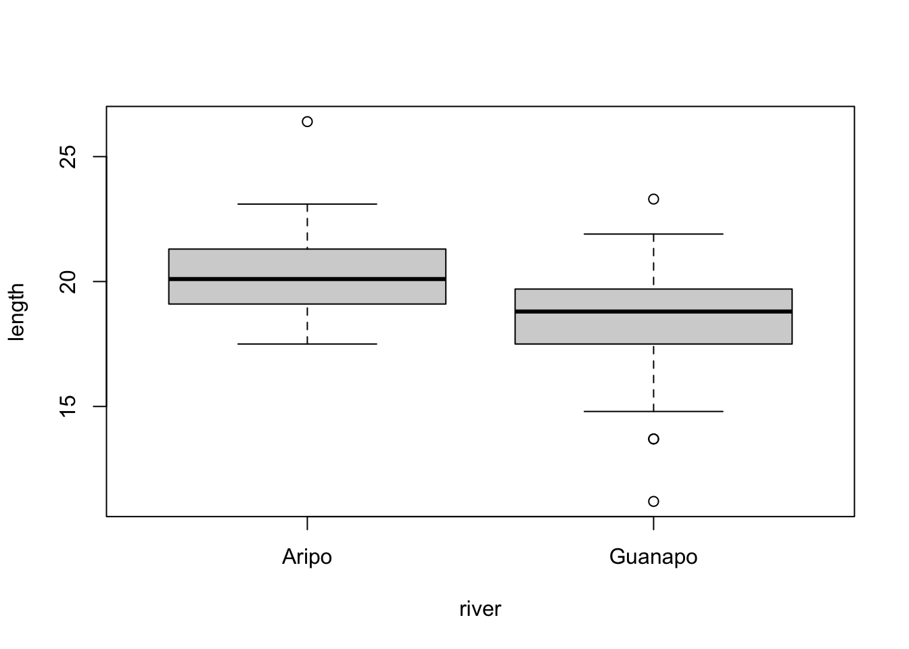

# Power analysis

## Objectives
:::objectives
**Questions**

- How do I...
- What do I...

**Objectives**

- Be able to...
- Use...
:::

## Background
All hypothesis tests can be wrong in two ways:

* we can appear to have found a significant result when there really isn’t anything there: a false positive (or Type I error), or
* we can fail to spot a significant result when there really is something interesting going on: a false negative (or Type II error).

The probability of getting a false positive in our analysis is precisely the significance level we use in our analysis. So, in order to reduce the likelihood of getting a false positive we simply reduce the significance level of our test (from 0.05 down to 0.01 say). Easy as that.

Unfortunately, this has unintended consequences (doesn’t everything?). It turns out that reducing the significance level means that we increase the chance of getting false negatives. This should make sense; if we’re increasing the barrier to entry in terms of acceptance then we’ll also accidentally miss out on some of the good stuff.

**Power** is the capacity of a test to detect significant different results. It is affected by three things:

1. the effect size: i.e. how big of a difference do you want to be able to detect, or alternatively what do you consider a meaningful effect/difference to be?
2. sample size
3. the significance level

In an ideal world we would want to be carrying out highly powerful tests using low significance levels, to both reduce our chance of getting a false positive and maximise our chances of finding a true effect.

***Power analysis** allows us to design experiments to do just that. Given:

* a desired power (0.8 or 80% is considered pretty good)
* a significance level (0.05 or 5% is our trusty yet arbitrary steed once again)
* an effect size that we would like to detect

we can calculate the amount of data that we need to collect in our experiments. (Woohoo! it looks as if statistics will actually give us an answer at last rather than these perpetual shades-of-grey "maybes").

The reality is that most of the easily usable power analysis functions all operate under the assumption that the data that you will collect will meet all of the assumptions of your chosen statistical test perfectly. So, for example, if you want to design an experiment investigating the effectiveness of a single drug compared to a placebo (so a simple t-test) and you want to know how many patients to have in each group in order for the test to work, then the standard power analysis techniques will still assume that all of the data that you end up collecting will meet the assumptions of the t-test that you have to carry out (Sorry to have raised your hopes ever so slightly 😉).

### Effect size
As we shall see the commands for carrying out power analyses are very simple to implement apart from the concept of effect size. This is a tricky issue for most people to get to grips with for two reasons:

1. Effect size is related to biological significance rather than statistical significance
2. The way in which we specify effect sizes

With respect to the first point a common conversation goes a bit like this:

me: "So you’ve been told to carry out a power analysis, eh? Lucky you. What sort of effect size are you looking for?"

you: "I have no idea what you’re talking about. I want to know if my drug is any better than a placebo. How many patients do I need?"

me:	"It depends on how big a difference you think your drug will have compared to the placebo."

you: "I haven’t carried out my experiment yet, so I have absolutely no idea how big the effect will be!"

me:	<sigh>

(To be honest this would be a relatively well-informed conversation: [this is much closer](https://www.youtube.com/watch?v=Hz1fyhVOjr4) to how things actually go)

The key point about effect sizes and power analyses is that you need to specify an effect size that you would be interested in observing, or one that would be biologically relevant to see. There may well actually be a 0.1% difference in effectiveness of your drug over a placebo but designing an experiment to detect that would require markedly more individuals than an experiment that was trying to detect a 50% difference in effectiveness. In reality there are three places we can get a sense of effect sizes from:

1. A pilot study
2. Previous literature or theory
3. Jacob Cohen

[Jacob Cohen](https://en.wikipedia.org/wiki/Jacob_Cohen_(statistician)) was an American statistician who developed a large set of measures for effect sizes (which we will use today). He came up with a rough set of numerical measures for "small", "medium" and "large" effect sizes that are still in use today. These do come with some caveats though; Jacob was a psychologist and so his assessment of what was a large effect may be somewhat different from yours. They do form a useful starting point however.

There a lot of different ways of specifying effects sizes, but we can split them up into three distinct families of estimates:

1. **Correlation estimates**: these use R<sup>2</sup> as a measure of variance explained by a model (for linear models, anova etc. A large R<sup>2</sup> value would indicate that a lot of variance has been explained by our model and we would expect to see a lot of difference between groups, or a tight cluster of points around a line of best fit. The argument goes that we would need fewer data points to observe such a relationship with confidence. Trying to find a relationship with a low R<sup>2</sup> value would be trickier and would therefore require more data points for an equivalent power.
2. **Difference between means**: these look at how far apart the means of two groups are, measured in units of standard deviations (for t-tests). An effect size of 2 in this case would be interpreted as the two groups having means that were two standard deviations away from each other (quite a big difference), whereas an effect size of 0.2 would be harder to detect and would require more data to pick it up.
3. **Difference between count data**: these I freely admit I have no idea how to intuitively explain them (shock, horror). Mathematically they are based on the chi-squared statistic but that’s as good as I can tell you I’m afraid. They are, however, pretty easy to calculate.

For reference here are some of Cohen’s suggested values for effect sizes for different tests. You’ll probably be surprised by how small some of these are.

| Test| Small | Medium | Large |
|:- |:- |:- |:- |
|t-tests| 0.2 | 0.5 | 0.8 |
|anova | 0.1 | 0.25 | 0.4 |
linear models | 0.02 | 0.15 | 0.35 |
chi-squared | 0.1 | 0.3 | 0.5 |

We will look at how to carry out power analyses and estimate effect sizes in this section.

## Packages
We will be using the `pwr` and `powerAnalysis` packages during this section. Please install those now.

You can do this by running the following code in your console:


```r
install.packages(c("pwr", "powerAnalysis"))
```

Next, load them by running:


```r
library(pwr)
library(powerAnalysis)
```

These packages have a lot of overlap but unfortunately neither one of them quite has all the functionality I’d like. `powerAnalysis` has more functions for explicitly calculating effect sizes from previous studies but has a smaller range of power calculation functions. `pwr` has more power functions but fewer effect size functions. However, together they do the job.

## Section commands
New commands used in this section:

| Function| Description|
|:- |:- |
|`pwr.t.test()`| Power analysis for 1-sample, 2-sample and paired t-tests |
|`pwr.f2.test()`| Power analysis for linear models |
|`cohen.ES()`| Conventional effect sizes for all tests |
|`ES.t.one()`| Effect size calculation for t-test |
|`ES.t.two()`| Effect size calculation for t-test |
|`ES.t.paired()`| Effect size calculation for t-test |

## t-tests
Let’s assume that we want to design an experiment to determine whether there is a difference in the mean price of what male and female students pay at a cafe. How many male and female students would we need to observe in order to detect a "medium" effect size with 80% power and a significance level of 0.05?

We first need to think about which test we would use to analyse the data. Here we would have two groups of continuous response. Clearly a t-test.

### Get the effect size
Now we need to work out what a "medium" effect size would be. In the absence of any other information we appeal to Cohen’s conventional values:


```r
cohen.ES(test = "t", size = "medium")
```

```
## 
##      Conventional effect size from Cohen (1982) 
## 
##            test = t
##            size = medium
##     effect.size = 0.5
```

This function just returns the default conventional values for effect sizes as determined by Jacob Cohen back in the day. It just saves us scrolling back up the page to look at the table I provided. It only takes two arguments:

*	test which is one of
    * "t", for t-tests,
    * "anova" for anova,
    * "f2" for linear models
    * "chisq" for chi-squared test
* size, which is just one of "small", "medium" or "large".

The bit we want is on the bottom line; we apparently want an effect size of 0.5.
For this sort of study effect size is measured in terms of Cohen’s d statistic. This is simply a measure of how different the means of the two groups are expressed in terms of the number of standard deviations they are apart from each other. So, in this case we’re looking to detect two means that are 0.5 standard deviations away from each other. In a minute we’ll look at what this means for real data.

### Carry out a power analysis
We do this as follows:


```r
pwr.t.test(d = 0.5, sig.level = 0.05, power = 0.8,
           type = "two.sample", alternative="two.sided")
```

```
## 
##      Two-sample t test power calculation 
## 
##               n = 63.76561
##               d = 0.5
##       sig.level = 0.05
##           power = 0.8
##     alternative = two.sided
## 
## NOTE: n is number in *each* group
```

The first line is what we’re looking for `n = 63.76` tells that we need 64 (rounding up) students in each group (so 128 in total) in order to carry out this study with sufficient power. The other lines should be self-explanatory (well they should be by this stage; if you need me to tell you that the function is just returning the values that you’ve just typed in then you have bigger problems to worry about).

The `pwr.t.test()` function has six arguments. Two of them specify what sort of t-test you’ll be carrying out
* `type`; which describes the type of t-test you will eventually be carrying out (one of `two.sample`, `one.sample` or `paired`), and
* `alternative`; which describes the type of alternative hypothesis you want to test (one of `two.sided`, `less` or `greater`)

The other four arguments are what is used in the power analysis:

* `d`; this is the effect size, a single number calculated using Cohen’s d statistic.
* `sig.level`; this is the significance level
* `power`; is the power
* `n`; this is the number of observations per sample.

The function works by allowing you to specify any three of these four arguments and the function works out the fourth. In the example above we have used the test in the standard fashion by specifying power, significance and desired effect size and getting the function to tell us the necessary sample size.

We can use the function to answer a different question:

> If I know in advance that I can only observe 30 students per group, what is the effect size that I should be able to observe with 80% power at a 5% significance level?


```r
pwr.t.test(n = 30, sig.level = 0.05, power = 0.8,
           type = "two.sample", alternative = "two.sided")
```

```
## 
##      Two-sample t test power calculation 
## 
##               n = 30
##               d = 0.7356292
##       sig.level = 0.05
##           power = 0.8
##     alternative = two.sided
## 
## NOTE: n is number in *each* group
```

This time we want to see what the effect size is so we look at the second line and we can see that an experiment with this many people would only be expected to detect a difference in means of `d = 0.74` standard deviations. Is this good or bad? Well, it depends on the natural variation of your data; if your data is really noisy then it will have a large variation and a large standard deviation which will mean that 0.74 standard deviations might actually be quite a big difference between your groups. If on the other hand your data doesn’t vary very much, then 0.74 standard deviations might actually be a really small number and this test could pick up even quite small differences in mean.

In both of the previous two examples we were a little bit context-free in terms of effect size. Let’s look at how we can use a pilot study with real data to calculate effect sizes and perform a power analysis to inform a future study.

Let’s look again at the `fishlength` data we saw in the first practical relating to the lengths of fish from two separate rivers. This is saved as `data/raw/CS6-fishlength.csv`.


```r
# read in the data
fishlength <- read.csv("data/raw/CS6-fishlength.csv")

# summarise the data
summary(fishlength)
```

```
##      length         river          
##  Min.   :11.20   Length:68         
##  1st Qu.:18.40   Class :character  
##  Median :19.30   Mode  :character  
##  Mean   :19.46                     
##  3rd Qu.:20.93                     
##  Max.   :26.40
```

```r
# visualise the data
boxplot(length ~ river,
        data = fishlength)
```



```r
# perform a t-test, assuming equal variance
t.test(length ~ river,
       data = fishlength, var.equal = TRUE)
```

```
## 
## 	Two Sample t-test
## 
## data:  length by river
## t = 3.8433, df = 66, p-value = 0.0002754
## alternative hypothesis: true difference in means between group Aripo and group Guanapo is not equal to 0
## 95 percent confidence interval:
##  0.9774482 3.0909868
## sample estimates:
##   mean in group Aripo mean in group Guanapo 
##              20.33077              18.29655
```

From the `summary()` command we can see that there are 39 records for the Aripo river and only 29 records for the Guanapo river. From the box plot we see that the groups appear to have different means and from the t-test analysis we can see that this difference is significant.

Can we use this information to design a more efficient experiment? One that we would be confident was powerful enough to pick up a difference in means as big as was observed in this study but with fewer observations?

Let’s first work out exactly what the effect size of this previous study really was by estimating Cohen’s d using this data.


```r
ES.t.two(t = 3.8433, n1 = 39, n2 = 29)
```

```
## 
##      effect size (Cohen's d) of independent two-sample t test 
## 
##               d = 0.942383
##     alternative = two.sided
## 
## NOTE: The alternative hypothesis is m1 != m2
## small effect size:  d = 0.2
## medium effect size: d = 0.5
## large effect size:  d = 0.8
```

This function calculates the effect size using the t-statistic (`t`) and the values of the sample sizes of the two groups (`n1`, `n2`). The function can perform the same calculation is given other information (means of the two groups, standard deviations of the two groups etc.) Have a look at the five examples at the bottom of the help file (`?ES.t.two`) to see other ways in which it can be used.

* The second line has the `d` value that we want.
* The rest of the output is just padding and reminds us of the conventional values of effect sizes for reference only.

We can know actually answer our question and see how many fish we really need to catch in the future:


```r
pwr.t.test(d = 0.94, power = 0.8, sig.level = 0.05,
           type = "two.sample", alternative = "two.sided")
```

```
## 
##      Two-sample t test power calculation 
## 
##               n = 18.77618
##               d = 0.94
##       sig.level = 0.05
##           power = 0.8
##     alternative = two.sided
## 
## NOTE: n is number in *each* group
```

From this we can see that any future experiments would really only need to use 19 fish for each group (18.77 from the first line rounded up, so no fish will be harmed during the experiment...) if we wanted to be confident of detecting the difference we observed in the previous study.

This approach can also be used when the pilot study showed a smaller effect size that wasn’t observed to be significant (indeed arguably, a pilot study shouldn’t really concern itself with significance but should only really be used as a way of assessing potential effect sizes which can then be used in a follow-up study).

## Exercise: one-sample
:::exercise
Performing a power analysis on a one-sample data set

Load in `data/raw/CS6-onesample.csv` (this is the same data we looked at in the earlier practical containing information on fish lengths from a single river).

a. Assume this was a pilot study and analyse the data using a one-sample t-test to see if there is any evidence that the mean length of fish differs from 19 cm.
b. Use the results of this analysis to estimate the effect size.
c. Work out how big a sample size would be required to detect an effect this big with power 0.8 and significance 0.05.
d. How would the sample size change if we wanted 0.9 power and significance 0.01?

<details><summary>Answer</summary>

First, read in the data:


```r
exOne <- read.csv("data/raw/CS6-onesample.csv")
```

Let's run the one-sample t-test as we did before:


```r
t.test(exOne$Guanapo , mu = 19)
```

```
## 
## 	One Sample t-test
## 
## data:  exOne$Guanapo
## t = -1.4657, df = 28, p-value = 0.1539
## alternative hypothesis: true mean is not equal to 19
## 95 percent confidence interval:
##  17.31341 19.27969
## sample estimates:
## mean of x 
##  18.29655
```
OK, there doesn't appear to be a statistically significant result here; the mean length of the fish doesn't appear to be different from 19cm. From the output though we do see that the mean length of our sample of fish is 18.30 (2dp), so the sample is a little bit smaller than 19 cm.

Let's calculate the effect size using the t-statistic and the degrees of freedom from the t-test output above. This gives us the following value for the effect size in terms of the Cohen's d metric.


```r
ES.t.one(t = -1.4657 , df = 28)
```

```
## 
##      effect size (Cohen's d) of one-sample t test 
## 
##               d = 0.2769913
##     alternative = two.sided
## 
## NOTE: The alternative hypothesis is m != mu
## small effect size:  d = 0.2
## medium effect size: d = 0.5
## large effect size:  d = 0.8
```

Our effect size is 0.277 which is somewhere between a small and medium effect size. This means that this would be hard to detect with a small sample size and it's likely that we would need more than just 29 observations to detect an effect this big.

Now, let's do the power analysis to actually calculate the sample size required:


```r
pwr.t.test(d = 0.2769913, sig.level = 0.05, power = 0.8,
           type = "one.sample")
```

```
## 
##      One-sample t test power calculation 
## 
##               n = 104.2368
##               d = 0.2769913
##       sig.level = 0.05
##           power = 0.8
##     alternative = two.sided
```

We would need 105 (you round up the n value) observations in our experimental protocol in order to be able to detect an effect size this big (small?) at a 5% significance level and 80% power. Let's see what would happen if we wanted to be even more stringent:


```r
pwr.t.test(d = 0.2769913, sig.level = 0.01, power = 0.9,
           type = "one.sample")
```

```
## 
##      One-sample t test power calculation 
## 
##               n = 197.2625
##               d = 0.2769913
##       sig.level = 0.01
##           power = 0.9
##     alternative = two.sided
```

198 observations! We would need to do a lot of work if we wanted to work to this level of significance and power. Are such small differences in fish length biologically meaningful?

</details>
:::

## Exercise: two-sample paired
:::exercise
Power analysis on a paired two-sample data set

Load in `data/raw/CS6-twopaired.csv` (again this is the same data that we used in an earlier practical and relates to cortisol levels measured on 20 participants in the morning and evening).

a. first carry out a power analysis to work out how big of an effect size this experiment should be able to detect at a power of 0.8 and significance level of 0.05. Don’t look at the data just yet!
b. Now calculate the actual observed effect size from the study.
c. If you were to repeat the study in the future, how many observations would be necessary to detect the observed effect with 80% power and significance level 0.01?

<details><summary>Answer</summary>

First, read in the data:


```r
exTwo <- read.csv("data/raw/CS6-twopaired.csv")
```

We have a paired dataset with 20 pairs of observations, what sort of effect size could we detect at a significance level of 0.05 and power of 0.8?


```r
pwr.t.test(n = 20, sig.level = 0.05, power = 0.8,
           type="paired")
```

```
## 
##      Paired t test power calculation 
## 
##               n = 20
##               d = 0.6604413
##       sig.level = 0.05
##           power = 0.8
##     alternative = two.sided
## 
## NOTE: n is number of *pairs*
```

Remember that we get effect size measured in Cohen's d metric. So here this experimental design would be able to detect a d value of 0.66 (2dp) which is a medium to large effect size.

Now let's look at the actual data and work out what the effect size actually is:


```r
t.test(exTwo$morning, exTwo$evening, paired=T)
```

```
## 
## 	Paired t-test
## 
## data:  exTwo$morning and exTwo$evening
## t = 5.1833, df = 19, p-value = 5.288e-05
## alternative hypothesis: true difference in means is not equal to 0
## 95 percent confidence interval:
##   69.20962 162.96038
## sample estimates:
## mean of the differences 
##                 116.085
```

Use the t-statistic to calculate the effect size:


```r
ES.t.paired(t = 5.1833, df = 19)
```

```
## 
##      effect size (Cohen's d) of paired two-sample t test 
## 
##               d = 1.189131
##     alternative = two.sided
## 
## NOTE: The alternative hypothesis is md != 0
## small effect size:  d = 0.2
## medium effect size: d = 0.5
## large effect size:  d = 0.8
```
This (1.19) is a massive effect size. It's quite likely that we actually have more participants in this study than we actually need given such a large effect. Let calculate how many individuals we would actually need:


```r
pwr.t.test(d = 1.189131, sig.level = 0.01, power=0.8,
           type = "paired")
```

```
## 
##      Paired t test power calculation 
## 
##               n = 11.67291
##               d = 1.189131
##       sig.level = 0.01
##           power = 0.8
##     alternative = two.sided
## 
## NOTE: n is number of *pairs*
```

So we would have only needed 12 pairs of participants in this study given the size of effect we were trying to detect.

</details>
:::

## Key points

:::keypoints
- Point 1
- Point 2
- Point 3
:::
